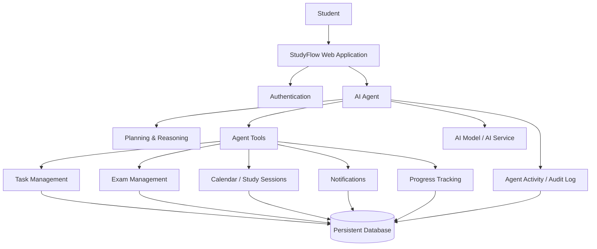
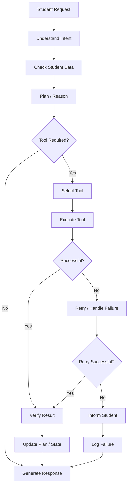
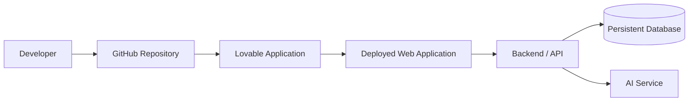

# StudyFlow – Capstone Deliverables

## 1. Application Overview

StudyFlow is an AI-powered Agentic Student Productivity Assistant designed to help college students organize assignments, exams, study sessions and academic deadlines.

Instead of functioning as only a chatbot, StudyFlow uses an AI agent to analyze academic workload, prioritize upcoming work, generate study sessions, update the calendar and adapt the plan when the student falls behind or adds new deadlines.

The main objective is to help students start work early, avoid deadline pressure and maintain a consistent study routine.

---

# 2. Architecture Diagram

## High-Level Architecture



### Architecture Layers

**Presentation Layer:** Responsive StudyFlow web interface containing the dashboard, AI assistant, calendar, tasks, exams, study plan, notifications and monitoring pages.

**Authentication Layer:** Handles sign-up, login, logout, password reset and identity management.

**Agent Layer:** Interprets the student's request, checks relevant data, reasons about the workload, selects tools, executes actions and verifies results.

**Tool Layer:** Provides actions for tasks, exams, study sessions, calendar events, notifications and progress.

**Data Layer:** Stores user-specific academic information and persistent agent activity logs.

**Monitoring Layer:** Records agent actions, status, tool usage, failures and activity history.

### Trust Boundaries

1. **Student ↔ Application:** Authentication is required to access private student data.
2. **Application ↔ Backend:** Requests are validated and associated with the authenticated user.
3. **Agent ↔ Tools:** The agent can only use defined tools/actions.
4. **Tools ↔ Database:** Data access is restricted to the authenticated student's records.
5. **AI Service ↔ Application:** Sensitive credentials are kept server-side and are not exposed in the frontend.

---

# 3. Agent Workflow Design

## Main Agent Workflow



## Agent States

The agent can be represented through these states:

- **Understanding** – identifies what the student wants.
- **Checking Data** – retrieves relevant exams, assignments and availability.
- **Planning** – evaluates urgency, workload and available time.
- **Tool Selection** – chooses the required action.
- **Executing** – performs the action.
- **Verification** – checks whether the action succeeded.
- **Completed** – returns the result.
- **Failed** – handles errors without pretending the action succeeded.

## Example Workflow: Generate Study Plan

```text
Student:
"Create a study plan for me."

        ↓

Agent checks:
- Upcoming exams
- Assignment deadlines
- Estimated workload
- Existing sessions
- Available study hours

        ↓

Agent calculates priorities

        ↓

Agent distributes work across available days

        ↓

Agent creates study sessions

        ↓

Calendar is updated

        ↓

Agent verifies the changes

        ↓

Agent Activity records the actions

        ↓

Student receives the completed study plan
```

## Human Approval

For significant schedule changes, the agent requests confirmation before modifying multiple planned sessions.

Example:

> "These changes will move 3 planned study sessions. Apply these changes?"

The student can select **Apply Changes** or **Cancel**.

This keeps the student in control of important decisions.

## Failure Path

If an agent action fails, the system attempts a retry when appropriate. If the retry fails, the student is informed and the original schedule is preserved. The failure is recorded in the agent activity log.

---

# 4. Deployment Strategy

## Deployment Architecture



### Development

The application is developed using Lovable and the generated source code is maintained in GitHub.

### Testing

The application is tested using demo academic data and representative agent workflows such as:

- Creating an assignment
- Generating a study plan
- Rescheduling a missed session
- Updating progress
- Handling failed actions
- Testing user-specific data isolation

### Production

The completed application is deployed as a web application through Lovable.

Environment-specific secrets such as AI API credentials should be stored using secure environment variables rather than hardcoded in source code.

### Scaling and Resilience

The application can be scaled by increasing backend capacity and database resources as the number of users grows.

Agent failures are handled through retries and error logging. The application does not report an action as successful unless the underlying operation succeeds.

### Release Strategy

```text
Development
    ↓
Functional Testing
    ↓
Security / Data Isolation Testing
    ↓
Production Deployment
    ↓
Monitoring
```

---

# 5. Security Model

## Authentication

Students authenticate before accessing their private academic data.

Supported authentication capabilities include:

- Sign up
- Login
- Logout
- Password reset
- Google authentication where configured

## Authorization

Every student's academic records are associated with their authenticated account.

A student can only access their own:

- Assignments
- Tasks
- Exams
- Study sessions
- Notifications
- Progress
- Agent activity

Data isolation is enforced at the backend/data layer rather than only through frontend screens.

## Secrets Management

API keys, authentication secrets and other sensitive credentials should not be placed directly in frontend source code.

Secrets are stored using secure environment/server-side configuration.

## Privacy

The AI agent operates on the currently authenticated student's data and only uses the information needed to perform the requested action.

## Agent Guardrails

The agent has a controlled set of tools instead of unrestricted database access.

For major schedule changes, human approval is required.

The agent must not claim that an action succeeded if the underlying tool failed.

## Audit

Important agent actions are recorded with:

- Student
- Action
- Tool used
- Timestamp
- Status
- Error information when applicable

Example:

```text
Student: Aarav
Action: Create Study Session
Tool: createStudySession()
Status: Success
Time: 10:32 AM
```

---

# 6. Monitoring Dashboard Design

The Agent Activity page acts as the monitoring dashboard for the application.

## Key Metrics

The dashboard can display:

- Agent Health
- Total Agent Actions
- Successful Actions
- Failed Actions
- Success Rate
- Tool Usage
- Study Sessions Created
- Tasks Rescheduled
- Average Response Time

Example:

```text
AGENT HEALTH             Healthy
ACTIONS TODAY            24
SUCCESS RATE             96%
TASKS CREATED             8
TASKS RESCHEDULED         3
```

## Agent Activity Log

Example:

```text
10:32  Agent analyzed upcoming deadlines
10:33  Agent calculated priorities
10:34  Agent created study session
10:35  Agent updated calendar
11:10  Agent created reminder
11:25  Agent rescheduled missed session
```

## Monitoring Categories

**Health:** Whether the agent and application are operating normally.

**Trace:** Records the sequence of agent actions and tool calls.

**Quality:** Tracks successful versus failed actions and completion behavior.

**Safety:** Records rejected/failed operations and approval-required changes.

**Cost:** Can be extended to track AI API usage and estimated model cost.

**Business Outcome:** Tracks whether students are completing planned tasks, staying ahead of deadlines and maintaining study progress.

---

# 7. Technologies

- Lovable
- React / TypeScript-based web application
- AI model / AI service
- Authentication service
- Persistent database
- GitHub for source-code management

---

# 8. Demonstration Scenario

For the final presentation, demonstrate the following:

1. Log into StudyFlow.
2. Add a DAA exam.
3. Add an IoT assignment with an estimated workload.
4. Add a DBMS project with a larger workload.
5. Ask the AI assistant to create a study plan.
6. Show the agent's reasoning/action sequence.
7. Open the calendar and show generated study sessions.
8. Mark a study session completed.
9. Tell the assistant that a planned session was missed.
10. Show the agent rescheduling the remaining work.
11. Open Agent Activity and show the recorded tool actions.
12. Show the monitoring metrics.

This demonstrates the complete agentic loop:

**Input → Reasoning → Tool Selection → Action → Verification → Persistent State → Adaptive Planning → Monitoring**

---

# 9. Conclusion

StudyFlow demonstrates an agentic AI architecture applied to student productivity. The system combines an AI planning agent, controlled tools, persistent user data, adaptive scheduling, human approval and monitoring. It is designed to help students organize academic responsibilities while keeping the student in control of important scheduling decisions.
