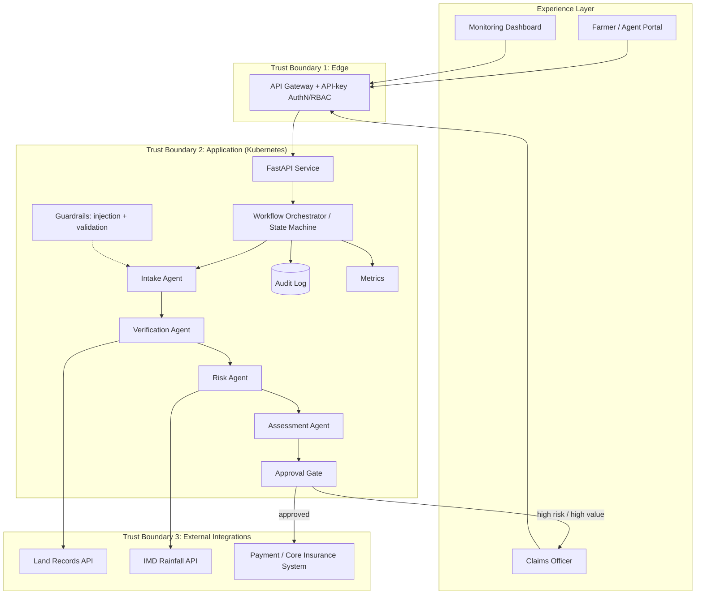
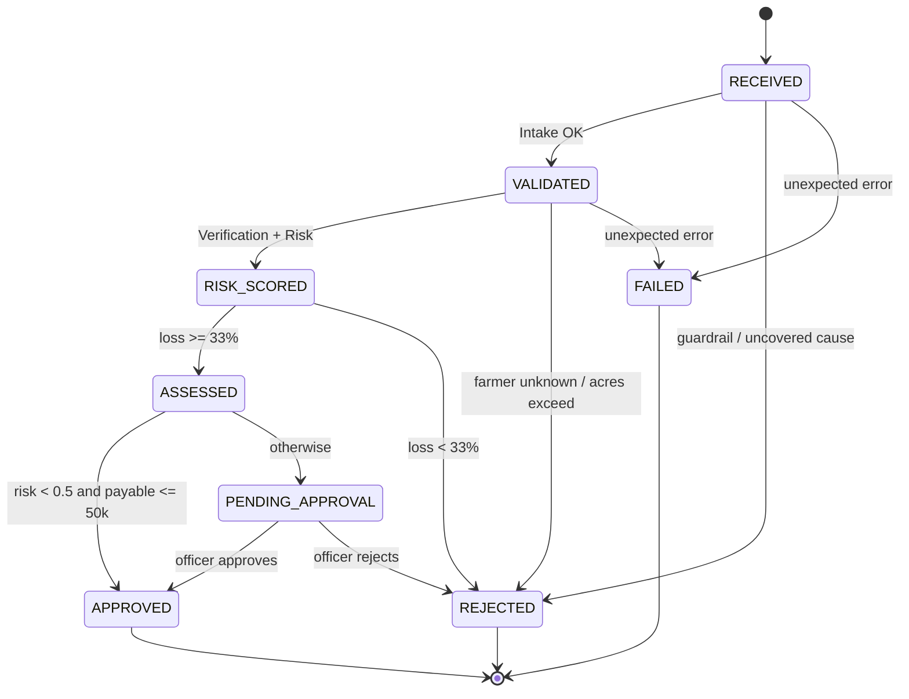

# Capstone Deliverables — AgroMitra

**Name:** Deepak R | **Roll No:** 2023103527
**Project:** Agentic AI crop-loss insurance claim processing (Tamil Nadu)

---

## 1. Architecture Diagram

**Layers:** Experience (portal, officer UI, dashboard) -> Edge (gateway, auth) -> Application
(API, orchestrator, agents, guardrails) -> Data/Observability (audit, metrics) -> External
integrations (land records, weather, payments).

**Trust boundaries:** (1) Internet to gateway; (2) gateway to application, which is
authenticated and RBAC-enforced; (3) application to third-party APIs, which have
least-privilege credentials, timeouts and retries.

**Integrations:** Land Records (verification), IMD rainfall (risk), payment system (payout on approval).

---

## 2. Agent Workflow Design

| Agent | Role | Tools | Input state -> Output state |
|---|---|---|---|
| Intake | Validate and sanitize | Guardrail regex, schema | RECEIVED -> VALIDATED |
| Verification | Confirm farmer and acreage | `land_record_lookup` (retry x3) | VALIDATED -> VALIDATED |
| Risk | Fraud / anomaly score | `rainfall_lookup` | -> RISK_SCORED |
| Assessment | Compute payable amount | Policy rules | -> ASSESSED |
| Approval Gate | Route decision | Thresholds | -> APPROVED / PENDING_APPROVAL |

- **Handoffs:** agents communicate only through the shared `ClaimRecord`. Each handoff appends an audit event.
- **Approvals:** claims with risk >= 0.5 or payable > INR 50,000 require a human officer, who must supply a reason.
- **Failure paths:** business rejections carry a reason. Tool timeouts are retried 3 times. Any unhandled error moves the claim to `FAILED` (dead-letter) for manual handling, and the pipeline never silently continues.

---

## 3. Deployment Strategy

- **Runtime:** containerised FastAPI (Python 3.12-slim, non-root), served by Uvicorn.
- **Scaling:** Kubernetes Deployment with 2 replicas and an HPA (2 to 6 pods at 70% CPU). The service is stateless; the in-memory store is replaced by PostgreSQL/Redis for multi-replica use.
- **Resilience:** readiness and liveness probes on `/health`, resource limits, rolling updates, retries with timeouts on tool calls, and a dead-letter state for failures.
- **Environments:** `dev` (docker-compose), `staging` (K8s namespace with synthetic data), `prod` (K8s with secrets from a vault). Config comes from environment variables only.
- **Release:** GitHub Actions runs lint, pytest, image build and scan. Staging gets a rolling deploy, then manual promotion to prod using canary (10% -> 100%) with automatic rollback if the failure rate or p95 latency breaches its SLO.

---

## 4. Security Model

| Area | Control |
|---|---|
| Identity | API-key identity mapped to roles; production swaps to OAuth2/OIDC (e.g. Azure AD / Keycloak) |
| Authorization | RBAC: `submitter` (submit/view), `officer` (decide, metrics), `admin` (all); deny by default, 401/403 enforced and tested |
| Secrets | Env vars / K8s Secrets only; no secrets in the repo (`.env.example` holds placeholders) |
| Privacy | Farmer IDs masked in every response (`TN****01`); minimal data collected; encryption in transit (TLS at the gateway) |
| Guardrails | Pydantic validation, injection and unsafe-pattern blocking, coverage-rule checks, and human approval for high-risk or high-value claims |
| Audit | Immutable per-claim event trail (actor, event, detail, timestamp) including every human decision |
| Platform | Non-root container, resource limits, image scanning, least-privilege credentials to external APIs |

---

## 5. Monitoring Dashboard Design

Implemented at `GET /` (live, auto-refresh 5 s), backed by `/api/metrics` and Prometheus `/metrics`.

| Dimension | Metrics | Alert example |
|---|---|---|
| Health | Service status, pod readiness | `/health` down for 1 min |
| Trace | Per-claim audit trail (agent, event, time) | n/a (drill-down view) |
| Quality | Auto-approval rate, rejection rate, human override rate | Rejection rate > 50% |
| Safety | Guardrail blocks, injection attempts | Spike > 10/min |
| Reliability | Failure rate, p95 latency | Failure > 2% or p95 > 500 ms |
| Cost | Compute per claim, LLM tokens per claim (when an LLM is added) | Cost per claim above budget |
| Business outcomes | Claims processed, total payout (INR), pending reviews, time to decision | Pending queue > 50 |

Production stack: Prometheus (scrape `/metrics`) -> Grafana dashboards -> Alertmanager.
