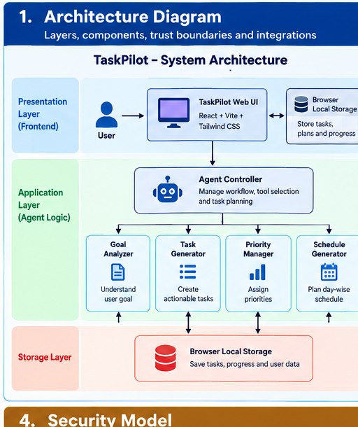
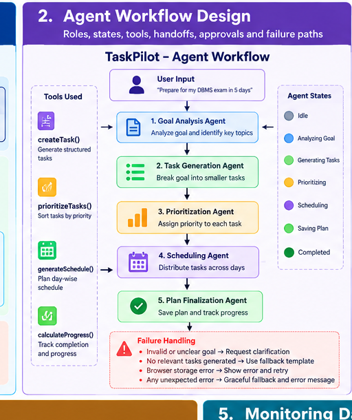
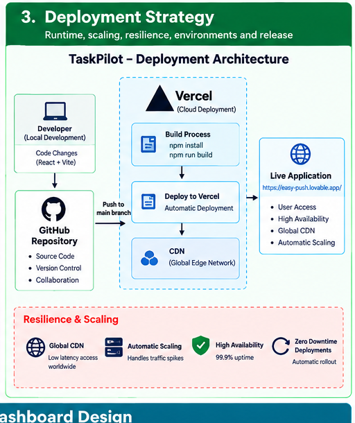
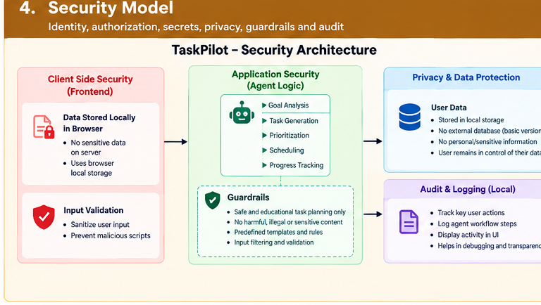
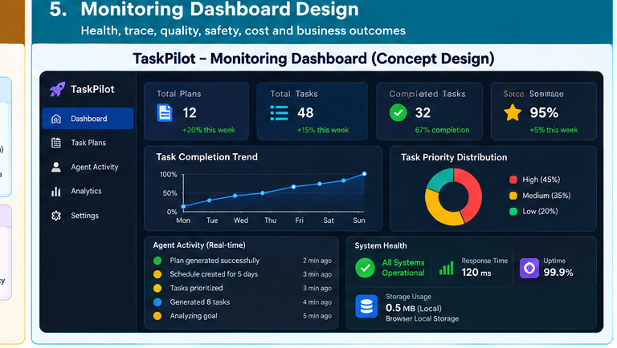

# TaskPilot -- Agentic AI Task Planner

## Capstone Deliverables

**Project Type:** Agentic AI Productivity and Task Planning Application\
**Live Application:** https://easy-push.lovable.app/\
**Development Platform:** Lovable\
**Frontend:** React, TypeScript, Vite, Tailwind CSS\
**Persistence:** Browser Local Storage

------------------------------------------------------------------------

# 1. Architecture Diagram
> **Visual Evidence**
>
> Add your architecture diagram/screenshot here:
>
> 
>
> **Image file:** `screenshots/architecture.png`


## 1.1 Architecture Overview

TaskPilot follows a lightweight agentic application architecture in
which a user's high-level goal is transformed into an actionable task
plan.

``` text
┌──────────────────────────────────────────────────────────────┐
│                         USER LAYER                           │
│  Goal Input │ Example Goals │ Task Completion │ Dashboard   │
└─────────────────────────────┬────────────────────────────────┘
                              │
                              ▼
┌──────────────────────────────────────────────────────────────┐
│                    PRESENTATION LAYER                        │
│ Goal Input │ Agent Activity │ Task Cards │ Progress │ UI    │
└─────────────────────────────┬────────────────────────────────┘
                              │
                              ▼
┌──────────────────────────────────────────────────────────────┐
│                     AGENT CONTROL LAYER                      │
│                      Agent Controller                        │
│  Goal Analysis → Planning → Tool Selection → Observation    │
└───────────────┬──────────────────┬───────────────────────────┘
                │                  │
                ▼                  ▼
┌─────────────────────────┐   ┌────────────────────────────────┐
│     AGENT TOOLS         │   │       PLANNING LOGIC            │
│ createTask()            │   │ Goal Pattern Detection          │
│ prioritizeTasks()       │   │ Task Decomposition              │
│ generateSchedule()      │   │ Priority Assignment             │
│ calculateProgress()     │   │ Schedule Generation             │
└────────────┬────────────┘   └───────────────┬────────────────┘
             │                                │
             └───────────────┬────────────────┘
                             ▼
┌──────────────────────────────────────────────────────────────┐
│                    STATE / DATA LAYER                        │
│                  Browser Local Storage                       │
│ Goals │ Tasks │ Priorities │ Schedule │ Progress            │
└─────────────────────────────┬────────────────────────────────┘
                              │
                              ▼
┌──────────────────────────────────────────────────────────────┐
│                         OUTPUT                               │
│                 Action Plan + Progress Dashboard             │
└──────────────────────────────────────────────────────────────┘
```

## 1.2 Architectural Layers

### User Layer

The user provides a natural-language objective such as:

> Prepare for my DBMS exam in 5 days.

### Presentation Layer

The interface provides goal input, generated tasks, agent activity,
progress information, and task controls.

### Agent Control Layer

The agent controller manages the planning workflow and coordinates the
internal tools.

### Agent Tool Layer

Four lightweight tools support the workflow:

-   `createTask()`
-   `prioritizeTasks()`
-   `generateSchedule()`
-   `calculateProgress()`

### State and Data Layer

Task and goal information is persisted using browser Local Storage. The
current prototype does not require a separate database.

### Output Layer

The generated action plan and progress information are presented through
the dashboard.

## 1.3 Trust Boundaries and Integrations

The application has a small trust boundary:

``` text
User Browser
     │
     ├── User Input
     │
     ├── React Application
     │
     ├── Agent Planning Logic
     │
     └── Local Storage
```

The current prototype does not require external AI APIs, a cloud
database, or external authentication services. This keeps the
demonstration lightweight and reduces external dependencies.

------------------------------------------------------------------------

# 2. Agent Workflow Design
> **Visual Evidence**
>
> Add your agent workflow diagram/screenshot here:
>
> 
>
> **Image file:** `screenshots/agent-workflow.png`


## 2.1 Agent Objective

The TaskPilot agent converts a high-level user goal into a structured,
prioritized, scheduled, and trackable action plan.

## 2.2 Agent Workflow

``` text
                ┌───────────────┐
                │   User Goal   │
                └───────┬───────┘
                        ▼
                ┌───────────────┐
                │ Goal Analysis │
                └───────┬───────┘
                        ▼
                ┌───────────────┐
                │ Task Planning │
                └───────┬───────┘
                        ▼
                ┌───────────────┐
                │ Tool Selection│
                └───────┬───────┘
                        ▼
        ┌───────────────┼────────────────┐
        ▼               ▼                ▼
  createTask()   prioritizeTasks()  generateSchedule()
        │               │                │
        └───────────────┼────────────────┘
                        ▼
                ┌───────────────┐
                │  Observation  │
                └───────┬───────┘
                        ▼
                ┌───────────────┐
                │ Progress Check│
                └───────┬───────┘
                        ▼
                ┌───────────────┐
                │ Save Plan     │
                └───────┬───────┘
                        ▼
                ┌───────────────┐
                │   Dashboard   │
                └───────────────┘
```

## 2.3 Agent Roles

### Agent Controller

Coordinates the complete planning process.

### Goal Analyzer

Interprets the user's high-level goal and identifies the planning
context.

### Task Planner

Breaks the goal into smaller actionable activities.

### Priority Manager

Assigns High, Medium, or Low priority to tasks.

### Schedule Manager

Distributes tasks across available days.

### Progress Monitor

Tracks completed and pending tasks and calculates completion percentage.

## 2.4 Agent States

The application can represent the workflow through the following states:

1.  `IDLE`
2.  `GOAL_RECEIVED`
3.  `ANALYZING`
4.  `GENERATING_TASKS`
5.  `PRIORITIZING`
6.  `SCHEDULING`
7.  `SAVING`
8.  `COMPLETED`
9.  `ERROR`

## 2.5 Tool Handoffs

``` text
Goal Analyzer
      │
      ▼
Task Generator
      │
      ▼
Priority Tool
      │
      ▼
Schedule Tool
      │
      ▼
Progress Tool
      │
      ▼
Dashboard
```

## 2.6 Approvals and Human Control

TaskPilot is designed as a human-in-the-loop productivity application.

The user:

-   Provides the original goal.
-   Reviews the generated plan.
-   Marks tasks as completed.
-   Can delete or modify tasks.
-   Controls the actual execution of the plan.

The agent generates recommendations and a plan; it does not autonomously
perform external actions on behalf of the user.

## 2.7 Failure Paths

The system handles common failure conditions:

### Empty Goal

If the user submits an empty goal, the application displays an input
validation message.

### Invalid or Unsupported Goal

The application falls back to a generic structured planning template.

### Local Storage Failure

The application can continue to display the current session state while
reporting a storage-related error.

### Plan Generation Failure

The interface provides an error state rather than silently producing an
invalid plan.

## 2.8 Agent Activity Visibility

The UI displays concise workflow events such as:

``` text
✓ Goal received
✓ Goal analyzed
✓ Tasks generated
✓ Priorities assigned
✓ Schedule created
✓ Plan saved
```

Only high-level action/status information is shown. Hidden
chain-of-thought or private reasoning is not exposed.

------------------------------------------------------------------------

# 3. Deployment Strategy
> **Visual Evidence**
>
> Add your deployment architecture/deployment screenshot here:
>
> 
>
> **Image file:** `screenshots/deployment.png`


## 3.1 Deployment Architecture

``` text
                 ┌─────────────────┐
                 │    Developer    │
                 └────────┬────────┘
                          │
                          ▼
                 ┌─────────────────┐
                 │     GitHub      │
                 │ Source Control  │
                 └────────┬────────┘
                          │
                          ▼
                 ┌─────────────────┐
                 │   Deployment    │
                 │    Platform     │
                 └────────┬────────┘
                          │
                          ▼
                 ┌─────────────────┐
                 │ Production Web  │
                 │   Application   │
                 └─────────────────┘
```

The current live TaskPilot prototype is available at:

**https://easy-push.lovable.app/**

## 3.2 Runtime

The application is a browser-based React application.

Runtime components include:

-   React UI
-   TypeScript application logic
-   Client-side agent planning logic
-   Browser Local Storage

No dedicated backend server is required for the current prototype.

## 3.3 Environment Separation

The project can be maintained using:

-   Development environment
-   Preview/testing environment
-   Production environment

The production environment exposes the live application for
demonstration.

## 3.4 Scaling Strategy

The current implementation is intentionally lightweight and suitable for
a prototype or academic demonstration.

For future scaling:

``` text
Client
   ↓
CDN / Web Hosting
   ↓
Application API
   ↓
Agent Orchestrator
   ↓
LLM / AI Services
   ↓
Database + Vector Store
```

Future scaling can introduce:

-   Cloud database
-   User authentication
-   LLM APIs
-   Background job processing
-   Distributed agent workers
-   Caching
-   Monitoring
-   Rate limiting

## 3.5 Resilience

Current resilience mechanisms include:

-   Client-side validation
-   Error states
-   Local state management
-   Browser persistence
-   Graceful fallback planning for unsupported goals

Future production resilience can include:

-   API retries
-   Timeouts
-   Circuit breakers
-   Centralized logging
-   Health checks
-   Backup and recovery

## 3.6 Release Strategy

The recommended release process is:

``` text
Development
     ↓
Local Testing
     ↓
Git Commit
     ↓
Repository Push
     ↓
Preview Validation
     ↓
Production Deployment
     ↓
Live Application Verification
```

------------------------------------------------------------------------

# 4. Security Model
> **Visual Evidence**
>
> Add your security model diagram/screenshot here:
>
> 
>
> **Image file:** `screenshots/security.png`


## 4.1 Security Overview

TaskPilot is currently a client-side academic prototype. The security
model focuses on input validation, safe browser storage, avoiding
unnecessary secrets, and maintaining user control.

## 4.2 Identity and Authentication

The current version does not require user authentication.

For a future multi-user version, the system can introduce:

-   User registration
-   Secure login
-   Session management
-   OAuth
-   Role-based access control

## 4.3 Authorization

The current application operates within the user's browser and does not
expose administrative functions.

For future server-side deployment, authorization should be applied to:

-   User data
-   Plans
-   Tasks
-   Administrative features
-   AI tools
-   External integrations

## 4.4 Secrets Management

The current prototype does not require an external AI API key.

For future LLM integrations:

-   API keys must never be hard-coded in frontend source code.
-   Secrets should be stored as environment variables or a secure secret
    manager.
-   Production secrets should not be committed to GitHub.

Files such as `.env` and `.env.local` should be excluded from source
control when they contain secrets.

## 4.5 Privacy

The current version stores planning information in browser Local
Storage.

Users should avoid entering highly sensitive personal, financial,
medical, or confidential organizational information into a demonstration
deployment.

A future cloud version should provide:

-   Data encryption
-   Data retention controls
-   User deletion controls
-   Privacy policy
-   Secure database access

## 4.6 Guardrails

TaskPilot uses a controlled planning workflow.

The agent:

-   Generates plans rather than taking irreversible external actions.
-   Keeps the user in control of task execution.
-   Displays high-level agent status.
-   Uses predefined planning logic in the current prototype.
-   Does not expose hidden model reasoning.

## 4.7 Auditability

The Agent Activity panel provides a lightweight user-visible record of
the main planning stages:

``` text
Goal Received
→ Goal Analyzed
→ Tasks Generated
→ Priorities Assigned
→ Schedule Created
→ Plan Saved
```

A future enterprise implementation could maintain structured audit logs
with timestamps, user IDs, tool calls, errors, and deployment versions.

------------------------------------------------------------------------

# 5. Monitoring Dashboard Design
> **Visual Evidence**
>
> Add your monitoring dashboard screenshot/design here:
>
> 
>
> **Image file:** `screenshots/monitoring.png`


## 5.1 Monitoring Objectives

The monitoring design focuses on:

-   Application health
-   Agent workflow status
-   Task quality
-   User progress
-   Safety
-   Performance
-   Cost for future AI integrations

## 5.2 Current Dashboard Metrics

The TaskPilot dashboard can display:

  Metric                  Purpose
  ----------------------- -----------------------------------
  Total Tasks             Number of generated tasks
  Completed Tasks         Tasks completed by the user
  Pending Tasks           Remaining tasks
  Completion %            Overall plan progress
  Priority Distribution   High/Medium/Low task distribution
  Agent Activity          Current workflow status

## 5.3 Agent Health

A future monitoring dashboard should track:

``` text
Agent Runs
Successful Runs
Failed Runs
Average Planning Time
Tool Errors
Fallback Usage
```

## 5.4 Traceability

For each agent execution, a future production system can record:

``` text
Request ID
     ↓
Goal Analysis
     ↓
Task Generation
     ↓
Priority Assignment
     ↓
Schedule Generation
     ↓
Progress Calculation
     ↓
Final Response
```

This enables troubleshooting and performance analysis without exposing
private reasoning.

## 5.5 Quality Monitoring

Useful quality metrics include:

-   Task completion rate
-   User modification rate
-   Plan regeneration rate
-   Task rejection rate
-   Average tasks per goal
-   Schedule adherence
-   User feedback

## 5.6 Safety Monitoring

Potential safety indicators include:

-   Invalid input rate
-   Tool execution failures
-   Unexpected outputs
-   Excessive task generation
-   External action attempts
-   Policy/guardrail violations if future LLM tools are added

## 5.7 Cost Monitoring

The current prototype has no paid AI inference dependency.

For a future LLM-powered version, monitor:

-   LLM requests
-   Token usage
-   Cost per plan
-   Cost per user
-   Tool invocation count
-   Embedding usage
-   API error rate

## 5.8 Business / User Outcomes

The main outcome metrics for TaskPilot are:

``` text
Goal → Plan
Plan → Task Completion
Task Completion → Progress
Progress → Goal Achievement
```

Potential product metrics include:

-   Number of plans created
-   Average task completion percentage
-   Returning users
-   Average planning sessions
-   User satisfaction
-   Goal completion rate

------------------------------------------------------------------------

# Visual Evidence and Screenshot Checklist

Place the following files inside the `screenshots/` folder in the same directory as this Markdown file:

```text
screenshots/
├── architecture.png
├── agent-workflow.png
├── deployment.png
├── security.png
└── monitoring.png
```

These five images correspond directly to the five required capstone deliverables:

| Image | Required Deliverable | What it should show |
|---|---|---|
| `architecture.png` | Architecture Diagram | Layers, components, data flow, trust boundaries and integrations |
| `agent-workflow.png` | Agent Workflow Design | Agent roles, states, tools, handoffs, human approval and failure paths |
| `deployment.png` | Deployment Strategy | Runtime, deployment flow, environments, scaling and release process |
| `security.png` | Security Model | Identity, authorization, secrets, privacy, guardrails and audit |
| `monitoring.png` | Monitoring Dashboard Design | Health, traceability, quality, safety, cost and user outcomes |

> **Important:** Keep the image filenames exactly as shown above, or update the Markdown image paths if you use different filenames.

---

# 6. Capstone Deliverables Summary

TaskPilot provides the following five enterprise-architecture
deliverables:

  -----------------------------------------------------------------------
  \#                      Deliverable             Coverage
  ----------------------- ----------------------- -----------------------
  1                       Architecture Diagram    Layers, components,
                                                  trust boundaries and
                                                  integrations

  2                       Agent Workflow Design   Roles, states, tools,
                                                  handoffs, approvals and
                                                  failure paths

  3                       Deployment Strategy     Runtime, scaling,
                                                  resilience,
                                                  environments and
                                                  release

  4                       Security Model          Identity,
                                                  authorization, secrets,
                                                  privacy, guardrails and
                                                  audit

  5                       Monitoring Dashboard    Health, trace, quality,
                          Design                  safety, cost and user
                                                  outcomes
  -----------------------------------------------------------------------

------------------------------------------------------------------------


> **Image Support:** This Markdown document uses relative image paths so the diagrams render correctly on GitHub. Keep the `screenshots` folder alongside `TaskPilot_Deliverables.md` when committing the project.

# 7. Project Deliverables Files

The project submission should contain:

``` text
TaskPilot/
│
├── src/
├── public/
├── screenshots/
│
├── README.md
├── GENERATION_PROMPT.md
├── TaskPilot_Deliverables.md
└── Deployment_Link.md
```

## Documentation Files

### `README.md`

Provides the project overview, setup instructions, architecture,
features, and usage information.

### `GENERATION_PROMPT.md`

Contains the prompt used to generate the TaskPilot application.

### `TaskPilot_Deliverables.md`

Contains the five capstone architecture deliverables documented in this
file.

### `Deployment_Link.md`

Contains the live application URL.

------------------------------------------------------------------------

# 8. Live Application

**Project:** TaskPilot -- Agentic AI Task Planner

**Live URL:**\
https://easy-push.lovable.app/

------------------------------------------------------------------------

# 9. Final Conclusion

TaskPilot demonstrates a complete lightweight architecture for an
Agentic AI productivity application.

The project covers the five major capstone deliverables:

1.  **Architecture Diagram** -- explains system layers, components,
    boundaries, and integrations.
2.  **Agent Workflow Design** -- explains agent roles, states, tools,
    handoffs, human approvals, and failure handling.
3.  **Deployment Strategy** -- explains runtime, deployment, scaling,
    resilience, environments, and release flow.
4.  **Security Model** -- explains identity, authorization, secrets,
    privacy, guardrails, and auditability.
5.  **Monitoring Dashboard Design** -- defines health, traceability,
    quality, safety, cost, and user-outcome metrics.

The current implementation intentionally remains lightweight and
browser-based while providing a clear foundation for future expansion
into a production-grade multi-agent AI platform with LLM integration,
cloud storage, authentication, monitoring, and autonomous plan
adaptation.
