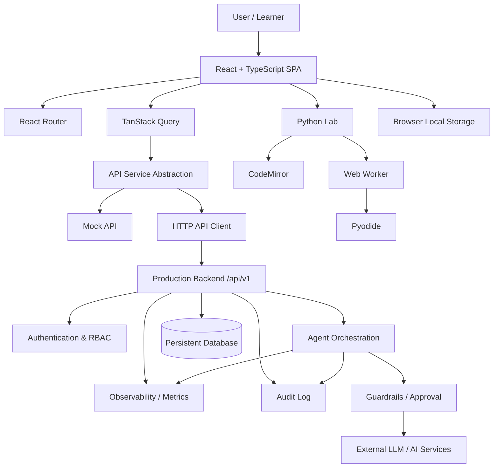
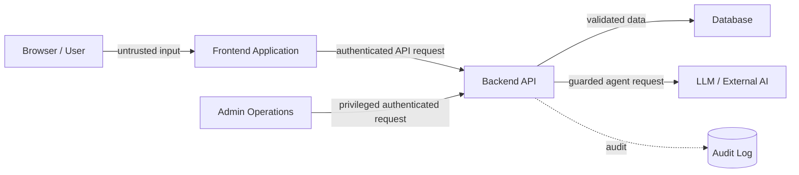
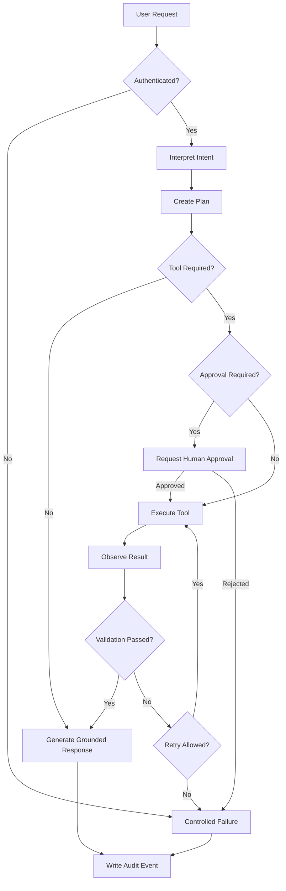
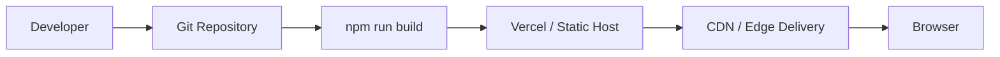

# Armor Forge — Capstone Deliverables

> **Submission folder:** `RollNo-Name`  
> **Application:** Armor Forge  
> **Live application:** `https://cosmic-sunflower-a0b649.netlify.app/`

## 0. Executive Summary

**Armor Forge** is an interactive, browser-based AI engineering workshop. The learner progresses through 12 mission chapters, beginning with Python fundamentals and moving through data science, machine learning, neural networks, computer vision, NLP, reinforcement learning, RAG, and agentic AI.

The application combines narrative progression with actual interaction: learners inspect concepts, solve matching exercises, edit Python code in the browser, execute code through Pyodide, submit tests, view results, and unlock additional armor systems.

The current deployed demonstration uses a frontend mock API and local browser state. An OpenAPI contract defines the backend boundary for production authentication, progress persistence, agent execution, approvals, metrics, guardrails, and audit logging.

---

# 1. Architecture Diagram

## 1.1 High-Level Architecture



## 1.2 Frontend Layers

| Layer | Implementation | Responsibility |
|---|---|---|
| Presentation | React components/pages | UI and user interaction |
| Routing | React Router | SPA navigation |
| Server-state boundary | TanStack Query | Queries and mutations |
| API boundary | `src/services/api` | Mock/HTTP implementation switching |
| Schema boundary | Zod | Runtime validation |
| Local runtime state | `localStorage` | Demo progress/code persistence |
| Python execution | Web Worker + Pyodide | Isolated browser execution |
| 3D visualisation | Three.js / FBX loader | Armor workshop visual |
| Motion | Motion primitives | Mission transitions and visual feedback |

## 1.3 Main Application Components

- **Landing** — cinematic introduction and Forge Protocol entry point.
- **Map** — campaign progression through 12 systems.
- **Level** — mission briefing, concept deck, matching game, and Python lab.
- **Workshop** — 3D armor/system assembly view.
- **Progress** — XP, forged systems, missions, and current objective.
- **Glossary** — searchable AI/engineering concept index.
- **API abstraction** — central client boundary supporting mock and HTTP modes.
- **OpenAPI contract** — documented backend interface.

## 1.4 Trust Boundaries



The browser is not a security boundary. In production, authentication, authorization, validation, rate limiting, guardrails, secret handling, and audit enforcement must happen server-side.

---

# 2. Agent Workflow Design

## 2.1 Agentic Architecture

The current frontend establishes the UI and API contract for future agentic capabilities. The OpenAPI contract includes:

- agent run creation
- agent trace retrieval
- SSE event streaming
- JARVIS chat
- skip/approval requests
- agent configuration
- guardrail configuration
- audit logs

A production agent should therefore operate through an explicit stateful workflow rather than directly executing arbitrary actions.

## 2.2 Proposed Agent Workflow



## 2.3 Agent Roles

| Role | Responsibility |
|---|---|
| JARVIS / Orchestrator | Understand request, coordinate workflow, maintain state |
| Retrieval component | Find relevant trusted context before generation |
| Tool executor | Invoke an approved application/API capability |
| Validator | Check tool output and expected schema |
| Guardrail layer | Block unsafe, unauthorized, or invalid actions |
| Human approver | Approve high-impact actions |
| Audit component | Record security-relevant and agent decisions |

## 2.4 State Model

Recommended states:

```text
RECEIVED
  ↓
AUTHENTICATED
  ↓
PLANNING
  ↓
WAITING_FOR_APPROVAL ──→ REJECTED
  ↓
EXECUTING
  ↓
OBSERVING
  ↓
VALIDATING
  ├──→ RETRYING ──→ EXECUTING
  ├──→ FAILED
  └──→ COMPLETED
```

The application already contains a dedicated orchestration/state-machine module, which keeps workflow state separate from presentation components.

## 2.5 Failure Paths

- Invalid input → validation error.
- Unauthenticated request → `401`.
- Unauthorized operation → `403`.
- Invalid challenge submission → `422`.
- Rate limit exceeded → `429`.
- Agent/tool failure → controlled retry or failure state.
- External AI failure → fallback/error response.
- Human approval rejected → terminate requested action safely.
- Timeout → terminate execution and record the event.
- Unexpected exception → `5xx` response with trace identifier and audit event.

---

# 3. Deployment Strategy

## 3.1 Current Deployment Model

Armor Forge is designed as a Vite-built single-page application.



The repository includes a `vercel.json` SPA rewrite so application routes continue to resolve to `index.html` when a user refreshes a deep link.

## 3.2 Runtime

### Demo mode

```text
Browser
  ├── React application
  ├── localStorage
  ├── Mock API
  ├── Pyodide Web Worker
  └── Three.js / FBX renderer
```

No backend or API secret is required in the default mock configuration.

### Production mode

```text
Browser
   ↓
Frontend
   ↓
/api/v1 Backend
   ├── Authentication
   ├── Authorization
   ├── Progress
   ├── Challenges
   ├── Agent orchestration
   ├── Guardrails
   ├── Metrics
   └── Audit
```

## 3.3 Scaling

The frontend is stateless and suitable for CDN/static hosting.

A production backend should scale independently:

- horizontally scale API instances
- use a managed database
- use asynchronous workers for long-running agent jobs
- stream agent events using SSE
- use caching for frequently requested read-only content
- isolate code execution from the API process

## 3.4 Resilience

Recommended production controls:

- health endpoint
- request timeouts
- retry policies for transient dependencies
- circuit breakers where appropriate
- structured error envelopes
- request trace IDs
- database connection pooling
- isolated code execution
- graceful degradation when AI services are unavailable

## 3.5 Release Strategy

```text
Commit
  ↓
Install dependencies
  ↓
Type check
  ↓
Automated tests
  ↓
Production build
  ↓
Deploy
  ↓
Smoke test
  ↓
Monitor
```

Rollback should restore the previous known-good frontend deployment and, for backend changes, use versioned migrations and backward-compatible API changes.

## 3.6 Live Application

**Deployed URL:** `https://cosmic-sunflower-a0b649.netlify.app/`

---

# 4. Security Model

## 4.1 Identity

Production authentication should be handled by the backend. The frontend may display role-specific experiences, but client-side role selection is not authorization.

The documented API includes authentication and current-user endpoints.

## 4.2 Authorization

Use server-side RBAC/ABAC for:

- learner actions
- mentor/cohort functions
- administrator configuration
- guardrail configuration
- content editing
- audit-log access

Never rely on hidden buttons or frontend route guards as the only authorization mechanism.

## 4.3 Secrets

The project includes `.env.example`.

Rules:

- never commit `.env`
- never place service credentials in `VITE_*` variables
- keep LLM/API/database credentials on the server
- rotate compromised credentials
- use managed secret storage in production

## 4.4 Input Validation

Validate:

- request body
- query parameters
- route parameters
- challenge submissions
- agent tool arguments
- external API responses

The application uses Zod at the frontend schema boundary and defines a formal OpenAPI backend contract.

## 4.5 Code Execution Security

The browser Python lab uses Pyodide/Web Worker execution for the demonstration.

A production backend must not execute arbitrary learner code inside the main API process. Use a sandboxed execution environment with:

- CPU limits
- memory limits
- execution timeout
- filesystem restrictions
- network restrictions
- process/container isolation
- resource quotas

## 4.6 AI Guardrails

Agentic operations should enforce:

- tool allowlists
- schema validation
- prompt/context boundaries
- output validation
- rate limiting
- sensitive-data controls
- approval for high-impact actions
- audit logging

LLM-generated content must be treated as untrusted output.

## 4.7 Privacy

Minimize stored learner data. Store only information required for:

- account identity
- progress
- challenge results
- required audit/security events

Avoid storing secrets or unnecessary personal information.

---

# 5. Monitoring Dashboard Design

## 5.1 Dashboard Goals

The monitoring layer should measure five dimensions:

1. **Health**
2. **Trace / performance**
3. **Quality**
4. **Safety**
5. **Cost / business outcomes**

## 5.2 Dashboard Layout

```text
┌─────────────────────────────────────────────────────────────┐
│ ARMOR FORGE OPERATIONS                                      │
├─────────────┬─────────────┬─────────────┬───────────────────┤
│ API HEALTH  │ AGENT HEALTH│ ERROR RATE  │ ACTIVE USERS      │
├─────────────┴─────────────┴─────────────┴───────────────────┤
│                                                             │
│ Request / Agent Latency Timeline                             │
│                                                             │
├─────────────────────────────┬───────────────────────────────┤
│ Agent Success / Failure     │ Tool / Model Usage            │
│                             │                               │
├─────────────────────────────┼───────────────────────────────┤
│ Guardrail Events            │ Cost / Token Consumption      │
│                             │                               │
├─────────────────────────────┴───────────────────────────────┤
│ Business Outcomes / Learning Progress                        │
└─────────────────────────────────────────────────────────────┘
```

## 5.3 Health Metrics

Track:

- API availability
- frontend errors
- backend errors
- dependency health
- Python execution failures
- agent execution availability

## 5.4 Trace Metrics

Track:

- request latency
- agent run duration
- tool latency
- LLM latency
- queue time
- timeout count
- trace IDs

The API contract includes an agent-run/event model suitable for streaming or polling traces.

## 5.5 Quality Metrics

Track:

- challenge completion rate
- test pass rate
- retry rate
- agent task success rate
- validation failure rate
- retrieval success rate
- user progression through the 12 missions

Do not present fabricated learner-performance scores as real measurements.

## 5.6 Safety Metrics

Track:

- guardrail blocks
- unauthorized requests
- approval requests
- rejected approvals
- tool-policy violations
- suspicious execution attempts
- audit-log failures

## 5.7 Cost Metrics

Track:

- LLM requests
- token usage
- model cost
- code-execution resource usage
- backend compute
- storage

## 5.8 Business / Learning Outcomes

Potential KPIs:

- learners entering the Forge
- missions started
- missions completed
- average time per mission
- coding challenge completion
- progression from fundamentals to agentic AI
- glossary usage
- learner retention

These should be sourced from real telemetry in production rather than hard-coded demo values.

---

# 6. Evidence in the Current Implementation

The supplied application contains:

- React + TypeScript + Vite frontend
- Tailwind CSS styling
- React Router navigation
- TanStack Query data access
- Motion-based interaction
- CodeMirror Python editor
- Pyodide/Web Worker execution
- Three.js FBX armor viewer
- local learner state
- mock/HTTP API abstraction
- OpenAPI backend contract
- 12 seeded campaign chapters
- glossary/search experience
- automated state-machine test

The deployed demonstration is intentionally frontend-first. The backend capabilities are documented through the API contract and should be enforced server-side when connected to a production backend.
