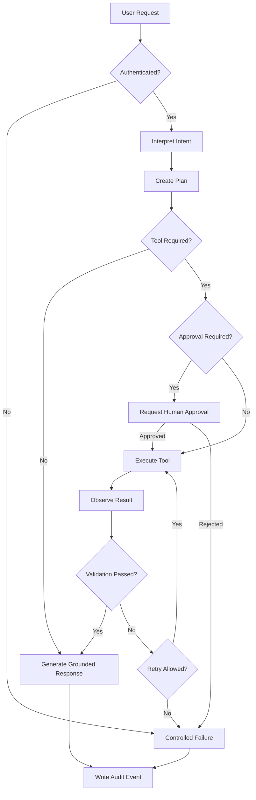

# 2. Agent Workflow Design

## 2.1 Agentic Architecture

The current frontend establishes the UI and API contract for future agentic capabilities. The OpenAPI contract includes:

- agent run creation
- agent trace retrieval
- SSE event streaming
- JARVIS chat
- skip/approval requests
- agent configuration
- guardrail configuration
- audit logs

A production agent should therefore operate through an explicit stateful workflow rather than directly executing arbitrary actions.

## 2.2 Proposed Agent Workflow



## 2.3 Agent Roles

| Role | Responsibility |
|---|---|
| JARVIS / Orchestrator | Understand request, coordinate workflow, maintain state |
| Retrieval component | Find relevant trusted context before generation |
| Tool executor | Invoke an approved application/API capability |
| Validator | Check tool output and expected schema |
| Guardrail layer | Block unsafe, unauthorized, or invalid actions |
| Human approver | Approve high-impact actions |
| Audit component | Record security-relevant and agent decisions |

## 2.4 State Model

Recommended states:

```text
RECEIVED
  ↓
AUTHENTICATED
  ↓
PLANNING
  ↓
WAITING_FOR_APPROVAL ──→ REJECTED
  ↓
EXECUTING
  ↓
OBSERVING
  ↓
VALIDATING
  ├──→ RETRYING ──→ EXECUTING
  ├──→ FAILED
  └──→ COMPLETED
```

The application already contains a dedicated orchestration/state-machine module, which keeps workflow state separate from presentation components.

## 2.5 Failure Paths

- Invalid input → validation error.
- Unauthenticated request → `401`.
- Unauthorized operation → `403`.
- Invalid challenge submission → `422`.
- Rate limit exceeded → `429`.
- Agent/tool failure → controlled retry or failure state.
- External AI failure → fallback/error response.
- Human approval rejected → terminate requested action safely.
- Timeout → terminate execution and record the event.
- Unexpected exception → `5xx` response with trace identifier and audit event.

---
