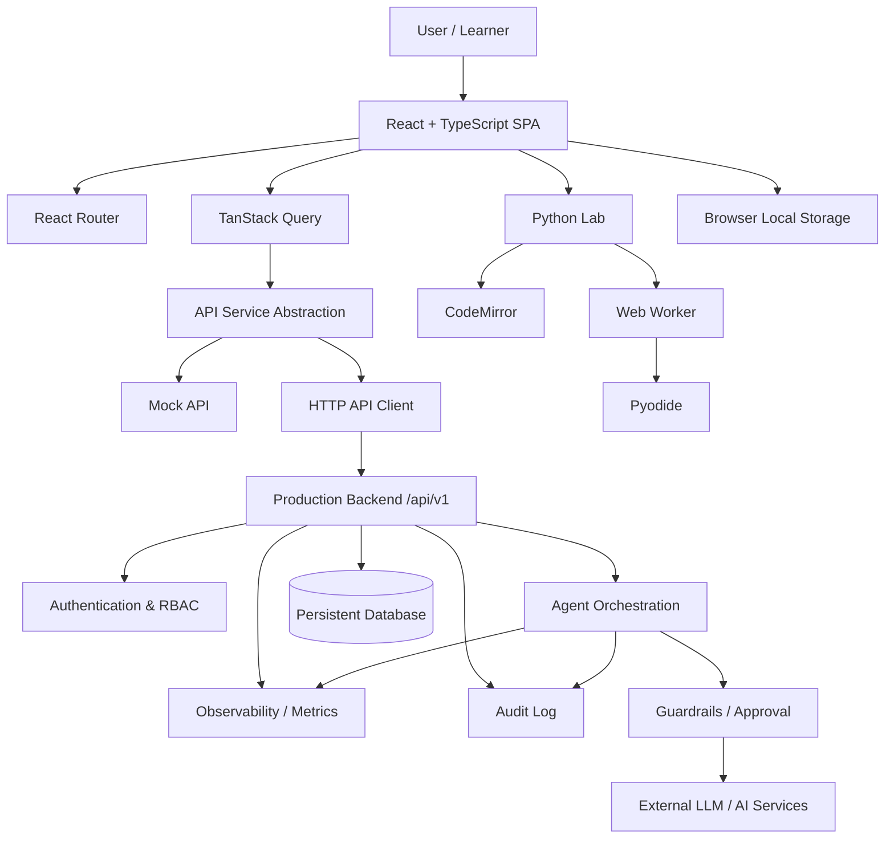
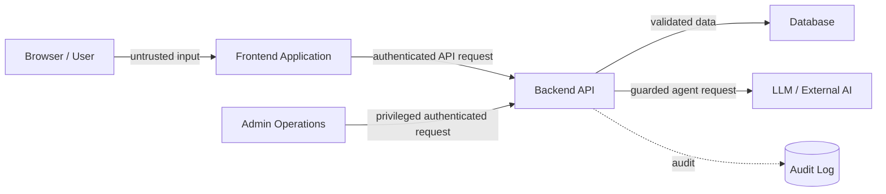

# 1. Architecture Diagram

## 1.1 High-Level Architecture

## 1.2 Frontend Layers

| Layer | Implementation | Responsibility |
|---|---|---|
| Presentation | React components/pages | UI and user interaction |
| Routing | React Router | SPA navigation |
| Server-state boundary | TanStack Query | Queries and mutations |
| API boundary | `src/services/api` | Mock/HTTP implementation switching |
| Schema boundary | Zod | Runtime validation |
| Local runtime state | `localStorage` | Demo progress/code persistence |
| Python execution | Web Worker + Pyodide | Isolated browser execution |
| 3D visualisation | Three.js / FBX loader | Armor workshop visual |
| Motion | Motion primitives | Mission transitions and visual feedback |

## 1.3 Main Application Components

- **Landing** — cinematic introduction and Forge Protocol entry point.
- **Map** — campaign progression through 12 systems.
- **Level** — mission briefing, concept deck, matching game, and Python lab.
- **Workshop** — 3D armor/system assembly view.
- **Progress** — XP, forged systems, missions, and current objective.
- **Glossary** — searchable AI/engineering concept index.
- **API abstraction** — central client boundary supporting mock and HTTP modes.
- **OpenAPI contract** — documented backend interface.

## 1.4 Trust Boundaries

The browser is not a security boundary. In production, authentication, authorization, validation, rate limiting, guardrails, secret handling, and audit enforcement must happen server-side.

---
