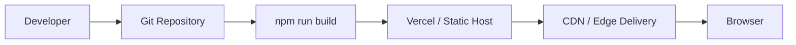

# 3. Deployment Strategy

## 3.1 Current Deployment Model

Armor Forge is designed as a Vite-built single-page application.



The repository includes a `vercel.json` SPA rewrite so application routes continue to resolve to `index.html` when a user refreshes a deep link.

## 3.2 Runtime

### Demo mode

```text
Browser
  ├── React application
  ├── localStorage
  ├── Mock API
  ├── Pyodide Web Worker
  └── Three.js / FBX renderer
```

No backend or API secret is required in the default mock configuration.

### Production mode

```text
Browser
   ↓
Frontend
   ↓
/api/v1 Backend
   ├── Authentication
   ├── Authorization
   ├── Progress
   ├── Challenges
   ├── Agent orchestration
   ├── Guardrails
   ├── Metrics
   └── Audit
```

## 3.3 Scaling

The frontend is stateless and suitable for CDN/static hosting.

A production backend should scale independently:

- horizontally scale API instances
- use a managed database
- use asynchronous workers for long-running agent jobs
- stream agent events using SSE
- use caching for frequently requested read-only content
- isolate code execution from the API process

## 3.4 Resilience

Recommended production controls:

- health endpoint
- request timeouts
- retry policies for transient dependencies
- circuit breakers where appropriate
- structured error envelopes
- request trace IDs
- database connection pooling
- isolated code execution
- graceful degradation when AI services are unavailable

## 3.5 Release Strategy

```text
Commit
  ↓
Install dependencies
  ↓
Type check
  ↓
Automated tests
  ↓
Production build
  ↓
Deploy
  ↓
Smoke test
  ↓
Monitor
```

Rollback should restore the previous known-good frontend deployment and, for backend changes, use versioned migrations and backward-compatible API changes.

## 3.6 Live Application

**Deployed URL:** `PASTE-YOUR-LIVE-LINK-HERE`

---
