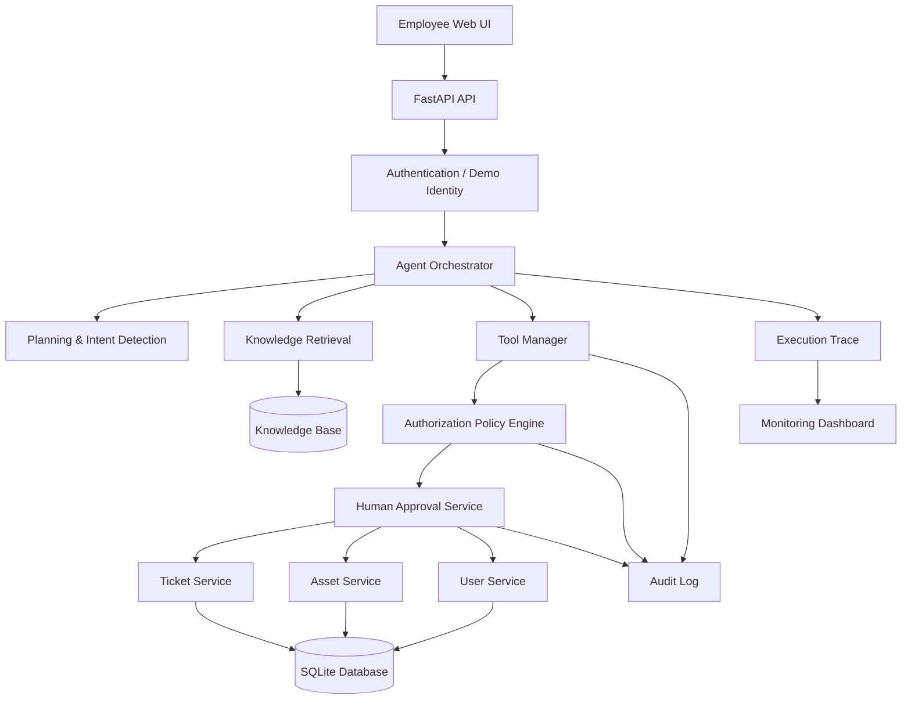

# Enterprise Agentic IT Service Assistant — Capstone Deliverables

**Student:** Jivetesh Balaji  
**Roll No:** 2023103032  
**Project:** Enterprise Agentic IT Service Assistant

---

## 1. Architecture Diagram



### Components

| Component | Responsibility |
|---|---|
| Web UI | Chat, quick actions, trace and monitoring |
| FastAPI API | HTTP interface and application boundary |
| Agent Orchestrator | Intent detection, planning, tool selection and response |
| Knowledge Retrieval | Searches IT policies and FAQs |
| Tool Manager | Provides controlled tool execution |
| Authorization Engine | Enforces role/permission checks |
| Approval Service | Controls high-risk operations |
| Ticket Service | Creates and retrieves tickets |
| Asset Service | Retrieves device information |
| User Service | Retrieves safe user information |
| SQLite | Local persistence |
| Audit/Trace | Security and observability records |
| Monitoring | Health, quality and business metrics |

---

# 2. Agent Workflow Design

## Main workflow

```text
User Request
    |
    v
Intent Detection
    |
    v
Execution Plan
    |
    +--> Knowledge Request ----> Knowledge Search ----+
    |                                                 |
    +--> Ticket Request -------> Ticket Tool ---------+
    |                                                 |
    +--> Asset Request --------> Asset Tool ----------+
    |                                                 |
    +--> Password Reset -------> Authorization ------> Approval
    |                                                 |
    +-----------------------------------------------+
                                                    |
                                                    v
                                             Verify Result
                                                    |
                                             +------+------+
                                             |             |
                                          Success       Failure
                                             |             |
                                             v             v
                                           Reply      Retry / Escalate
```

## Agent states

- `RECEIVED`
- `ANALYZING`
- `PLANNING`
- `RETRIEVING`
- `AUTHORIZING`
- `AWAITING_APPROVAL`
- `EXECUTING`
- `VERIFYING`
- `COMPLETED`
- `FAILED`

## Agent roles

### Orchestrator Agent
Coordinates the complete request lifecycle.

### Knowledge Agent
Searches internal IT policies and FAQs.

### Ticket Agent
Creates tickets and retrieves ticket status.

### Asset Agent
Looks up device information.

### Security Agent
Applies authorization and approval rules.

---

# 3. Deployment Strategy

## Local Development

```text
Developer
   |
   v
FastAPI + SQLite
```

## Containerized Deployment

```text
Internet
   |
Load Balancer / Reverse Proxy
   |
FastAPI Containers
   |
SQLite/PostgreSQL
```

For the capstone demo, Docker Compose is sufficient. In production, SQLite should be replaced by a managed relational database.

## Environments

```text
Development --> Staging --> Production
```

### Resilience

- Request validation
- Timeouts
- Controlled retries
- Health endpoint
- Exception handling
- Audit logging
- Database persistence
- Graceful failure messages

### Release strategy

1. Develop locally.
2. Run tests.
3. Build Docker image.
4. Deploy to staging.
5. Validate security and workflows.
6. Promote to production.

---

# 4. Security Model

## Authentication

The demonstration application uses a selected demo identity. A production version should integrate SSO/OAuth/OIDC.

## Authorization

Authorization is enforced at the tool boundary rather than trusting the model.

| Tool | EMPLOYEE | IT_SUPPORT | ADMIN |
|---|---:|---:|---:|
| Search Knowledge | Yes | Yes | Yes |
| Create Ticket | Yes | Yes | Yes |
| View Own Ticket | Yes | Yes | Yes |
| View Any Ticket | No | Yes | Yes |
| View Own Asset | Yes | Yes | Yes |
| View Any Asset | No | Yes | Yes |
| Password Reset | No | Yes* | Yes* |
| Delete Account | No | No | Yes* |

`*` High-risk operations require approval.

## Guardrails

- Least privilege
- Tool-level authorization
- Input validation
- No secret values in responses
- Audit logging
- Approval for high-risk actions
- Safe error messages
- Restricted cross-user data access

## Audit

Each important operation records:

- Timestamp
- User
- Role
- Intent
- Tool
- Authorization decision
- Approval state
- Result

---

# 5. Monitoring Dashboard Design

The dashboard tracks:

### Health
- Total requests
- Successful requests
- Failed requests
- Average latency

### Safety
- Authorization denials
- Approval requests
- High-risk operations
- Policy violations

### Agent Quality
- Tool calls
- Completed tasks
- Escalated tasks
- Knowledge searches

### Business Outcomes
- Tickets created
- Tickets resolved
- Automated task percentage

## Example dashboard

```text
+---------------------------------------------------------+
|             ENTERPRISE AGENT MONITORING                 |
+---------------------------------------------------------+
| Requests | Success | Avg Latency | Tickets Created     |
|    42    |   95%   |    120ms    |        11           |
+---------------------------------------------------------+
| Authorization Denials: 3                                |
| Approval Requests: 2                                    |
| Tool Failures: 1                                        |
+---------------------------------------------------------+
| Recent Agent Execution                                  |
| User -> Intent -> Plan -> Authorization -> Tool -> OK  |
+---------------------------------------------------------+
| Recent Audit Events                                     |
| 18:31 CREATE_TICKET ALLOWED                             |
| 18:29 VIEW_ASSET ALLOWED                                |
| 18:27 PASSWORD_RESET APPROVAL_REQUIRED                  |
+---------------------------------------------------------+
```

---

# Demonstration Scenarios

## Scenario 1 — Knowledge

User:

> How do I connect my laptop to the company Wi-Fi?

Expected:

1. Detect knowledge intent.
2. Search knowledge base.
3. Return the relevant procedure.
4. Record trace.

## Scenario 2 — Ticket creation

User:

> My laptop is overheating. Create an IT ticket.

Expected:

1. Detect ticket intent.
2. Create ticket.
3. Return ticket ID.
4. Record audit event.

## Scenario 3 — Unauthorized access

Employee:

> Show me another employee's asset information.

Expected:

1. Detect asset lookup.
2. Authorization check fails.
3. Tool is not executed.
4. Return access-denied response.
5. Record denial.

## Scenario 4 — High-risk operation

IT Support:

> Reset the password for user U1002.

Expected:

1. Detect password-reset intent.
2. Authorization succeeds.
3. Approval is required.
4. Request approval.
5. Execute only after approval.

---

# Conclusion

The application demonstrates that an agent is not simply a chatbot. It has:

**Reasoning → Planning → Tools → Authorization → Approval → Execution → Verification → Monitoring**

This directly covers the five capstone deliverables required for enterprise agentic AI architecture.
