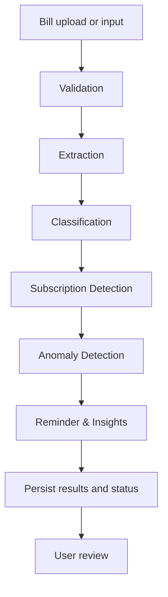

# Agent Workflow Design

The six responsibilities are defined in `SourceCode/src/lib/agents.ts`.

| Agent | Responsibility |
|---|---|
| Validation | Check input structure and required information. |
| Extraction | Identify candidate bill fields from uploaded/input material. |
| Classification | Categorize extracted bill information. |
| Subscription Detection | Detect recurring payment/service patterns and connect bills to subscriptions. |
| Anomaly Detection | Identify unusual values or changes for user review. |
| Reminder & Insights | Produce reminder-oriented and summary outputs from stored records. |

Server-side orchestration records run and step status; the workflow page surfaces activity and counts. Pass structured validated data, preserve actionable errors, and support retries. Show uncertain extraction/classification and anomalies for review. AI must not autonomously pay or cancel a bill.

The original concept listed additional analysis/report roles. Comparisons are part of subscription/anomaly detection, while summaries are part of Reminder & Insights in the implemented six-agent system.
