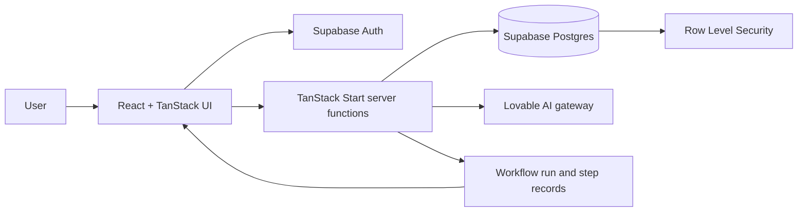

# System Architecture — BillPilot AI

BillPilot uses React 19, TypeScript, and TanStack Start/Router. TanStack Start renders UI and provides server functions. Supabase provides authentication and Postgres persistence; migrations define schema and policies. Server-side agent workflows call the Lovable AI gateway.

## Components
- Presentation routes: landing, login/signup, dashboard, bills, subscriptions, upload, alerts, workflow (`src/routes/`).
- Auth integration and middleware: `src/integrations/supabase/`.
- Agent definitions and orchestration: `src/lib/agents.ts`, `src/lib/workflow.server.ts`, `src/lib/workflow.functions.ts`.
- Persistence and policies: `supabase/migrations/`.
- AI provider: Lovable AI gateway called server-side.

The original brief mentioned FastAPI; the submitted source instead uses TanStack Start server functions with Supabase. No separate FastAPI service is claimed.
