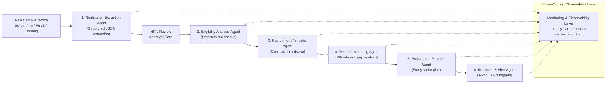
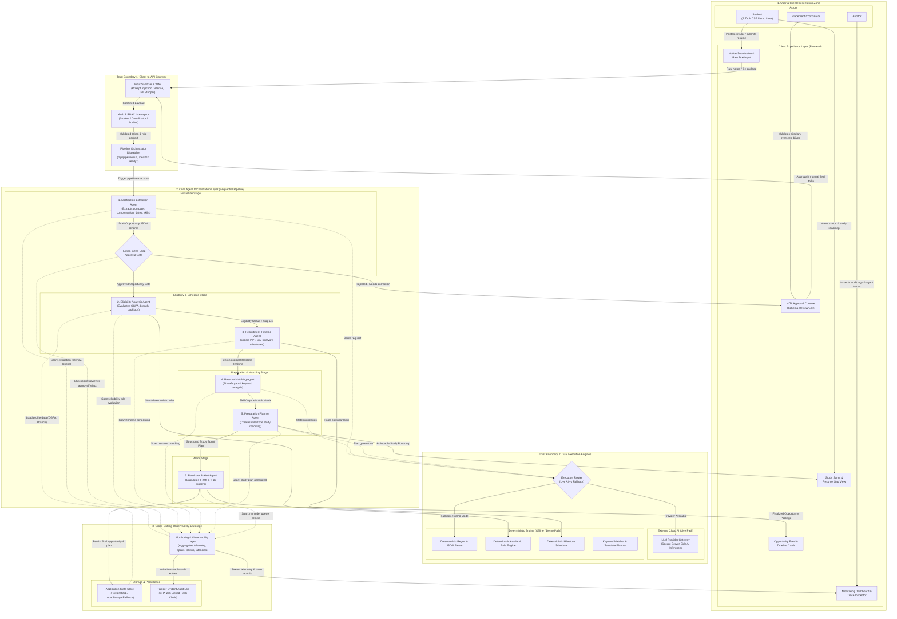
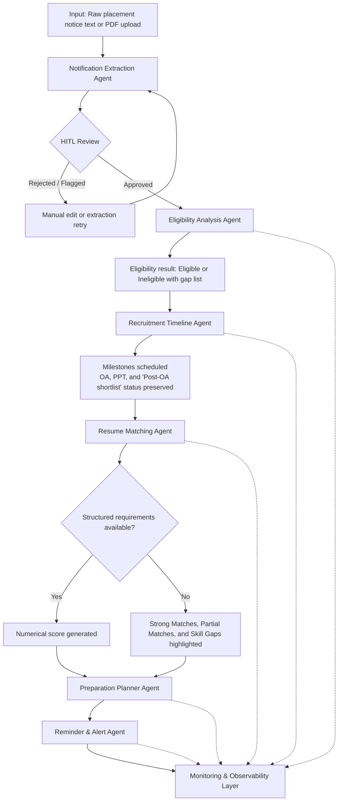
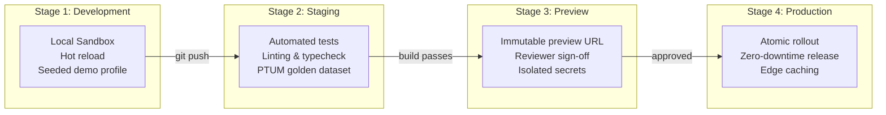
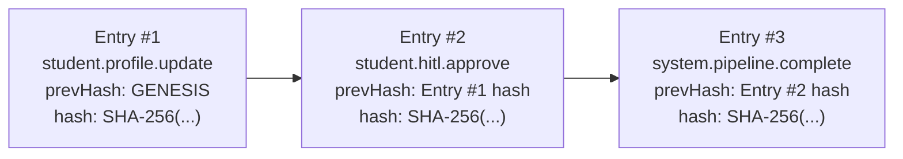
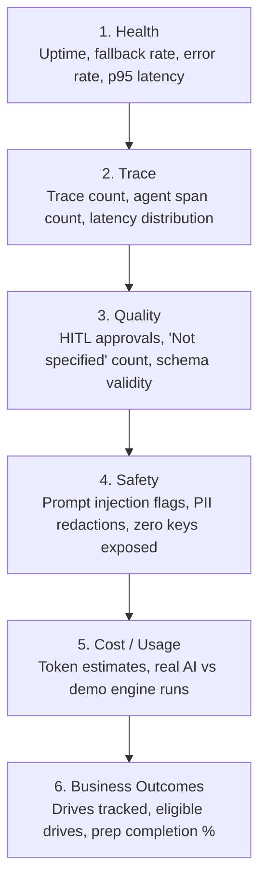
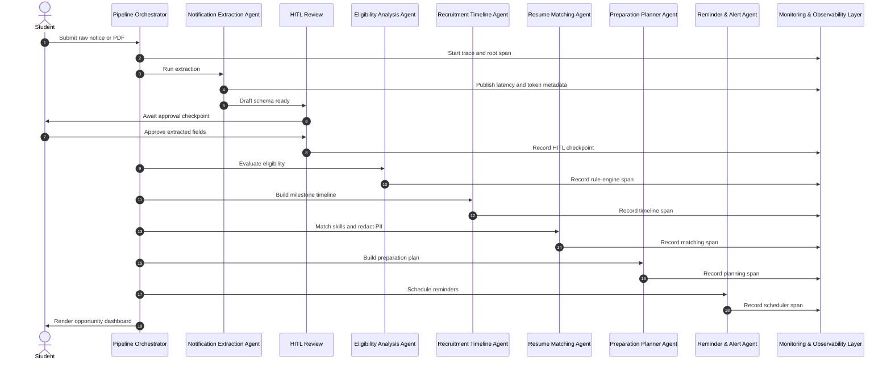

# PlacePilot AI — Capstone Architecture Deliverables

### Scalable Enterprise Architectural Deployments of Agentic AI Solutions

> **Course Deliverables Documentation**: This document standardizes the five academic capstone deliverables, the six-agent workflow, the deployment model, and the detailed architecture flow diagrams for a clean, production-aligned classroom prototype.

---

## Executive Summary

**PlacePilot AI** is an enterprise-grade placement intelligence and preparation platform for engineering college students. It organizes noisy WhatsApp broadcasts, email circulars, and placement notices into structured eligibility checks, timeline scheduling, skill-gap analysis, and guided preparation planning. The solution combines a deterministic rule-based safety model with human-in-the-loop (HITL) review, traceable telemetry, and an optional real-AI execution path when the provider is available.

### PTUM Opportunity Snapshot

| Field | Value | Notes |
| :--- | :--- | :--- |
| **Company** | PTUM | Extracted primary demonstration opportunity |
| **Position** | Full Stack Engineer | Engineering role |
| **Employment Type** | FTE | Full-time employment |
| **CTC UG** | Not applicable | Standard campus categorization |
| **Annual Salary UG** | ₹18 lakhs per annum | Base compensation package for Undergraduate candidates |
| **CTC PG** | Not applicable | Standard campus categorization |
| **Annual Salary PG** | ₹18 lakhs per annum | Base compensation package for Postgraduate candidates |
| **Internship Stipend** | Not applicable | No standalone internship stipend specified |
| **Online Assessment** | 8 October 2026, 1:00 PM | Exact milestone date & time |
| **Pre-Placement Talk** | 15 October 2026, 9:00 AM | Exact milestone date & time |
| **Technical Interview** | Post-OA shortlist | Status preserved; no invented date |
| **HR Interview** | Post-OA shortlist | Status preserved; no invented date |
| **Missing Attributes** | "Not specified" | Explicit defensive handling |

### PTUM Academic Eligibility Thresholds

| Academic Parameter | Minimum Required Criterion | Verified Rule Logic |
| :--- | :--- | :--- |
| **Minimum UG CGPA** | 7.0 / 10.0 scale | Strict cutoff evaluated by Eligibility Agent |
| **Minimum PG CGPA** | 7.0 / 10.0 scale | Strict cutoff for MCA / M.Tech applicants |
| **SSLC / 10th Percentage** | 60.0% | Secondary school academic threshold |
| **HSC / 12th / Diploma** | 60.0% | Higher secondary or diploma academic threshold |
| **Standing Arrears / Backlogs** | 0 (Zero current backlogs) | Immediate disqualification if $> 0$ |
| **Eligible Degree Programs** | B.E. / B.Tech / MCA | Validated against target batch graduating year |
| **Eligible Branches** | CSE, IT, ECE, EEE, AI/DS | Six eligible program combinations preserved |



---

## Deliverable 1: Architecture Diagram

### 1.1 Complete End-to-End System Architecture & Data Flow Diagram



### 1.2 Data Flow Routing Table

| Flow Step | Origin Block | Destination Block | Data Payload Carried | Description |
| :--- | :--- | :--- | :--- | :--- |
| **1. Ingestion** | `Student` / `UI_Notice` | `GW_Sanitizer` | Raw text circular, email copy, or PDF document | User pastes an unformatted campus notice. |
| **2. Security & Auth** | `GW_Sanitizer` | `GW_Dispatcher` | Sanitized text + User JWT / Role (`Student`, `Coordinator`, `Auditor`) | Strips prompt injection attempts, validates active session and permissions. |
| **3. Extraction** | `GW_Dispatcher` | `A1: Extraction Agent` | Sanitized raw notice text | Triggers parsing via LLM or deterministic regex parser. |
| **4. Schema Validation** | `A1: Extraction Agent` | `HITL Approval Gate` | `Draft Opportunity JSON` (Company, Role, Dates, CTC, Skills) | Generates structured JSON adhering to the strict schema. |
| **5. Human Verification** | `HITL Approval Gate` | `A2: Eligibility Agent` | Verified `Approved Opportunity Object` | Coordinator/Student confirms dates and fields; unprovided fields stay `"Not specified"`. |
| **6. Academic Audit** | `A2: Eligibility Agent` | `A3: Timeline Agent` | `Eligibility Decision` (`Eligible: true/false`, Gaps: `[]`) | Evaluates 10-point CGPA, branch, 10th/12th percentages, and backlogs against profile data. |
| **7. Milestone Sequencing** | `A3: Timeline Agent` | `A4: Resume Agent` | Chronological Event Tree (OA, PPT, "Post-OA shortlist") | Enforces exact timestamps (e.g., PTUM OA Oct 8, PPT Oct 15) and tags interview stages. |
| **8. Gap Analysis** | `A4: Resume Agent` | `A5: Prep Planner Agent` | Skill Match Matrix (Strong, Partial, Missing Gaps) | Compares student skills against job criteria. Emits numerical score only if $\ge 3$ structured skills exist. |
| **9. Sprint Generation** | `A5: Prep Planner Agent` | `A6: Reminder Agent` | Day-by-Day Study Roadmap | Generates prioritized topics leading up to the Online Assessment date. |
| **10. Alert Arming** | `A6: Reminder Agent` | `UI_Dashboard` / `Storage` | Alert Triggers (`T-24h`, `T-1h`) | Queues local browser notifications and persists the fully resolved opportunity. |
| **Cross-Cutting** | All Agents (`A1`–`A6`) | `MonLayer` | Telemetry Spans (`trace_id`, `span_id`, engine type, latency, tokens) | Real-time observability tracking across both live-AI and fallback runs. |
| **Audit Log** | `MonLayer` | `DB_Audit` | Linked SHA-256 Hashes (`prevHash`, `dataHash`, timestamp) | Guarantees tamper-evident auditability for evaluation and compliance. |

### 1.3 Target Production vs. Classroom Prototype

| Environment | Description | Implementation Details |
| :--- | :--- | :--- |
| **Target Enterprise Cloud Architecture** | Supabase Postgres, edge functions, CI/CD automation, environment secrets, and role-bound data access | Production target model; schema enforced via migration files. |
| **Classroom Demonstration Prototype** | Client-side localStorage state, deterministic mock execution, and instant preview | For reliable, zero-latency evaluation and offline classroom defense. |
| **Blue/Green and Canary Deployments** | Optional enterprise enhancements | Documented as advanced deployment options, not prototype dependencies. |

- The application defines `/api/public/healthz` and `/api/public/readyz` as HTTP health/readiness API handlers for the deployment architecture. Their live availability depends on the active deployment/runtime.
- Notification alerts in the classroom prototype are executed through in-browser notifications and local storage queues.
- Active cellular SMS integration is not assumed unless carrier credentials are configured and approved.

---

## Deliverable 2: Agent Workflow Design

### 2.1 Agent Lifecycle Diagram



### 2.2 Agent State Model

| State | Meaning |
| :--- | :--- |
| **IDLE** | Pipeline not active; waiting for user submission. |
| **PROCESSING** | Agent is actively transforming input or computing outcomes. |
| **VALIDATING** | Guardrails and JSON Schema checks are running. |
| **AWAITING_APPROVAL** | Human review gate is pending coordinator or student sign-off. |
| **COMPLETED** | Agent execution has completed successfully and produced typed output. |
| **FAILED** | Schema failure, network error, or invalid input halted the run. |
| **FALLBACK** | Deterministic engine executed due to missing/failed external provider. |

### 2.3 Six Workflow Agents Specification

| # | Agent Name | Primary Role | Runtime Engine | Handoff Target | Retry / Circuit Policy |
| :--- | :--- | :--- | :--- | :--- | :--- |
| **1** | **Notification Extraction Agent** | Parses unstructured circulars and PDFs into typed Opportunity data | LLM provider or deterministic regex parser | HITL review gate → Eligibility Agent | Retry with exponential backoff; fallback to deterministic extraction if provider fails |
| **2** | **Eligibility Analysis Agent** | Evaluates CGPA, degree, branch, backlogs, and batch criteria | Deterministic rule engine | Recruitment Timeline Agent | Zero external dependency; schema invalidation halts the pipeline |
| **3** | **Recruitment Timeline Agent** | Produces milestone ordering for registration, PPT, OA, and interview stages | Deterministic rule engine | Resume Matching Agent | Preserves tentative dates as "Not specified" when missing |
| **4** | **Resume Matching Agent** | Matches skills and identifies gaps while preserving PII privacy | Structured match engine | Preparation Planner Agent | Numerical score only when structured requirements exist; otherwise qualitative guidance |
| **5** | **Preparation Planner Agent** | Creates a day-by-day preparation roadmap up to the OA | Template-based planner with optional AI assistance | Reminder & Alert Agent | Falls back to a canonical curriculum if AI is unavailable |
| **6** | **Reminder & Alert Agent** | Dispatches T-24h and T-1h reminders for dated milestones | Rule-based scheduler | Monitoring & Observability | Deduplicated by event and offset; browser alerts only unless configured |

*(Note: **Monitoring & Observability** is a cross-cutting telemetry layer that instruments all six workflow agents, not a seventh workflow agent.)*

### 2.4 Tool JSON Contract

#### Extraction Agent Output Schema

```json
{
  "$schema": "https://json-schema.org/draft/2020-12/schema",
  "type": "object",
  "required": ["company", "role"],
  "properties": {
    "company": { "type": ["string", "null"] },
    "role": { "type": ["string", "null"] },
    "employment_type": { "type": ["string", "null"] },
    "ctc_ug": { "type": ["string", "null"] },
    "annual_salary_ug": { "type": ["string", "null"] },
    "ctc_pg": { "type": ["string", "null"] },
    "annual_salary_pg": { "type": ["string", "null"] },
    "internship_stipend": { "type": ["string", "null"] },
    "batch": { "type": ["string", "null"] },
    "degrees": { "type": "array", "items": { "type": "string" } },
    "branches": { "type": "array", "items": { "type": "string" } },
    "registration": { "type": ["string", "null"] },
    "online_assessment": { "type": ["string", "null"] },
    "pre_placement_talk": { "type": ["string", "null"] },
    "technical_round": { "type": ["string", "null"] },
    "hr_round": { "type": ["string", "null"] },
    "skills": { "type": "array", "items": { "type": "string" } },
    "events": { "type": "array", "items": { "type": "object" } },
    "missing_fields": { "type": "array", "items": { "type": "string" } }
  }
}
```

### 2.5 HITL Validation Rules

- Company name and role are required fields.
- Missing attributes remain as `"Not specified"` instead of being inferred or guessed.
- Technical and HR interview dates remain as `"Post-OA shortlist"` when no date is given.
- Eligibility enforcement is computed strictly by the deterministic rule engine.
- Resume matching suppresses numerical score output when fewer than three structured skills are available.

---

## Deliverable 3: Deployment Strategy

### 3.1 Four-Stage Deployment Pipeline



### 3.2 Deployment Notes

- The target production architecture uses Supabase Postgres, serverless edge functions, CI/CD automation, and environment-scoped secret management.
- The classroom prototype uses localStorage-driven state and deterministic mock execution for instant preview and demo reliability.
- Blue/Green and Canary deployment strategies are optional enterprise enhancements and not required for the base prototype.
- The application defines `/api/public/healthz` and `/api/public/readyz` as HTTP health/readiness API handlers for the deployment architecture. Their live availability depends on the active deployment/runtime.

### 3.3 Health Probes Table

| Probe Path | Type | Purpose | Defined Behavior |
| :--- | :--- | :--- | :--- |
| `/api/public/healthz` | Liveness | Defines HTTP liveness probe contract for runtime platforms | HTTP 200 with service health status when active |
| `/api/public/readyz` | Readiness | Defines HTTP readiness probe contract for dependency & fallback state | Confirms operational status or graceful fallback readiness |

---

## Deliverable 4: Security Model

### 4.1 Role-Based Access Control Matrix

| Capability / Resource | Student | Placement Coordinator | Auditor |
| :--- | :--- | :--- | :--- |
| **Own profile and academic credentials** | Read / Write | — | — |
| **Own tracked drives and study plans** | Read / Write | — | — |
| **Publish or verify opportunities** | — | Read / Write | Read-Only |
| **Inspect aggregate cohort metrics** | — | Read-Only | Read-Only |
| **View trace executions** | Own traces only | Aggregate view | Full read access |
| **Verify audit chain** | — | — | Read and validate |

### 4.2 Row-Level Security (RLS) Guidance

The production architecture enforces data isolation using PostgreSQL Row Level Security:

```sql
create type public.app_role as enum ('student', 'coordinator', 'auditor');

create table public.user_roles (
  user_id uuid references auth.users on delete cascade,
  role app_role not null,
  primary key (user_id, role)
);

alter table public.opportunities enable row level security;

create policy "Students can only access own opportunities"
  on public.opportunities
  for all
  to authenticated
  using (auth.uid() = student_id)
  with check (auth.uid() = student_id);

create policy "Auditors have read access to all traces"
  on public.agent_traces
  for select
  to authenticated
  using (
    exists (
      select 1 from public.user_roles
      where user_roles.user_id = auth.uid()
      and user_roles.role = 'auditor'
    )
  );
```

### 4.3 Privacy and Prompt Injection Defense

- **PII Scrubbing**: Student resumes are anonymized prior to any external model ingestion (redacting name, email, phone, Aadhaar).
- **Prompt Injection Defense**: Guardrails defend against instruction overrides, role hijacks, system prompt exfiltration, and eligibility tampering.
- **Deterministic Precedence**: Academic eligibility is always evaluated by the deterministic rule engine, preventing AI hallucination from qualifying an ineligible candidate.

### 4.4 Tamper-Evident Audit Log



- Any modification to a historical record invalidates the SHA-256 hash chain for subsequent entries.
- The Auditor role can validate the chain and immediately detect tampering without requiring database write permissions.

---

## Deliverable 5: Monitoring Dashboard & Trace Inspector

### 5.1 Six Monitoring Categories



### 5.2 Trace Inspector Lifecycle



### 5.3 Telemetry Data Fields

- `trace_id`: Unique root pipeline identifier for the entire notice run.
- `span_id`: Unique invocation identifier for each agent or tool step.
- `parent_span_id`: Hierarchical parent relationship tracking handoffs.
- `latency_ms`: Duration of execution in milliseconds.
- `engine`: Engine tag (`real-ai`, `rule-engine`, `structured-match`, `ai-assist`, `det-template`, `rule-scheduler`).
- `tokens_in` / `tokens_out`: Measured or estimated token usage for AI operations.
- `safety_flags`: Count and classification of security checks or PII masks applied.

---

## Conclusion and Verification Summary

The updated PlacePilot AI architecture deliverables satisfy all capstone requirements:

1. **System Architecture**: Complete enterprise-oriented architecture with explicit trust boundaries, detailed block-by-block connections, and exact data-flow payloads.
2. **Agent Workflow**: Exactly 6 core workflow agents with human-in-the-loop validation, deterministic fallback, and cross-cutting Monitoring & Observability coverage.
3. **Deployment Strategy**: Practical 4-stage pipeline with documented HTTP health and readiness handlers (`/healthz`, `/readyz`) and optional enterprise rollout strategies.
4. **Security Model**: 3 strictly scoped RBAC roles, database RLS, prompt defense, and SHA-256 tamper-evident audit logging.
5. **Monitoring & Tracing**: 6 standard monitoring categories with trace telemetry across supported execution runs.
