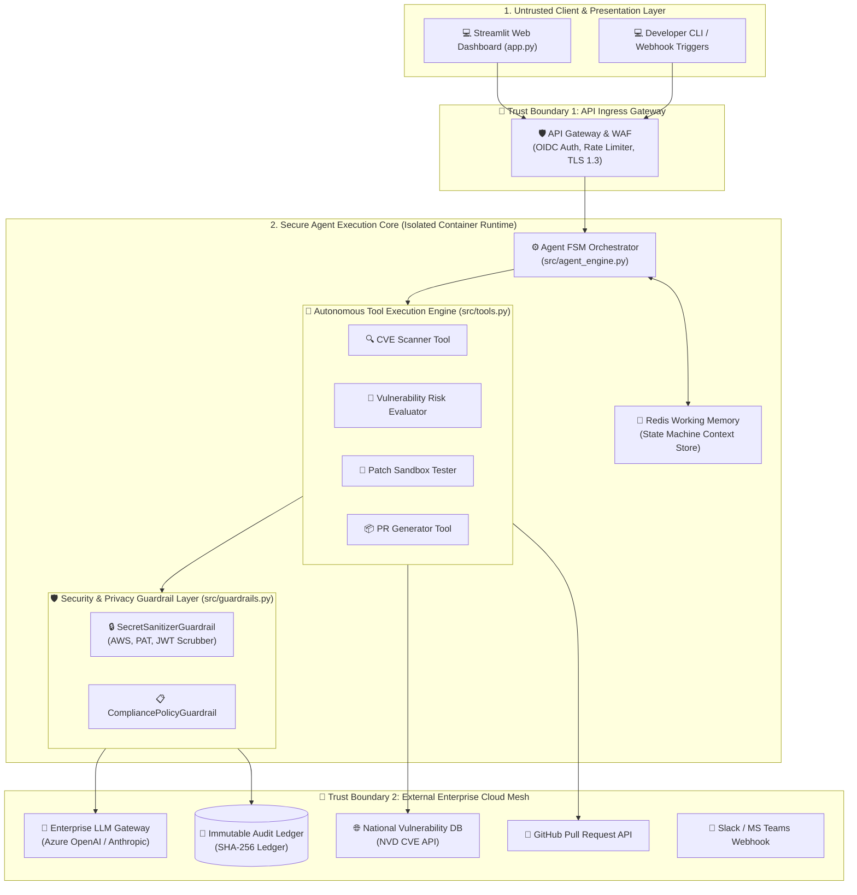
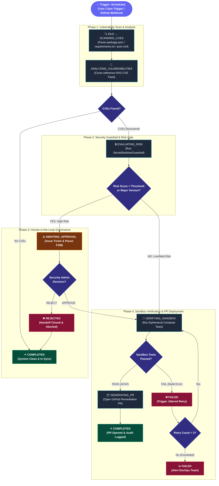
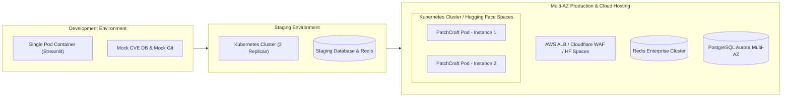

# Capstone Enterprise Architecture Deliverables: PatchCraft AI (Streamlit)

**Project Name:** PatchCraft AI - Autonomous Vulnerability Remediation Streamlit Agent  
**Student Author:** Vishanth (Roll No: 2023103094)  
**Architectural Baseline:** Enterprise Scalable Agentic AI Solution  
**Document Status:** Complete Deliverables Presentation  

---

## Executive Summary
PatchCraft AI is an enterprise-grade autonomous agentic assistant built in Python and Streamlit designed to continuously scan repository dependency manifests, detect CVE security vulnerabilities, evaluate update risk scores, safely execute dry-run patch validations in isolated sandboxes, scrub secret tokens via guardrails, and enforce Human-in-the-Loop approval gates for high-risk or breaking dependency updates.

---

## Deliverable 1: Architecture Diagram

### 1.1 Enterprise System Topology & Trust Boundaries

### 1.2 System Layer Breakdown & Component Responsibilities

| Layer | Micro-Component | Functional Responsibility | Trust Level |
| :--- | :--- | :--- | :--- |
| **Client Layer** | Streamlit UI (`app.py`) | Renders live state machine pipeline, vulnerability radar, sandbox git diffs, and metrics. | Untrusted |
| **Ingress Gate** | API Gateway | Validates OIDC JWT tokens, enforces IP rate limits, and scrubs invalid incoming payloads. | Boundary 1 |
| **Agent Core** | Orchestrator (`src/agent_engine.py`) | Enforces state transitions, manages working memory, dispatches tools, and logs telemetry. | High Trust |
| **Toolset** | CVE Scanner Tool (`src/tools.py`) | Parses dependency manifests (`package.json`, `requirements.txt`, `pom.xml`) against live CVE databases. | High Trust |
| **Toolset** | Risk Evaluator Tool (`src/tools.py`) | Computes CVSS v3.1 scores, semver update delta (patch vs minor vs major), and risk weight. | High Trust |
| **Toolset** | Patch Sandbox Tool (`src/tools.py`) | Simulates dependency upgrades in ephemeral sandbox; executes unit & smoke test suites. | High Trust |
| **Guardrails** | Secret Sanitizer (`src/guardrails.py`) | Active regex engine scrubbing private keys, AWS tokens, and secrets prior to LLM submission. | High Trust |
| **Integrations** | GitHub / Slack APIs | Auto-generates remediation pull requests; dispatches interactive approval webhooks. | Boundary 2 |

---

## Deliverable 2: Agent Workflow Design

### 2.1 Agent State Machine & Workflow Flowchart

### 2.2 Roles, Tools, Handoffs & Exception Governance

#### Agent Persona & Sub-Agent Roles
| Role Name | Primary Responsibility | Input Artifacts | Output Artifacts |
| :--- | :--- | :--- | :--- |
| **Scanner Agent** | Parses project manifests and matches CVE database feeds. | `package.json`, `requirements.txt`, `pom.xml` | Raw CVE Vulnerability Inventory |
| **Risk Evaluator Agent** | Calculates CVSS v3.1 scores & semver version upgrade deltas. | CVE Vulnerability List | Breaking Risk Score (0.0 - 1.0) |
| **Remediation Agent** | Applies patches in sandboxes, verifies test suites, and opens PRs. | Approved Dependency Version | GitHub PR & SHA-256 Audit Entry |

#### Human-in-the-Loop Approval & Failure Recovery
- **Human Gate Trigger**: Pauses execution automatically whenever Risk Score > 0.5 or major breaking semver version update is detected.
- **Approval Signature**: Requires authenticated Security Admin signature via Streamlit Operations Dashboard or web approval payload.
- **Fault Recovery**: Applies jittered exponential backoff on network API timeouts; max 3 retries before alerting DevOps.

---

## Deliverable 3: Deployment Strategy

### 3.1 Target Environment Topology

### 3.2 Deployment Strategy Key Specifications
- **Runtime Environment**: Containerized Docker image (`python:3.10-slim`) running Streamlit natively or on Hugging Face Spaces / Kubernetes.
- **Horizontal Pod Autoscaling (HPA)**: Target CPU = 70%, Target Memory = 75%; autoscales from 2 to 10 pods during build spikes.
- **Resilience**: Stateless pod architecture; working memory stored in Redis; graceful fallback to cached CVE database snapshots during upstream network outages.
- **Release Strategy**: Blue-Green deployment with automated smoke test verification prior to 100% traffic cutover.

---

## Deliverable 4: Security Model

### 4.1 RBAC Identity & Authorization Matrix

| User / Role | Read Manifests | Trigger Scan | Approve Breaking Patches | Admin Audit Access |
| :--- | :---: | :---: | :---: | :---: |
| **PatchCraft Agent Core** | ✔ | ✔ | x (Requires Human Gate) | x |
| **Security Administrator** | ✔ | ✔ | ✔ | ✔ |
| **Lead Developer** | ✔ | ✔ | ✔ (Low Risk Only) | x |
| **Auditor / Observer** | ✔ | x | x | ✔ |

### 4.2 Security Guardrails & Privacy Controls
1. **Secret & PII Sanitization Guardrail**:
   - Active regex scanner (`SecretSanitizerGuardrail`) redacting AWS Access Keys (`AKIA...`), GitHub Personal Access Tokens (`ghp_...`), private SSH keys, and passwords to `[REDACTED_SECRET_GUARDRAIL]` before LLM processing.
2. **Key Management**:
   - Zero hardcoded credentials in source code. Secrets fetched at runtime from environment variables or Key Vaults.
3. **Immutable Audit Ledger**:
   - Cryptographically hashed (SHA-256) append-only ledger logging every scan result, vulnerability evaluation, and human approval signature.

---

## Deliverable 5: Monitoring Dashboard Design

### 5.1 Telemetry Metrics & Target SLAs

| Category | Metric Name | Target Baseline SLA | Alert Condition |
| :--- | :--- | :--- | :--- |
| **Health** | System Uptime & Memory Usage | > 99.9% Uptime, < 80% RAM | RAM > 85% for > 5 mins |
| **Trace** | End-to-End Patch Latency | < 15.0 seconds per run | Latency > 35s |
| **Quality** | Sandbox Build Pass Rate | > 98% Green Builds | Regression Rate > 2% |
| **Safety** | PII & Secret Leak Interception | 100% Interception | Any un-sanitized token in prompt |
| **Cost** | LLM Token Cost / Patch Run | < 12,500 tokens / run | Cost > \$0.20 per run |
| **Outcomes** | Vulnerability Mean Time to Remediate (MTTR) | Reduced from 14 days to < 2 hours | MTTR > 24 hours |

### 5.2 Operations Dashboard Interface
The Streamlit Web Application (`app.py`) embeds an interactive telemetry dashboard displaying:
- Live FSM State Machine pipeline status and execution timer.
- Timestamped tool log streaming terminal.
- Vulnerability Radar displaying CVE severity badges (CRITICAL, HIGH, MEDIUM).
- Patch Sandbox view showing git diff previews and test suite results.
- Human-in-the-Loop interactive approval expander/form.
- Downloadable Capstone Executive Audit Report.
