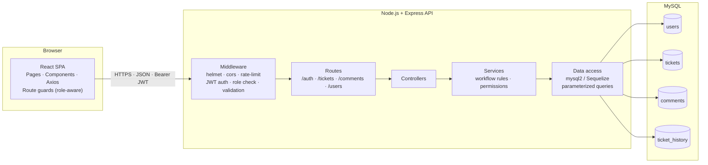
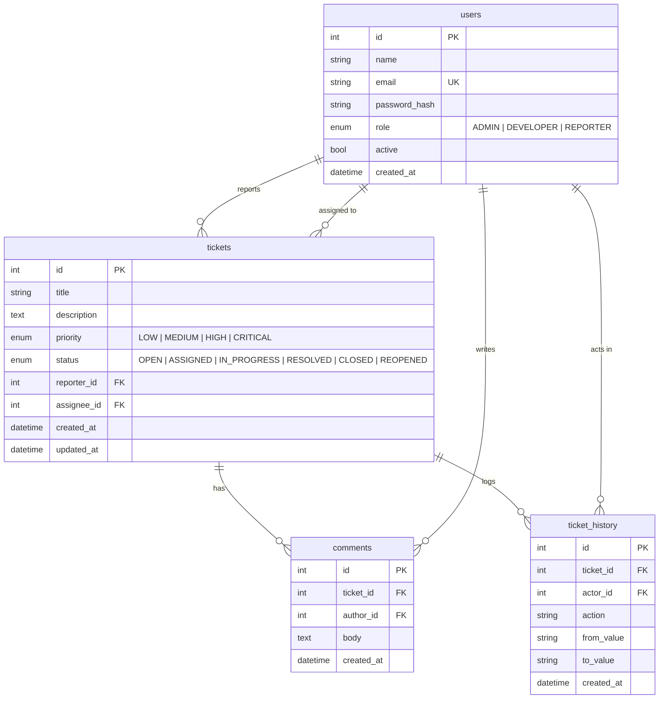
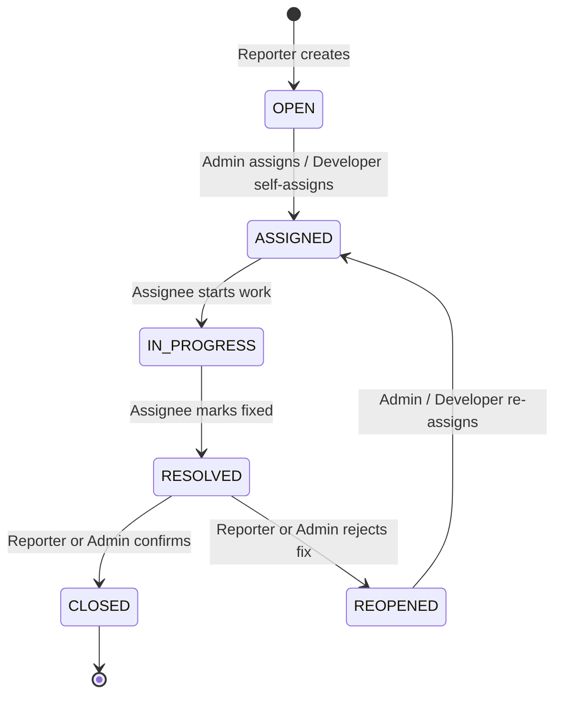
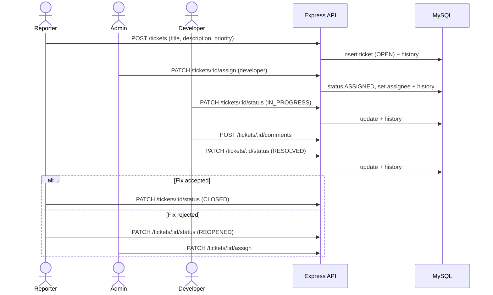
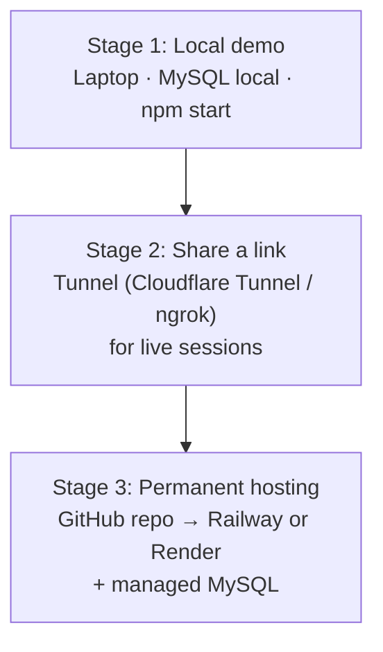
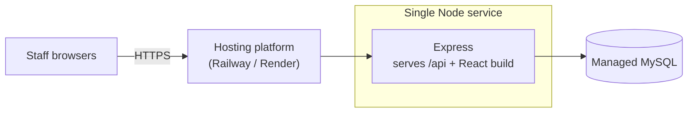
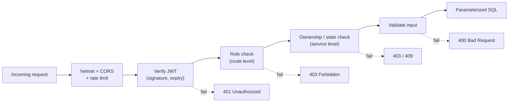

# DevPulse — Design Document

Stack: React (JavaScript) · Node.js + Express (JavaScript) · MySQL

---

## 1. Architecture Diagram

**Layers and responsibilities**

| Layer | Responsibility |
|---|---|
| React SPA | UI, forms, role-based menus and route guards (convenience only, not security) |
| Middleware | Authentication, role authorization, input validation, rate limiting, security headers |
| Routes / Controllers | Map HTTP requests to actions, shape responses |
| Services | Business rules: allowed status transitions, who can assign or close a ticket |
| Data access | All SQL, parameterized, no string concatenation |
| MySQL | Persistent storage with foreign keys and timestamps |

**Data model**

---

## 2. Workflow Design

*Interpreted as the ticket workflow and how each role (Reporter, Developer, Admin) moves a ticket through it. If you meant AI agent workflows, tell me and I'll redo this section.*

### 2.1 Ticket lifecycle (enforced in the backend service layer)

Any transition not shown above returns `409 Conflict` with a clear message. Every successful transition writes a row to `ticket_history`.

### 2.2 End-to-end flow by role

### 2.3 Who can do what

| Action | Reporter | Developer | Admin |
|---|---|---|---|
| Create ticket | Yes | Yes | Yes |
| View tickets | Own only | All | All |
| Comment | Own tickets | All | All |
| Self-assign | No | Yes | Yes |
| Assign to others | No | No | Yes |
| OPEN/ASSIGNED → IN_PROGRESS → RESOLVED | No | Assigned tickets only | Yes |
| RESOLVED → CLOSED / REOPENED | Own tickets | No | Yes |
| Change priority | No | No | Yes |
| Delete ticket | No | No | Yes |
| Manage users and roles | No | No | Yes |

---

## 3. Deployment Strategy

### 3.1 Recommended path for the staff demo

### 3.2 Simplest production shape: one service

Build the React app (`npm run build`) and let Express serve the static files, so there is one deployable unit and no CORS between frontend and backend.

If you prefer to split them: frontend on Netlify or Vercel, backend and MySQL on Railway or Render, and set CORS to the exact frontend URL.

### 3.3 Steps

1. Push the project to GitHub (never commit `.env`; commit `.env.example`).
2. Create a managed MySQL instance on the platform and run `schema.sql` plus the seed script.
3. Create the Node service from the repo. Build command: install and build the frontend, then install the backend. Start command: `node server.js`.
4. Set environment variables on the platform: `DB_HOST`, `DB_USER`, `DB_PASSWORD`, `DB_NAME`, `JWT_SECRET`, `JWT_EXPIRES_IN`, `NODE_ENV=production`, `CLIENT_URL`.
5. Open the generated HTTPS URL and log in with the demo accounts.
6. Change the demo passwords before sharing the link widely.

### 3.4 Pre-demo checklist

- Hosting free tiers may sleep after inactivity or have limits that change, so confirm current terms and open the app a few minutes before presenting.
- Seed realistic demo tickets in every status so each role has something to show.
- Keep a local copy running as a fallback in case of network problems.
- Take a database backup or export after seeding so you can reset quickly.

---

## 4. Security Model

### 4.1 Request security flow

### 4.2 Controls

| Area | Control |
|---|---|
| Authentication | Email and password login; passwords hashed with bcrypt (cost factor 10 or higher); never stored or returned in plain text |
| Sessions | Short-lived JWT (for example 1 hour) signed with a strong secret from environment variables; `401` on expiry sends the user to login |
| Authorization | Three layers: role middleware on routes, ownership checks (a Reporter sees only their own tickets), and workflow checks (valid transitions only). The backend is the source of truth; frontend guards are cosmetic |
| Role changes | Only an Admin can change roles; new registrations always start as `REPORTER`; never accept a role from the registration request body |
| Input validation | Validate and sanitize every body, query, and param (for example `express-validator` or `zod`); enforce length limits and allowed enum values |
| SQL injection | Parameterized queries or ORM only; no string-built SQL |
| XSS | Render user text as plain text in React (no `dangerouslySetInnerHTML`); set a Content-Security-Policy through helmet |
| CSRF | Low risk if the JWT is sent in the `Authorization` header rather than a cookie. If you store it in a cookie, use `httpOnly`, `secure`, `sameSite` and add CSRF protection |
| Token storage | Simplest: memory or `sessionStorage`. Understand the trade-off: `localStorage` is exposed to XSS, so keep XSS controls strict |
| Brute force | Rate-limit `/auth/login` and `/auth/register` (for example `express-rate-limit`) |
| Transport | HTTPS only in production (most hosting platforms provide it); HSTS via helmet |
| CORS | Allow only the known frontend origin, not `*` |
| Secrets | `.env` is git-ignored; secrets set in the hosting dashboard; use a least-privilege MySQL user (no `DROP`, no admin rights) |
| Error handling | Central error handler returns generic messages; log details server-side only; never expose stack traces or SQL errors |
| Auditability | `ticket_history` records who changed status, assignee, or priority and when |
| Data exposure | Select explicit columns; never return `password_hash`; DTO-style response shaping |
| Dependencies | Run `npm audit` before demo and release; pin versions with a lockfile |

### 4.3 Threats and mitigations

| Threat | Mitigation |
|---|---|
| Reporter edits another user's ticket by changing the ID in the URL | Ownership check in the service layer (broken access control) |
| User promotes self to Admin | Role ignored on register; role endpoint is Admin-only |
| Stolen or forged token | Signature verification, short expiry, strong secret |
| Credential stuffing | Rate limiting, bcrypt, generic login error message |
| Malicious script in a comment | React escaping, CSP, input length limits |
| Leaked database credentials | Environment variables only, least-privilege DB user, `.env` never committed |
| Invalid status jump (OPEN → CLOSED) | Transition table enforced server-side, returns `409` |

### 4.4 Minimum security checklist before sharing the link

- [ ] Demo passwords changed
- [ ] `JWT_SECRET` is long and random, not the example value
- [ ] CORS limited to the real frontend URL
- [ ] Rate limiting on auth routes
- [ ] No `.env` or secrets in Git history
- [ ] Role checks tested for all three roles on every route
