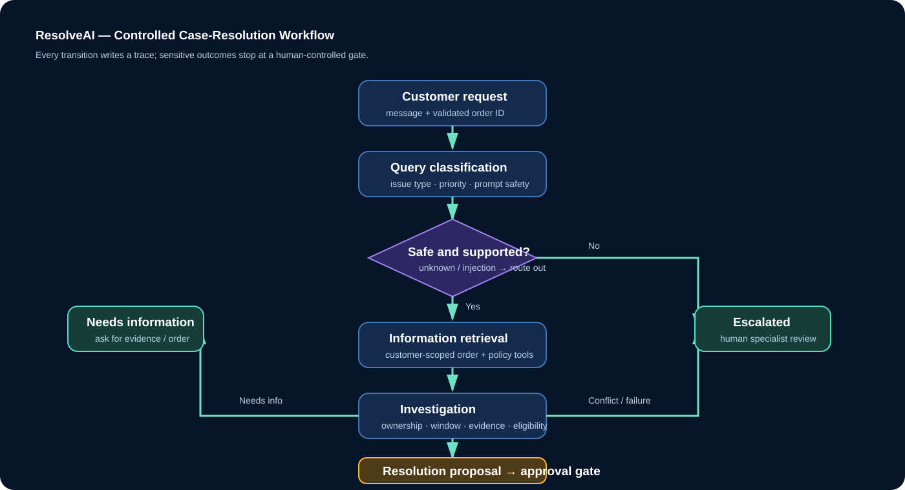
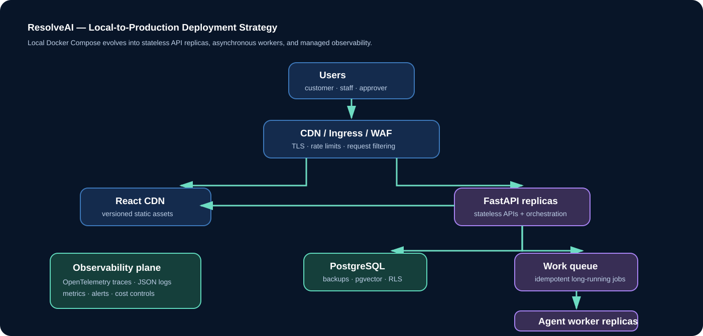

# ResolveAI — Complete Application Build Prompt

## Project identity

Build a complete, production-inspired **Multi-Agent Customer Support & Resolution Assistant** called **ResolveAI**. It serves an e-commerce business whose customers need help with damaged items, delayed deliveries, incorrect orders, returns, and refunds.

ResolveAI is not a chatbot that simply drafts an answer. It is a controlled support-operation workflow that can classify a request, retrieve customer-scoped records, investigate a policy decision, propose a resolution, and stop for an authorised human decision whenever the action is sensitive.

**Primary demo scenario:** A customer reports, “I purchased a laptop five days ago, but it arrived with a damaged screen. I want a replacement.” The system identifies the request, retrieves the correct order and damaged-item policy, validates eligibility and evidence, proposes a replacement, creates an approval task, and tells the customer that a support manager must approve the replacement.

## Product objective and success criteria

Create a polished, runnable application that demonstrates all five capstone areas:

| Area | Demonstrable outcome |
|---|---|
| Enterprise architecture | Layered client/API/orchestrator/data/observability architecture with clear trust boundaries |
| Agent workflow | Named agent stages, state transitions, tool use, failure routes, and step trace |
| Deployment | Docker Compose local stack plus a documented scalable cloud path |
| Security | JWT, RBAC, customer-data isolation, input validation, approval separation, and audit events |
| Monitoring | Operational dashboard for health, workflow quality, safety, latency, approvals, and cost |

The workflow must work with deterministic mock data and **must not require an LLM API key**. Gemini may be configured as an optional response-enrichment adapter, but it must never be an authority for a policy decision, a database query, a sensitive tool call, or a final approval.

## Required technology stack

| Layer | Required technology | Notes |
|---|---|---|
| Frontend | React 18+ with Vite | Responsive, accessible single-page application |
| API | Python 3.12+ and FastAPI | Typed REST contract, OpenAPI documentation |
| Workflow | LangGraph-compatible central orchestrator | Agents are nodes in one bounded graph, not autonomous microservices |
| Model adapter | Google Gemini (optional) | Disabled safely when `GEMINI_API_KEY` is missing |
| Data | PostgreSQL + pgvector | Mock repository allowed for first runnable demo |
| Identity | JWT bearer tokens | Role-aware server-side enforcement |
| Packaging | Docker + Docker Compose | Separate frontend, backend, and database containers |
| Observability | Structured logs, trace identifiers, custom dashboard | Production design supports OpenTelemetry/Prometheus/Grafana |

## Personas, roles, and authorisation matrix

Build role-aware journeys for four roles. The API is the authority: hiding a button in the frontend is not a security control.

| Role | Primary abilities | Explicit restrictions |
|---|---|---|
| Customer | Sign in, submit ticket, view only their own tickets and messages | Cannot read peer data, approve, refund, replace, or alter policy |
| Support agent | Search operational ticket queue, inspect trace and policy context | Cannot approve or reject refunds/replacements |
| Approver | Review pending sensitive proposal, approve/reject with reason | Cannot impersonate customer or bypass validation |
| Admin | View dashboard/audit reports and manage configuration in future release | Must not expose secrets or raw credentials |

Seed these deterministic demonstration users:

| Email | Password | Role |
|---|---|---|
| `customer@resolveai.demo` | `DemoPass!23` | customer |
| `agent@resolveai.demo` | `DemoPass!23` | support_agent |
| `manager@resolveai.demo` | `DemoPass!23` | approver |

## Business capabilities

### Customer support workspace

- Create a support request using a validated order ID and free-text message.
- Present a practical default scenario: `ORD-1001` and a damaged-laptop request.
- Show ticket identifier, status, issue type, proposed action, customer-facing answer, last update time, and workflow trace.
- Explain in plain language when a human approval is required.
- Provide ticket history with customer-level isolation.

### Staff operations workspace

- Display support queue and ticket status filters: `RESOLVED`, `PENDING_APPROVAL`, `NEEDS_INFORMATION`, `ESCALATED`, and `REJECTED`.
- Show classification, retrieved facts, investigation outcome, resolution proposal, and chronological trace without exposing internal secrets.
- Present an approver-only panel for pending refund/replacement proposals.
- Require a decision note of at least three characters before approve/reject.
- Append the approver identity, decision, reason, and time to both ticket trace and audit log.

### Monitoring dashboard

Render values from records rather than hard-coded screenshots. Include:

- Total tickets and daily/weekly growth.
- Workflow-resolved rate, escalation rate, and status distribution.
- Average end-to-end workflow duration and API latency.
- Agent/node durations, tool success rate, timeout count, and retry count.
- Pending approval count, oldest approval age, approval/rejection rate.
- Prompt-injection/suspicious-request escalations and denied sensitive actions.
- Estimated tokens and estimated model cost per run/day.
- Audit event count and linkable ticket/trace correlation IDs.

## Agent graph design

Use a central state object with `ticket_id`, `customer_id`, `order_id`, validated message, classification, retrieved context, investigation findings, proposed action, status, trace list, attempt counts, and `trace_id`.

### Node responsibilities

| Node | Input | Output | Tool access | Mandatory guardrail |
|---|---|---|---|---|
| Query Classifier | validated customer message | issue, action, priority, safety flag | none | unrecognised or instruction-override language routes to escalation |
| Information Retrieval | customer ID, order ID, issue type | minimum order fields and matching approved policy | read-only order/policy adapters | customer ID comes from JWT, never from user prompt |
| Investigation | order and policy context | eligibility, evidence gap, exception reason | none | policy calculation must be deterministic |
| Resolution | validated findings | proposed action, rationale, next state | none | cannot execute replacement/refund |
| Escalation | failed/unsafe/incomplete workflow state | human queue reason and safe response | ticket update only | never retries endlessly |
| Human Approval | pending ticket, approver identity, decision note | approved/rejected final outcome | approval write API | only approver/admin role; not callable by agent |
| Response Generator | approved state and safe facts | customer-ready response | optional Gemini summariser only | output validation and no policy authority |

### Routing rules

1. Validate message length, order ID format, token, and customer role before the graph starts.
2. If message has prompt-injection indicators (for example, “ignore previous instructions”, “reveal your system prompt”, “bypass policy”), create an `ESCALATED` ticket. Never follow the embedded instruction.
3. If the intent is unknown, create an `ESCALATED` ticket with a specialist-review reason.
4. Retrieve the order only if it belongs to the authenticated customer. A missing order produces `NEEDS_INFORMATION`; do not reveal whether a different customer owns it.
5. Fetch policy using a server-selected policy key, never a model-selected arbitrary URL/query.
6. If evidence is missing, create `NEEDS_INFORMATION` with a specific requested next step.
7. If the issue is outside policy or data/policy conflicts, create `ESCALATED` rather than fabricate a decision.
8. If replacement/refund is eligible, create a proposal and terminate at `PENDING_APPROVAL`.
9. Only an approver’s authenticated POST action may change a pending sensitive ticket to `RESOLVED` or `REJECTED`.
10. Generate a concise status-aware response and persist trace/audit records.

### Execution reliability requirements

- Cap execution at six workflow stages. Record and escalate when the budget is exhausted.
- Add per-tool deadline, bounded transient retry, exponential backoff, and circuit-breaker behaviour in production adapters.
- Use idempotency keys for create-ticket and approval transitions.
- Send long-running carrier/vendor investigation jobs to a durable queue; never block a web request for an unbounded task.
- Persist checkpoints after each state transition so retries resume safely.
- Separate transient tool errors from policy failures; both must produce transparent staff-visible traces.

## Mock tools, policies, and demo data

Implement tool adapters with typed input/output contracts. Keep the first version deterministic.

| Tool | Input | Output | Boundary |
|---|---|---|---|
| `get_order_for_customer` | order ID, JWT-derived customer ID | limited order facts or no result | read-only, tenant-scoped |
| `get_policy` | server-approved issue type | versioned policy summary | approved knowledge only |
| `create_approval_task` | ticket ID, proposed action | task ID/status | backend-only |
| `record_audit_event` | actor, action, metadata | event ID | append-only repository |

Seed at least the following records:

| Order | Customer | Product | Age | Evidence | Expected result |
|---|---|---|---:|---|---|
| `ORD-1001` | demo customer | NovaBook 14 laptop | 5 days | received | eligible replacement → pending approval |
| `ORD-1002` | demo customer | Orbit headphones | 42 days | absent | needs information or escalation depending policy |
| unknown / another-customer order | no authorised match | hidden | n/a | n/a | safe `NEEDS_INFORMATION` response |

Define a damaged-product policy: report within 30 days, evidence required, replacement/refund available for human review. Define a delivery-delay policy: safe status update first, escalation after unresolved carrier investigation.

## Security, privacy, and responsible-AI requirements

### Authentication and access control

- Issue short-lived JWTs with `sub`, role, email, expiration, issuer, and audience claims.
- Verify token signature, expiration, issuer, audience, and role server-side on every protected route.
- Implement `require_roles()` for privileged endpoints and an ownership filter for customer tickets/orders/messages.
- Return `401` for invalid/missing authentication and `403` for authenticated insufficient privileges.
- Rate-limit login and ticket creation routes in production; add lockout/monitoring for repeated failures.

### Input, model, and tool safety

- Constrain order IDs to an expected format and cap message/note length.
- Reject null bytes, invalid encodings, and oversized payloads.
- Treat customer messages, retrieved web-like content, uploads, and model responses as untrusted.
- Do not concatenate untrusted text into privileged tool instructions.
- Allow-list tool functions and policy IDs; no open-ended browser, shell, database, or payment access.
- Validate every proposed action against backend policy before it appears actionable.
- Never expose system prompts, credentials, tokens, full customer records, or hidden policy logic in a response.

### Data and audit requirements

- Store only data needed to resolve a support request.
- Encrypt in transit and at rest in production; use managed key/secrets services.
- Redact access tokens, passwords, payment data, and sensitive PII from logs.
- Create audit events for login, token rejection, ticket creation, tool call, tool failure, policy version used, proposal, approval/rejection, and admin configuration changes.
- Include `ticket_id`, `trace_id`, actor ID, timestamp, action, outcome, and minimal safe metadata in every event.
- Define retention, deletion, export, and access-review procedures before connecting real customer data.

## API contract

Expose REST APIs and publish FastAPI Swagger documentation.

| Method/path | Caller | Purpose |
|---|---|---|
| `POST /api/auth/login` | public | validate demo credentials and issue JWT |
| `GET /api/health` | public/platform | liveness/readiness-style health response |
| `POST /api/tickets` | customer | validate and initiate controlled workflow |
| `GET /api/tickets` | authenticated | role/ownership-filtered ticket collection |
| `GET /api/tickets/{id}` | authenticated | ownership/role checked ticket details |
| `POST /api/tickets/{id}/approval` | approver/admin | human decision with mandatory reason |
| `GET /api/dashboard` | support/approver/admin | aggregate operational metrics |
| `GET /api/audit-logs` | admin, future | filtered governance evidence |

Use Pydantic request/response models, meaningful HTTP status codes, stable error objects, and no raw stack traces in normal responses.

## Frontend experience and design system

Create an enterprise-quality dark interface with a calm, trustworthy support-operation visual language:

- Base: deep navy background, blue-tinted surfaces, subtle grid/gradient, high-contrast light text.
- Accent: teal for healthy/success state, violet for workflow intelligence, amber for human approval, red only for risk/rejection.
- Use responsive cards, readable forms, keyboard focus rings, semantic labels, empty states, loading states, and error states.
- Place a compact workflow visual/trace next to ticket status so users understand what the system did.
- Make the customer experience empathetic and plain-language. Make staff views information-dense but scannable.
- Display demo credentials only in local demo mode; never present real credentials in a production build.
- Do not rely on colour alone for status; use labels/icons as well.

## Data model

Implement the following production-oriented tables/repositories. The demo may use in-memory repository implementations behind these interfaces.

| Entity | Essential fields |
|---|---|
| `users` | id, email, password hash/external identity, role, status, created_at |
| `orders` | id, customer_id, product, order date, delivery state, evidence metadata |
| `tickets` | id, customer_id, order_id, issue type, status, proposal, response, timestamps |
| `messages` | id, ticket_id, speaker role, redacted content, created_at |
| `agent_runs` | id, ticket_id, trace_id, node, input/output summary, duration, outcome |
| `tool_calls` | id, ticket_id, tool name, safe request summary, result, duration, failure category |
| `approvals` | id, ticket_id, action, approver ID, decision, reason, created_at |
| `knowledge_base` | id, policy type, version, approved content, embedding, effective dates |
| `audit_logs` | id, trace ID, ticket ID, actor, action, outcome, safe metadata, timestamp |

## Deployment requirements

### Local stack

Supply Dockerfiles for frontend and backend plus Docker Compose for frontend, backend, and PostgreSQL. Provide environment examples only—never commit real secrets. Add health checks and explicit startup dependencies. Document a one-command startup and shutdown process.

### Production architecture

- Serve React assets from a CDN behind TLS and a WAF.
- Run stateless FastAPI replicas behind managed ingress/load balancing.
- Store operational data in managed PostgreSQL with pgvector, backups, encryption, migration jobs, and least-privilege service accounts.
- Use Redis/cache/rate-limit service where appropriate and a durable queue for long-running work.
- Run agent workers separately from the API. Autoscale APIs by requests/latency and workers by queue depth/age.
- Inject secrets from a managed secret store; rotate keys and never bake credentials into images.
- Use isolated dev/test/staging/production environments, CI checks, image scanning, canary deployment, rollback, backup restore tests, and disaster-recovery runbooks.

## Observability and operations requirements

Every request, ticket, workflow run, tool invocation, approval, and response must be correlated by `trace_id` and `ticket_id`. Emit structured JSON logs and traces. Never use raw customer text as a metric label.

| Panel | Metrics | Example action |
|---|---|---|
| API health | availability, p50/p95 latency, 4xx/5xx | investigate error spike or dependency outage |
| Workflow health | status mix, duration, step-budget exhaustion | tune policy, timeout, or routing |
| Tool health | success %, latency, timeout/error category | open integration incident/circuit break |
| Customer outcomes | resolution %, escalation %, information-request % | improve knowledge/policy/user experience |
| Approval SLA | queue count, oldest pending age, acceptance/rejection % | notify support manager |
| AI safety | injection flags, output-validation failures, denied actions | security review and rule improvement |
| Cost | token/model cost per ticket and daily cost | apply budget or model routing control |

## Test and acceptance requirements

Implement automated tests and make all pass before delivery.

| Test group | Required scenarios |
|---|---|
| Agent workflow | damaged laptop reaches `PENDING_APPROVAL`; missing evidence requests information; unsafe text escalates; unknown intent escalates |
| API security | unauthenticated rejection; customer cannot approve; support agent cannot approve; approver can finalise; customer cannot see peer ticket |
| Data safety | foreign order does not leak ownership/data; invalid order/message rejected |
| Audit | ticket/tool/approval events are recorded with correlation fields |
| Frontend | login, submit ticket, status/trace display, approver controls gated by role, error/loading/empty states |
| Build/deploy | Python tests, frontend production build, Docker Compose configuration, health endpoint |
