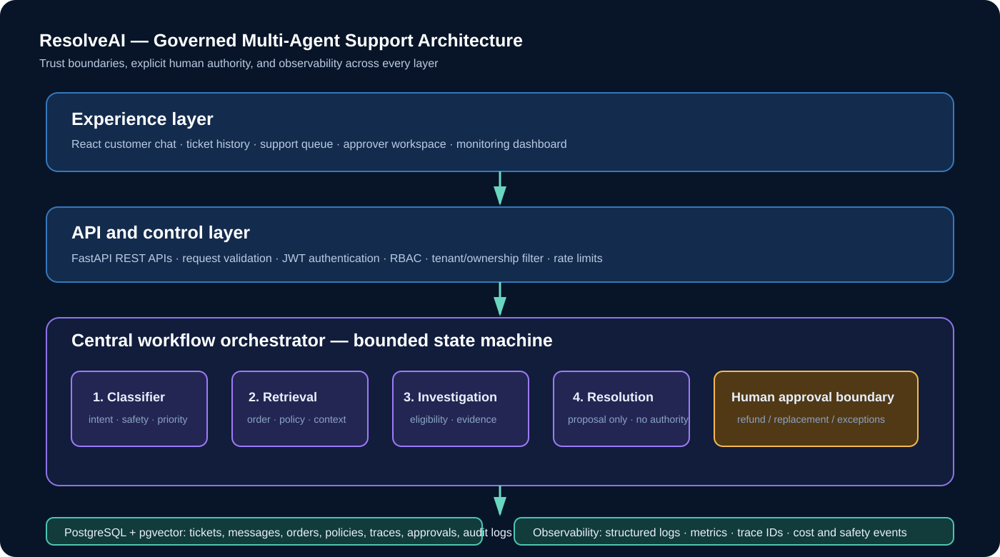

# Architecture

ResolveAI follows a **centralised orchestration** pattern. The web client never calls data stores or agent tools directly. FastAPI authenticates the request, applies role/ownership checks, and invokes the orchestrator. The orchestration layer invokes deterministic, narrowly scoped agent nodes and tool adapters.

## Component responsibilities

| Component | Responsibility | Failure behaviour |
|---|---|---|
| React | Customer chat, tickets, staff queue, metrics | Shows API failure without retaining secrets |
| FastAPI | Validation, authentication, ownership filtering, response APIs | Rejects invalid/unauthorised calls |
| Orchestrator | State transitions, step budget, agent trace | Escalates on unknown/unsafe states |
| Tool adapters | Customer-scoped order and policy lookup | Returns bounded result; never exposes arbitrary data |
| PostgreSQL | Durable operational, audit, and knowledge records | Backup/restore and readiness checks in production |
| Human approver | Final authority for refund/replacement decisions | Explicit accept/reject event required |

## Persistence model

The demo uses repository-shaped in-memory records so it is immediately runnable. The production database mapping is: `users`, `orders`, `tickets`, `messages`, `agent_runs`, `tool_calls`, `approvals`, `knowledge_base`, and `audit_logs`. `customer_id` is enforced in every customer-facing lookup. `pgvector` is reserved for approved policy/FAQ retrieval with tenant and document filters. The browser and agents never receive database credentials; only the API’s repository/tool layer does.

## LLM boundary

Gemini is deliberately an optional enrichment service. A future `GeminiResponseAdapter` can summarise retrieved, approved context, but validation, policy eligibility, tool selection, and sensitive outcome approval remain deterministic backend responsibilities. This prevents a prompt or model output from becoming authority.
