# AEGISDESK — Agentic IT Support Demonstrator

**Student:** R. Harsanth
**Register Number:** 2023103565
**Project:** AEGISDESK — Agentic IT Support Demonstrator

---

# 1. Architecture Diagram

## 1.1 High-Level Architecture

AEGISDESK uses a layered architecture that separates user interaction, agent orchestration, safety controls, controlled actions, and monitoring.

The main request path is intentionally simple:

**User → Agent → Policy → Safe Action / Human Approval → Audit**

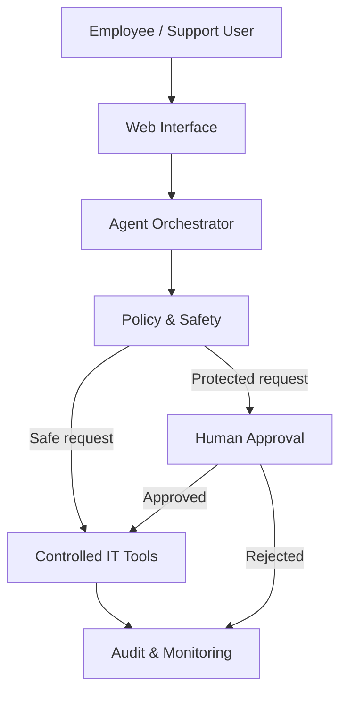

### Future Enterprise Integrations

Enterprise systems are kept behind the controlled tool layer rather than being accessed directly by the agent.

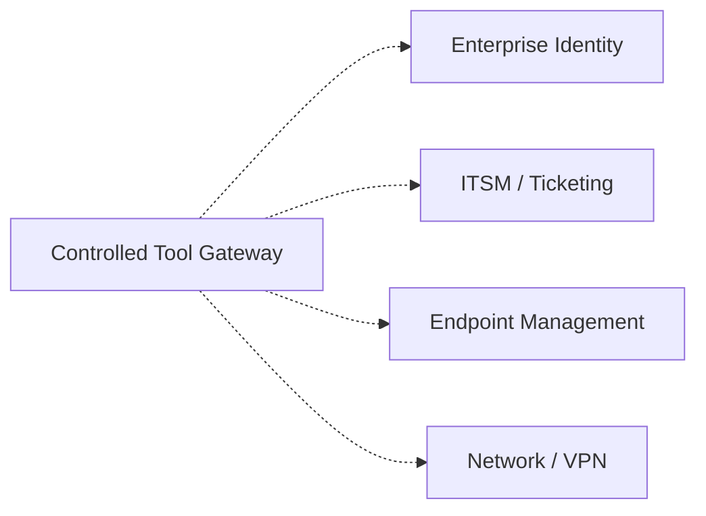

> Solid connections represent the main demonstrator workflow. Dashed connections represent future enterprise integrations.

---

## 1.2 Architecture Layers

| Layer         | Components             | Responsibility                           |
| ------------- | ---------------------- | ---------------------------------------- |
| Presentation  | Web Interface          | Accept requests and display results      |
| API           | FastAPI                | Receive requests and expose services     |
| Agent         | Planner / Orchestrator | Understand requests and select workflows |
| Knowledge     | Local Knowledge Base   | Provide relevant support guidance        |
| Safety        | Policy Engine          | Evaluate actions before execution        |
| Tools         | Simulated IT Tools     | Perform controlled diagnostics           |
| Approval      | Human Approval Queue   | Gate protected actions                   |
| Observability | Audit, Trace, Metrics  | Monitor and record workflows             |
| Integration   | Enterprise Adapters    | Future connection to enterprise systems  |

---

## 1.3 Internal Agent Components

The agent workflow consists of several logical components.

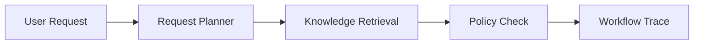

The planner determines the support category, retrieval provides relevant internal guidance, and the policy layer determines whether the requested operation can proceed.

---

## 1.4 Trust Boundaries

The system contains four logical trust boundaries.

### User Boundary

Natural-language requests originate from users and should be treated as untrusted input.

### Application Boundary

The API, planner, retrieval system, and policy engine process and validate the request.

### Action Boundary

Tools operate inside a controlled boundary. Protected operations cannot be executed directly by the agent.

### Operations Boundary

Audit logs, traces, and monitoring information are maintained separately for operational visibility.

---

# 2. Agent Workflow Design

## 2.1 Agent Roles

| Role                | Responsibility                                   |
| ------------------- | ------------------------------------------------ |
| User                | Submits an IT support request                    |
| Agent Planner       | Classifies the request and selects a workflow    |
| Knowledge Retriever | Retrieves relevant internal guidance             |
| Policy Engine       | Determines safety and authorization requirements |
| Tool Executor       | Executes permitted diagnostic actions            |
| Approver            | Approves or rejects protected actions            |
| Monitoring / Audit  | Records workflow and operational events          |

---

## 2.2 Main Workflow

The workflow follows a controlled sequence from request intake to completion.

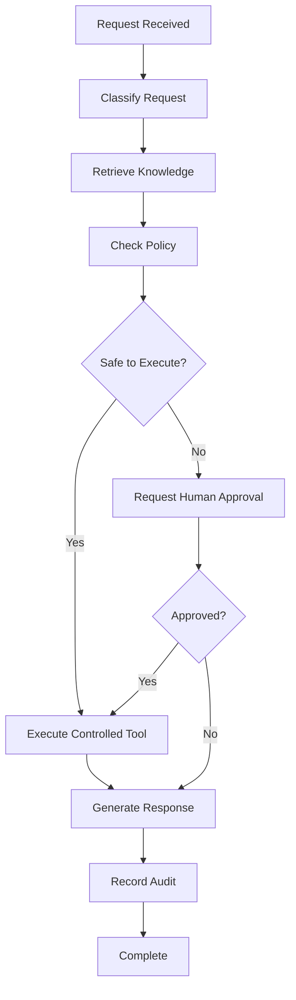

---

## 2.3 Workflow States

### 1. Request Received

The system receives a natural-language support request.

Example:

> My Wi-Fi keeps disconnecting.

---

### 2. Request Classified

The planner determines the appropriate support category.

Examples:

* Wi-Fi
* VPN
* Account assistance
* Protected account action
* Support ticket
* General support

---

### 3. Knowledge Retrieved

The system searches the local knowledge base for relevant support information.

Example:

```text
User Request
     ↓
Knowledge Search
     ↓
Relevant Support Article
     ↓
Workflow Evidence
```

---

### 4. Policy Checked

The request is evaluated before any action is performed.

Possible outcomes:

* Safe action
* Human approval required
* Action blocked

---

### 5. Controlled Tool Execution

Safe diagnostic workflows can use simulated tools.

Examples:

* Wi-Fi diagnostic
* VPN diagnostic
* Account status check
* Support ticket creation

---

### 6. Human Approval

Protected actions are sent to the approval queue.

Examples:

* Unlocking an account
* Resetting a password
* Changing access permissions
* Granting privileged access
* Restarting a device

The agent does not automatically execute these operations.

---

### 7. Response

The user receives:

* Detected issue
* Relevant guidance
* Tool result
* Approval status where applicable
* Recommended next steps

---

### 8. Audit

Important workflow events are recorded for traceability.

---

## 2.4 Protected Action Workflow

Protected operations follow a separate approval path.

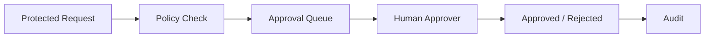

---

## 2.5 Handoffs

The workflow uses controlled handoffs between logical components.

```text
User
  ↓
Planner
  ↓
Knowledge Retrieval
  ↓
Policy Engine
  ↓
Safe Tool OR Human Approval
  ↓
Response
  ↓
Audit
```

Each handoff should preserve the request context and workflow state.

---

## 2.6 Failure Paths

The system should fail safely when an expected operation cannot be completed.

| Failure                  | Expected Behaviour                        |
| ------------------------ | ----------------------------------------- |
| No relevant knowledge    | Provide safe generic guidance or escalate |
| Tool failure             | Report failure and avoid unsafe retries   |
| Policy violation         | Block the action                          |
| Approval rejected        | Do not execute the protected action       |
| Approval timeout         | Keep pending or escalate                  |
| Invalid request          | Request clarification                     |
| Unexpected tool response | Stop the workflow and record the failure  |

---

# 3. Deployment Strategy

## 3.1 Current Deployment

The demonstrator is designed to run locally using Docker Compose.

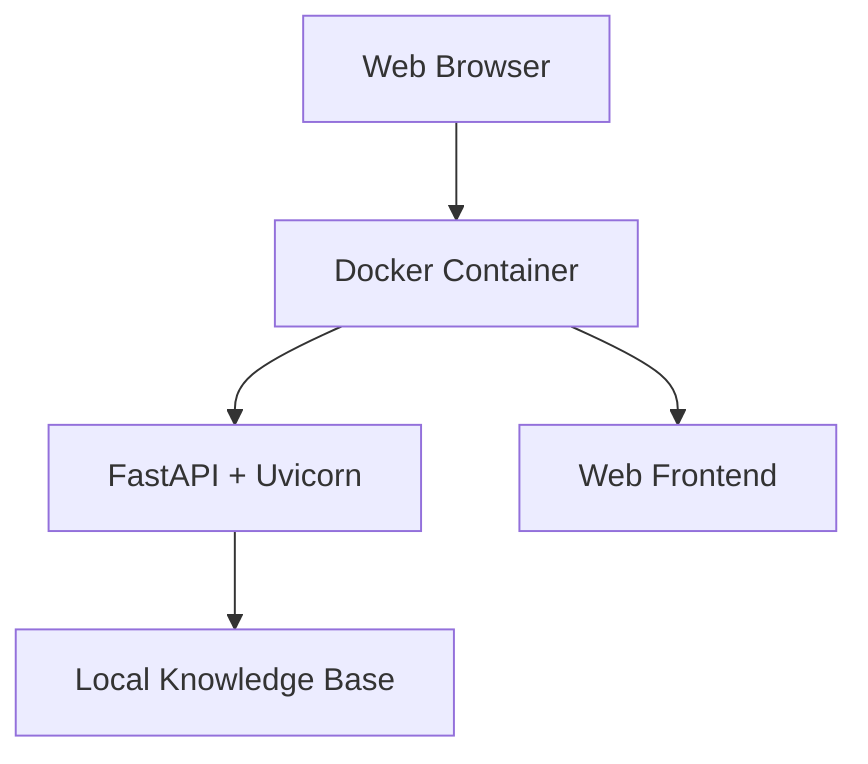

The current implementation uses a single container to keep the academic demonstrator simple and reproducible.

---

## 3.2 Runtime Stack

| Component          | Technology            |
| ------------------ | --------------------- |
| Frontend           | HTML, CSS, JavaScript |
| Backend            | Python                |
| API Framework      | FastAPI               |
| Application Server | Uvicorn               |
| Knowledge          | Markdown files        |
| Containerization   | Docker                |
| Orchestration      | Docker Compose        |
| Testing            | Pytest                |

---

## 3.3 Environment Strategy

A production-oriented implementation can use separate environments.

```text
Development
     ↓
Continuous Integration
     ↓
Staging
     ↓
Production
```

### Development

Used for:

* Local development
* Debugging
* Workflow testing
* Simulated integrations

### Continuous Integration

Used for:

* Automated tests
* Build validation
* Security checks
* Container validation

### Staging

Used for:

* Integration testing
* Security testing
* Performance testing
* Approval workflow testing

### Production

Used for:

* Controlled enterprise operation
* Real monitoring
* Enterprise identity
* Approved integrations
* Audited tool execution

---

## 3.4 Production Scaling

The single-container demonstrator can be extended to multiple agent instances.

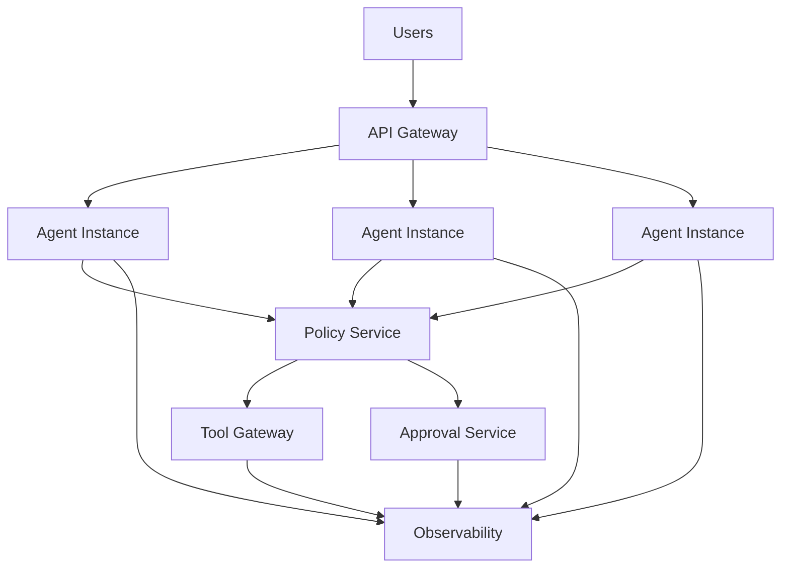

This allows agent workloads and supporting services to scale independently.

---

## 3.5 Resilience Strategy

Potential resilience mechanisms include:

* Container health checks
* Automatic service restart
* Request timeouts
* Controlled retries
* Idempotent tool operations
* Circuit breakers for external services
* Queue-based approval workflows
* Centralized logging
* Graceful degradation
* Backup and recovery procedures

Sensitive operations should fail closed when authorization cannot be established.

---

## 3.6 Release Strategy

A production release can follow:

```text
Developer Change
      ↓
Code Review
      ↓
Automated Tests
      ↓
Security Checks
      ↓
Container Build
      ↓
Staging Deployment
      ↓
Validation
      ↓
Production Approval
      ↓
Production Deployment
```

A rollback mechanism should be available for failed deployments.

---

# 4. Security Model

## 4.1 Security Principles

AEGISDESK follows:

* Least privilege
* Explicit authorization
* Human oversight
* Policy enforcement
* Secure secret management
* Data minimization
* Auditability
* Fail-safe execution

---

## 4.2 Identity Model

A production deployment should use an enterprise identity provider.

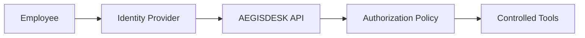

The current demonstrator does not require a real identity provider.

---

## 4.3 Role-Based Authorization

| Role          | Typical Permissions                 |
| ------------- | ----------------------------------- |
| Employee      | Submit requests and view results    |
| Support Agent | Investigate support requests        |
| Approver      | Approve or reject protected actions |
| Administrator | Manage configuration and policies   |

Authorization should be enforced by application controls rather than relying only on the AI agent.

---

## 4.4 Secrets Management

Secrets should never be hard-coded into the source code.

Production implementations should use:

* Environment variables
* Secret managers
* Short-lived credentials
* Credential rotation
* Restricted access
* Log redaction

The repository should contain safe configuration examples rather than real credentials.

---

## 4.5 Privacy

The application should minimize unnecessary collection of user information.

Recommended practices:

* Store only information required for support.
* Avoid unnecessary sensitive information.
* Restrict access to audit records.
* Apply retention policies.
* Protect user-related logs.
* Redact sensitive information from traces where appropriate.

---

## 4.6 Guardrails

A protected operation should pass through multiple controls.

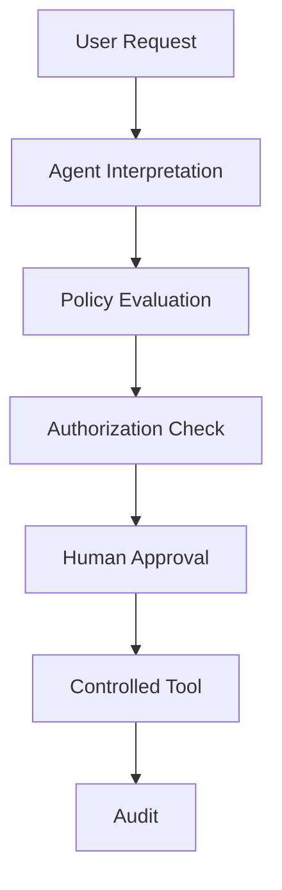

This prevents a natural-language request from directly becoming a privileged enterprise operation.

---

## 4.7 Threat Model

| Threat               | Risk                                                    | Mitigation                           |
| -------------------- | ------------------------------------------------------- | ------------------------------------ |
| Prompt injection     | Agent may be instructed to bypass intended behaviour    | External policy enforcement          |
| Unauthorized action  | Sensitive operation may be performed without permission | Role-based authorization             |
| Excessive privileges | Agent may access unnecessary systems                    | Least privilege                      |
| Tool misuse          | Incorrect parameters may affect systems                 | Tool validation and gateway          |
| Credential exposure  | Secrets may appear in source or logs                    | Secret management and redaction      |
| Data leakage         | Sensitive information may be exposed                    | Data minimization and access control |
| Audit tampering      | Activity may become difficult to investigate            | Protected audit storage              |
| Tool failure         | Unsafe or incomplete results                            | Validation and fail-safe handling    |

---

## 4.8 Audit Model

Important events should contain information such as:

| Field           | Purpose                      |
| --------------- | ---------------------------- |
| Request ID      | Correlates workflow events   |
| Timestamp       | Establishes event order      |
| Actor           | Identifies user or approver  |
| Action          | Describes the operation      |
| Policy Decision | Records the safety decision  |
| Tool            | Identifies the tool involved |
| Approval        | Records approval status      |
| Result          | Records success or failure   |

Audit records should be protected against unauthorized modification.

---

# 5. Monitoring Dashboard Design

## 5.1 Monitoring Architecture

The monitoring system collects workflow, health, audit, and usage information.

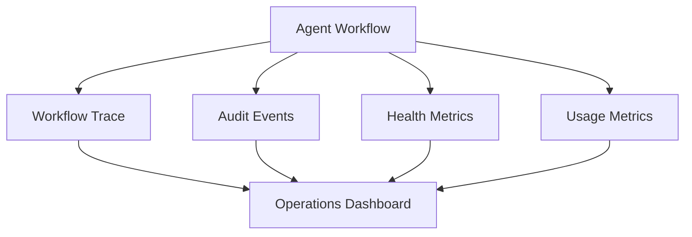

---

## 5.2 Health Metrics

The dashboard should provide:

* API availability
* Request count
* Error count
* Error rate
* Tool availability
* Average response duration
* Service restart count

---

## 5.3 Workflow Trace

Each request should be traceable through the major stages.

```text
Request Received
      ↓
Classified
      ↓
Knowledge Retrieved
      ↓
Policy Evaluated
      ↓
Tool Selected
      ↓
Tool Executed / Approval Requested
      ↓
Response Generated
      ↓
Audit Recorded
```

A request ID should correlate these events.

---

## 5.4 Quality Metrics

Potential quality indicators include:

* Successful resolutions
* Escalation rate
* Tool success rate
* Knowledge retrieval success
* Average handling time
* Repeated requests
* User follow-up rate

These metrics can identify workflows that require improvement.

---

## 5.5 Safety Metrics

Safety monitoring should include:

* Protected actions
* Policy blocks
* Approval requests
* Approvals
* Rejections
* Approval timeouts
* Tool authorization failures

Safety metrics should be investigated alongside audit records.

---

## 5.6 Cost and Resource Metrics

For an enterprise deployment, the dashboard can monitor:

* Model requests
* Token consumption
* Tool calls
* API usage
* Compute utilization
* Container resource usage
* Infrastructure cost

The local demonstrator can represent these concepts without requiring paid model infrastructure.

---

## 5.7 Business Outcome Metrics

| Metric                | Purpose                                  |
| --------------------- | ---------------------------------------- |
| Requests handled      | Measures workload                        |
| Resolution rate       | Measures support effectiveness           |
| Average handling time | Measures operational efficiency          |
| Escalation rate       | Measures human intervention              |
| Approval turnaround   | Measures protected workflow efficiency   |
| Repeat requests       | Identifies potentially unresolved issues |

These metrics should be interpreted together rather than as isolated indicators.

---

## 5.8 Current Dashboard Mapping

The AEGISDESK demonstrator provides an operations view containing:

* Total workflow runs
* Pending approvals
* Safety blocks
* Average duration
* Recent requests
* Approval queue
* Audit activity
* Application health

This allows the evaluator to observe both normal and protected workflows.

---

# 6. Demonstration Workflows

## 6.1 Wi-Fi Troubleshooting

**Example request:**

> My Wi-Fi keeps disconnecting.

**Workflow:**

```text
Request
  ↓
Wi-Fi Classification
  ↓
Knowledge Retrieval
  ↓
Policy Check
  ↓
Simulated Wi-Fi Diagnostic
  ↓
Troubleshooting Guidance
  ↓
Audit
```

The workflow demonstrates safe diagnostic automation.

---

## 6.2 VPN Troubleshooting

**Example request:**

> My corporate VPN is not connecting.

**Workflow:**

```text
Request
  ↓
VPN Classification
  ↓
Knowledge Retrieval
  ↓
Policy Check
  ↓
Simulated VPN Diagnostic
  ↓
Troubleshooting Guidance
  ↓
Audit
```

---

## 6.3 Protected Account Action

**Example request:**

> Please unlock my account.

**Workflow:**

```text
Request
  ↓
Protected Action Detected
  ↓
Policy Check
  ↓
Approval Required
  ↓
Approval Queue
  ↓
Human Decision
  ↓
Approve / Reject
  ↓
Audit
```

The sensitive action is not automatically performed.

---

## 6.4 Support Ticket

**Example request:**

> Create a support ticket for my issue.

**Workflow:**

```text
Request
  ↓
Ticket Classification
  ↓
Policy Check
  ↓
Simulated Ticket Tool
  ↓
Demo Ticket ID
  ↓
Audit
```

The ticket tool is explicitly simulated and does not contact a real external ticketing system.

---

# 7. Current Implementation Mapping

| Component           | Demonstrator Implementation   |
| ------------------- | ----------------------------- |
| User Interface      | Browser-based frontend        |
| API                 | FastAPI                       |
| Agent Planner       | Deterministic request planner |
| Knowledge Retrieval | Local Markdown knowledge base |
| Policy              | Protected-action detection    |
| Tool Layer          | Simulated IT tools            |
| Approval            | In-memory approval queue      |
| Audit               | In-memory audit events        |
| Metrics             | Application metrics           |
| Dashboard           | Operations view               |
| Deployment          | Docker Compose                |
| Testing             | Pytest                        |

The deterministic planner is intentional for this academic demonstrator. A production implementation could replace or augment it with an LLM-based planner while retaining the external policy and authorization controls.

---

# 8. Production Extension Architecture

The demonstrator can be extended into a production-oriented architecture while preserving its safety model.

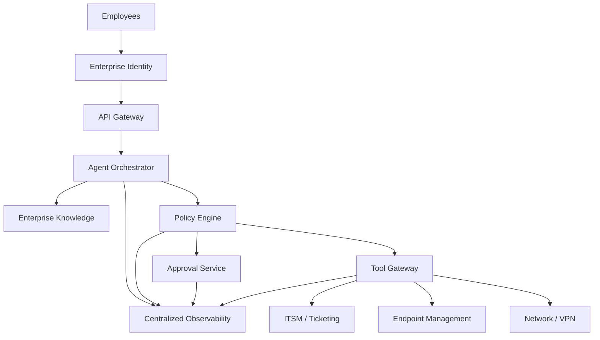

Enterprise integrations remain behind controlled interfaces.

The agent should not receive unrestricted direct access to enterprise infrastructure.

---

# 9. Overall Design Principle

The complete system follows:

```text
UNDERSTAND
    ↓
PLAN
    ↓
RETRIEVE
    ↓
CHECK POLICY
    ↓
ACT SAFELY
    ↓
REQUEST HUMAN APPROVAL WHEN REQUIRED
    ↓
TRACE
    ↓
AUDIT
    ↓
RESPOND
```

AEGISDESK demonstrates that an enterprise agentic IT support system requires more than conversational AI.

It combines:

* Intelligent workflow planning
* Knowledge retrieval
* Controlled tool use
* Authorization
* Human oversight
* Security guardrails
* Auditability
* Monitoring
* Failure handling

---

# 10. Conclusion

AEGISDESK provides a controlled demonstration of an enterprise-oriented agentic IT support architecture.

The project combines an agent planner, internal knowledge retrieval, simulated diagnostic tools, protected-action approval workflows, audit tracing, operational metrics, and a monitoring dashboard.

The demonstrator intentionally separates **decision-making from privileged execution**. Safe diagnostic workflows can proceed automatically, while sensitive actions are routed through policy checks and human approval.

The architecture can later be extended with enterprise identity, ticketing, endpoint management, network systems, centralized observability, and other controlled integrations.

The central principle of the system is:

> **Automate routine support safely, keep privileged actions controlled, and make important decisions traceable.**
