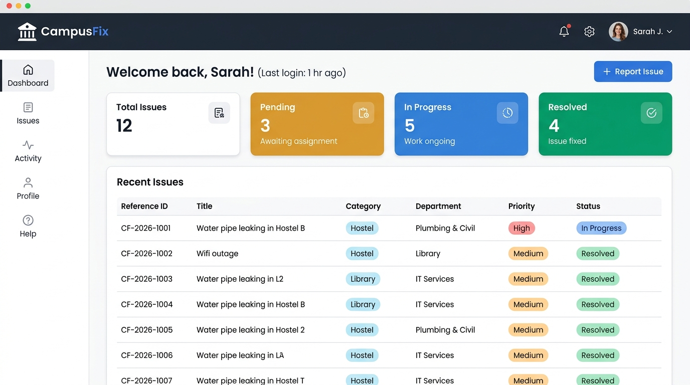
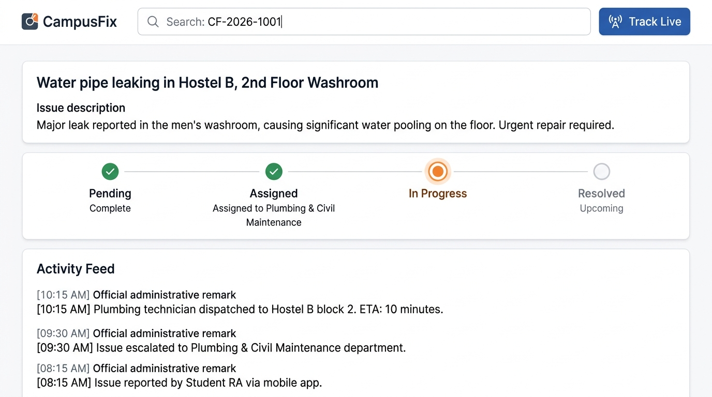
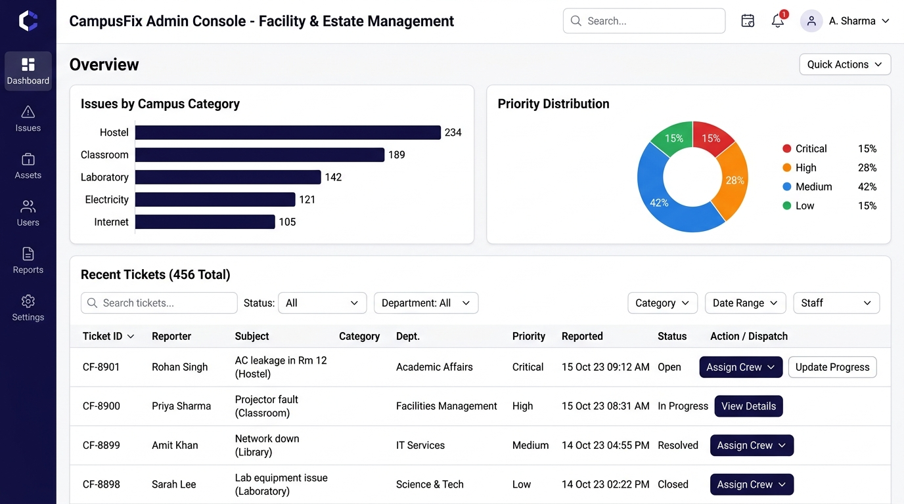

# CampusFix – AI-Powered Campus Issue Management System

> **Course Assignment:** Internet of Computation (IoC)  
> **Student Name:** Jamuna S  
> **Roll Number:** 2023103567  
> **Project Title:** CampusFix – AI-Powered Campus Issue Management System  
> **GitHub Repository:** [https://github.com/JamunaSenthil/CampusFix-AI-Powered-Campus-Issue-Management-System](https://github.com/JamunaSenthil/CampusFix-AI-Powered-Campus-Issue-Management-System)  
> **Live Deployment URL:** [https://ais-pre-n5juj74dytbhepwzp2ttii-196015505867.asia-southeast1.run.app](https://ais-pre-n5juj74dytbhepwzp2ttii-196015505867.asia-southeast1.run.app)  

---

## 🏛️ Enterprise Capstone Deliverables (5 Core Artifacts)

CampusFix adheres to the **Enterprise Architecture Completeness Framework** documented in detail in [`CAPSTONE_DELIVERABLES.md`](./CAPSTONE_DELIVERABLES.md):

| # | Capstone Artifact | Core Scope & Coverage |
| :-: | :--- | :--- |
| **1** | **Architecture Diagram** | Presentation Layer, Express API Gateway, AI Orchestration, Persistence Layer, and 4 Trust Boundary Zones. |
| **2** | **Agent Workflow Design** | State machine transitions, Gemini AI tools, Fail-Open heuristic fallback, Human-in-the-Loop review. |
| **3** | **Deployment Strategy** | Cloud Run auto-scaling, environments (Dev, Preview, Production), graceful shutdown, and containerization. |
| **4** | **Security Model** | Bcrypt (salt 10), signed JWT (HS256), strict RBAC (`student` vs `admin`), zero Aadhaar/Gov ID tracking, audit log. |
| **5** | **Monitoring Dashboard** | Observability matrix: Health probe (`/api/health`), P95 latency (<250ms), AI accuracy, and resolution SLA tracking. |

---

## 📸 Application Screenshots

Below are screenshots demonstrating the key functional modules implemented in CampusFix:

### 1. Student Portal & Analytics Dashboard

*Real-time student dashboard displaying analytical KPI summary cards (Total, Pending, In Progress, Resolved), active complaints table with categorical badges, department assignments, and quick issue submission.*

---

### 2. Interactive Live Issue Tracker & Timeline Stepper

*Live issue lookup by Reference ID (`CF-2026-XXXX`) featuring a 4-stage visual progress stepper (`Pending` → `Assigned` → `In Progress` → `Resolved`), assigned division indicator, and chronological administrative inspection log.*

---

### 3. Administrator Operations & Dispatch Console

*Dedicated administrative console with institutional issue distribution charts (by Category & Priority Severity matrix), ticket search filters, and an interactive status transition and remarks dispatch interface.*

---

## 🚀 Key Features & Highlights

- **Zero-Friction Student Access**:
  - Requires only Name, College Email, Password, Department, and Academic Year.
  - **Strictly NO Aadhaar, NO OTP, NO government ID, and NO document upload hurdles.**
  - Direct login upon registration with secure bcrypt hashing and signed JWT issuance.

- **AI-Powered Issue Triage & Routing**:
  - Evaluates issue title and detailed description using `@google/genai` (`gemini-3.8-flash`).
  - Automatically recommends Category, Urgency Priority, and designated campus maintenance department (e.g., Plumbing & Civil Maintenance, Electrical Works, Network Infrastructure, Sanitation).
  - Includes a built-in rule-based keyword fallback classifier for 100% reliable offline operation.

- **Dual Persistent Storage Engine**:
  - Connects to remote **MongoDB** / MongoDB Atlas when `MONGODB_URI` is provided.
  - Automatically provisions an embedded, file-backed MongoDB-compatible datastore (`data/db_*.json`) with BSON indexing when external MongoDB is not present.

- **Role-Based Security & Permissions**:
  - Bcrypt password encryption (salt rounds: 10).
  - Signed JSON Web Tokens (`jwt.sign`) with 7-day expiration.
  - Server-side role authorization guards (`authenticateToken`, `requireRole(['admin'])`).

- **In-App Notification Center**:
  - Real-time notification badge alert when administrators assign crew, update progress, or add inspection remarks.

---

## 🛠️ Technology Stack

- **Frontend**: React 19, TypeScript, Tailwind CSS, Lucide Icons, Motion
- **Backend**: Node.js, Express.js (v4.21), TypeScript (`tsx`), CORS, Dotenv
- **Database**: MongoDB (with embedded fallback persistent engine)
- **AI Integration**: Google GenAI SDK (`@google/genai`) with `gemini-3.8-flash`

---

## ⚡ Quick Start & Local Setup

### 1. Install Dependencies
```bash
npm install
```

### 2. Configure Environment Variables
Copy `.env.example` to `.env`:
```bash
cp .env.example .env
```

Environment variables:
```env
PORT=3000
NODE_ENV=development
JWT_SECRET="campusfix_super_secure_jwt_secret_key_2026"
MONGODB_URI="mongodb://localhost:27017/campusfix"
GEMINI_API_KEY="YOUR_GEMINI_API_KEY"
```

### 3. Run Development Server
```bash
npm run dev
```
The application will be live at **`http://localhost:3000`**.

### 4. Build for Production
```bash
npm run build
npm start
```

---

## 🔑 Pre-Configured Demo Credentials

Use the **1-Click Autofill Demo** buttons on the login screens or enter these credentials:

### 1. Campus Administrator
- **Email:** `admin@campusfix.edu`
- **Password:** `AdminPassword123!`
- **Role:** Facility & Estate Administrator
- **Access:** Complete management console, analytics, status transitions, department dispatch.

### 2. Student Account 1 (Alex Chen)
- **Email:** `alex.chen@campusfix.edu`
- **Password:** `StudentPass123!`
- **Department:** Computer Science & Engineering (3rd Year)

### 3. Student Account 2 (Priya Patel)
- **Email:** `priya.patel@campusfix.edu`
- **Password:** `StudentPass123!`
- **Department:** Mechanical Engineering (2nd Year)

---

## 📂 Project Structure

```
├── GENERATION_PROMPT.md        # Generation prompt specification
├── CampusFix_Deliverables.md   # Detailed project deliverables document
├── Deployment_Link.md          # Live deployment and reference links
├── README.md                   # System overview, screenshots, and setup
├── screenshots/                # Application screenshots demonstrating features
│   ├── 01_student_dashboard.jpg
│   ├── 02_live_issue_tracker.jpg
│   └── 03_admin_dispatch_console.jpg
├── client/                     # Client package configuration
├── server/                     # Backend Express routes, controllers, db & seed
│   ├── controllers/
│   ├── middleware/
│   ├── models/
│   ├── routes/
│   ├── services/
│   ├── app.ts
│   ├── db.ts
│   └── seed.ts
├── src/                        # React 19 Frontend components and views
├── server.ts                   # Full-stack server entry point (Express + Vite)
└── package.json                # Root dependencies & build scripts
```
