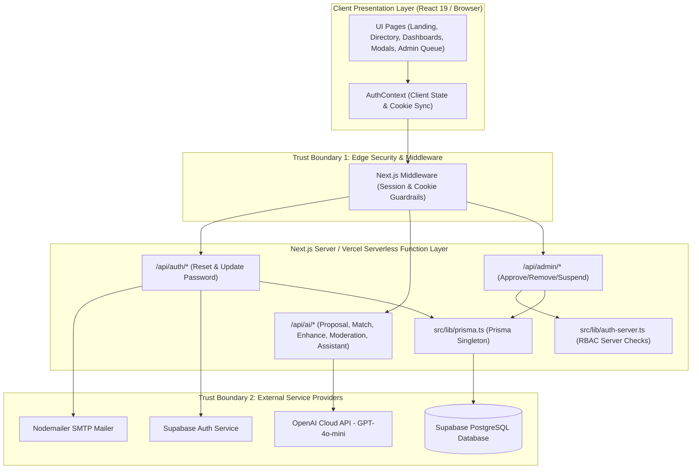
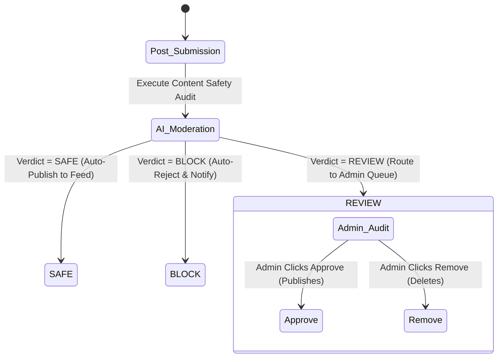

# SkillBridge AI — Capstone Deliverables Master Document

**Student Name:** Thariq Azees  
**Roll Number:** 2023103576  
**Course:** IoC — Scalable Enterprise Architectural Deployments of Agentic AI Solutions  
**Project Name:** SkillBridge AI — Smart Freelance Marketplace & AI Agent Ecosystem  
**Repository URL:** [https://github.com/ThariqAzees/SkillBridgeAI](https://github.com/ThariqAzees/SkillBridgeAI)  
**Live Application URL:** [https://skill-bridge-ai-blush.vercel.app/it](https://skill-bridge-ai-blush.vercel.app/it)  

---

## Executive Summary & Index of Deliverables

This master document presents the complete capstone deliverables for **SkillBridge AI**, a production-ready AI freelance marketplace built with Next.js 14 App Router, TypeScript, Tailwind CSS, Prisma ORM, Supabase Auth, Nodemailer, and OpenAI API.

### Index of Included Deliverables

1. [Deliverable 1: Architecture Diagram](#deliverable-1-architecture-diagram)
2. [Deliverable 2: Agent Workflow Design](#deliverable-2-agent-workflow-design)
3. [Deliverable 3: Deployment Strategy](#deliverable-3-deployment-strategy)
4. [Deliverable 4: Security Model](#deliverable-4-security-model)
5. [Deliverable 5: Monitoring Dashboard Design](#deliverable-5-monitoring-dashboard-design)

---

## Deliverable 1: Architecture Diagram

### System Architecture Overview

SkillBridge AI operates on a modern multi-tier serverless micro-services architecture hosted on **Vercel** with database persistence on **Supabase Cloud (PostgreSQL)** and AI features powered by **OpenAI GPT-4o-mini**.



---

## Deliverable 2: Agent Workflow Design

### Implemented AI Capabilities

1. **AI Profile Enhancer (`/api/ai/enhance-profile`)**: Analyzes freelancer portfolio and skills to write high-converting copy. Requires explicit user approval via interactive diff review modal.
2. **AI Project Matcher (`/api/ai/match`)**: Calculates real-time percentage match scores with feature alignment explanations.
3. **AI Proposal Generator (`/api/ai/generate-proposal`)**: Generates custom cover letter proposals based on client project descriptions and freelancer portfolio work.
4. **AI Community Moderation Engine (`/api/ai/moderate-post`)**: Multi-tier safety classifier routing content to `SAFE` (auto-publish), `REVIEW` (flagged for admin review queue), or `BLOCK` (auto-reject).
5. **AI Freelancing Assistant (`/api/ai/assistant`)**: Interactive chat assistant providing career, pricing, and portfolio strategy.



---

## Deliverable 3: Deployment Strategy

- **Live Application URL**: [https://skill-bridge-ai-blush.vercel.app/it](https://skill-bridge-ai-blush.vercel.app/it)
- **GitHub Repository**: [https://github.com/ThariqAzees/SkillBridgeAI](https://github.com/ThariqAzees/SkillBridgeAI)
- **Hosting Platform**: Vercel Serverless (Hobby Free Tier) with automated deployment on push to `main` branch.
- **Prisma Client Generation**: Executed automatically during install (`"postinstall": "prisma generate"`) to ensure Linux x64 compatibility.
- **Connection Management**: Supabase Transaction Pooler (port 6543) with Prisma client singleton pattern (`src/lib/prisma.ts`).

---

## Deliverable 4: Security Model

- **Authentication & Sessions**: Cryptographically signed `sb_session_id` cookies using HMAC-SHA256 signatures with HttpOnly and SameSite=Lax flags.
- **Server-Side RBAC**: Role validation enforced on server endpoints via `getAuthenticatedUserServer()` and `requireAdminServer()`.
- **Password Reset Security**:
  - High-entropy 64-character hex tokens generated via `crypto.randomBytes(32)`.
  - Only SHA-256 hashes stored in database (`PasswordResetToken` model).
  - 15-minute expiration and atomic single-use consumption (`consumePasswordResetToken`).
  - Non-enumerating API response: *"If the account exists, a password reset email has been sent."*
  - Server-side synchronization with Supabase Auth (`supabaseAdmin.auth.admin.updateUserById`).
- **Secret Protection**: `SUPABASE_SERVICE_ROLE_KEY`, `OPENAI_API_KEY`, `SMTP_PASSWORD`, and `DATABASE_URL` stored strictly in server-side environment variables.

---

## Deliverable 5: Monitoring Dashboard Design

- **System Metrics**: Vercel edge latency (p50/p95/p99), serverless cold start duration, 5xx API error rates.
- **Database Telemetry**: Connection pool saturation, Prisma query latency, connection error count.
- **AI Telemetry**: OpenAI request counts, token consumption per route, timeout tracking (>8000ms), fallback heuristic rate.
- **Security Audit Logs**: Password reset conversion rates, invalid token attempt frequency, community post moderation outcomes (`SAFE`, `REVIEW`, `BLOCK`).

```
+-----------------------------------------------------------------------------------+
|                           SKILLBRIDGE AI OPERATIONAL DASHBOARD                     |
+------------------------------------+----------------------------------------------+
| 1. SYSTEM HEALTH & LATENCY         | 2. AI AGENT PERFORMANCE & COST                |
| [Uptime: 99.95%]  [Error Rate: 0.2%] | [Daily Tokens: 42,500]  [Cost: $0.06/day]    |
| [p95 Latency Chart: ~350ms]        | [Fallback Trigger Rate: 0.4%]                 |
+------------------------------------+----------------------------------------------+
| 3. DATABASE & POOLER HEALTH        | 4. SECURITY & AUTHENTICATION AUDIT           |
| [Active DB Poolers: 6 / 20]        | [Active Sessions: 142]                       |
| [Prisma Avg Query: 14ms]           | [Password Resets (24h): 3]                   |
+------------------------------------+----------------------------------------------+
```
