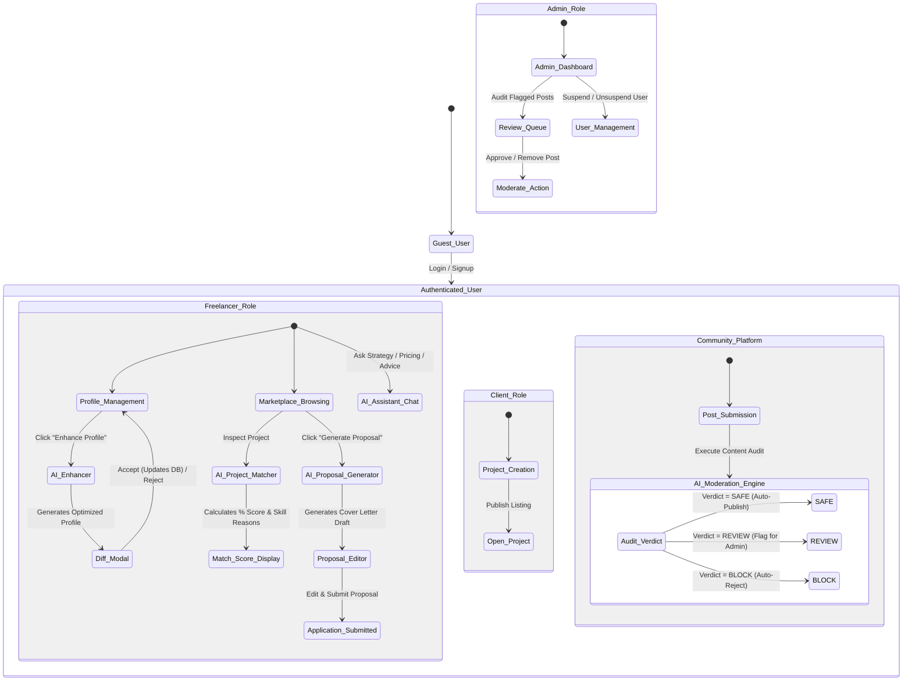
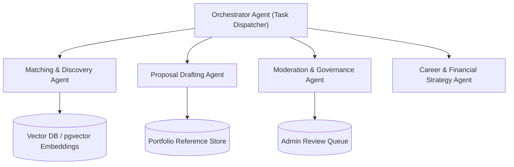

# Deliverable 2: Agent Workflow Design & AI Feature Specifications

**Student Name:** Thariq Azees  
**Roll Number:** 2023103576  
**Course:** IoC — Scalable Enterprise Architectural Deployments of Agentic AI Solutions  
**Project Name:** SkillBridge AI — Smart Freelance Marketplace & AI Agent Ecosystem  
**Repository URL:** [https://github.com/ThariqAzees/SkillBridgeAI](https://github.com/ThariqAzees/SkillBridgeAI)  
**Live Application URL:** [https://skill-bridge-ai-blush.vercel.app/it](https://skill-bridge-ai-blush.vercel.app/it)  

---

## 1. Executive Overview

SkillBridge AI integrates target agentic workflows into a full-stack freelance platform. The platform embeds AI directly into core user touchpoints to reduce friction, increase proposal conversion, protect community integrity, and maximize match quality.

> **Architecture Clarification**: The current implementation leverages single-agent specialized API prompts using OpenAI GPT-4o-mini with structured JSON outputs, fallback heuristics, and human-in-the-loop controls. A proposed multi-agent orchestrator architecture is detailed in Section 4 for future roadmap expansion.

---

## 2. Implemented AI Agent Capabilities & Workflows



---

## 3. Detailed Specifications of Implemented AI Features

### 3.1 AI Profile Enhancer (`/api/ai/enhance-profile`)
- **Purpose**: Analyzes a freelancer's raw bio, headline, skills, and portfolio work to produce professional, high-converting profile copy.
- **Workflow & Human Oversight**:
  1. Freelancer clicks "Enhance Profile with AI" on `/profile/edit`.
  2. POST request dispatched to `/api/ai/enhance-profile` with `{ headline, bio, skills, portfolio }`.
  3. AI generates structured JSON containing optimized headline, bio, and suggested skills.
  4. Response opens an **Interactive AI Diff Review Modal** (`AIProfileEnhancerModal.tsx`).
  5. **Human Approval**: The user must explicitly click "Accept Changes" to apply edits. Clicking "Discard" closes the modal with zero mutations.
- **Fallback Behavior**: If OpenAI API times out or fails, returns a formatted enhancement derived from top portfolio keywords without failing the page.

### 3.2 AI Project Compatibility Matcher (`/api/ai/match`)
- **Purpose**: Computes real-time match compatibility between a freelancer's skill set/experience and client project requirements.
- **Input Payload**: `{ freelancerProfile, projectDetails }`.
- **Output**:
  ```json
  {
    "score": 94,
    "reasons": [
      "✓ Next.js & TypeScript directly match required stack",
      "✓ Hourly rate ($65/hr) fits budget range ($50-$80/hr)",
      "✓ Previous portfolio project demonstrates similar SaaS experience"
    ]
  }
  ```
- **Fallback Heuristic**: If API is unreachable, computes match percentage based on skill array intersection (`matchingSkills / projectSkills * 100`).

### 3.3 AI Proposal Generator (`/api/ai/generate-proposal`)
- **Purpose**: Assists freelancers by writing customized, professional proposal cover letters tailored to specific client project descriptions and freelancer portfolio experience.
- **Workflow**:
  1. Freelancer opens project details on `/projects/[id]`.
  2. Clicks "Generate AI Cover Letter".
  3. POST request sent to `/api/ai/generate-proposal` with `{ projectTitle, projectDescription, freelancerSkills, portfolioSummary }`.
  4. AI constructs a structured 3-paragraph cover letter highlighting relevant skill alignment.
  5. Content populates the proposal text area inside `AIProposalModal.tsx` for manual review and editing before submission.

### 3.4 AI Community Content Moderation Engine (`/api/ai/moderate-post`)
- **Purpose**: Audits developer community posts (`/community`) for spam, toxicity, unauthorized promotion, or unsafe content prior to publishing.
- **Multi-Tier Decision Tree**:
  - `SAFE`: Status set to `PUBLISHED`, visible instantly in community feed.
  - `REVIEW`: Status set to `PENDING_REVIEW`, routed to Admin Queue (`/admin`) with AI justification reason.
  - `BLOCK`: Status set to `REMOVED`, blocked from feed with notification sent to author.
- **Admin Oversight**: Administrators can override AI moderation verdicts in `/admin` by clicking "Approve Post" or "Remove Post".

### 3.5 AI Freelancing Strategy Assistant (`/api/ai/assistant`)
- **Purpose**: Provides interactive guidance on freelance pricing, scope estimation, client negotiation, and profile positioning.
- **Implementation**: `/api/ai/assistant` handles multi-turn conversation prompts, applying system prompts tailored for freelance business strategy.

---

## 4. Proposed Future Architectural Enhancements: Multi-Agent Orchestrator

While the current version uses specialized single-agent prompts, future development will transition to an autonomous multi-agent orchestrator system:



- **Vector Embeddings (`vector(1536)`)**: Leveraging pgvector columns in PostgreSQL to perform semantic vector search across freelancer profiles and project descriptions.
- **Agent Handoffs**: Automatic routing of low-matching applicants to the Proposal Drafting Agent to suggest profile improvements prior to application submission.
