# Deliverable 1: Architecture Diagram & System Specification

**Student Name:** Thariq Azees  
**Roll Number:** 2023103576  
**Course:** IoC — Scalable Enterprise Architectural Deployments of Agentic AI Solutions  
**Project Name:** SkillBridge AI — Smart Freelance Marketplace & AI Agent Ecosystem  
**Repository URL:** [https://github.com/ThariqAzees/SkillBridgeAI](https://github.com/ThariqAzees/SkillBridgeAI)  
**Live Application URL:** [https://skill-bridge-ai-blush.vercel.app/it](https://skill-bridge-ai-blush.vercel.app/it)  

---

## 1. Executive Summary & Architectural Overview

SkillBridge AI is a modern, production-ready freelance marketplace and AI-driven professional ecosystem built with **Next.js 14 App Router**, **TypeScript**, **Tailwind CSS**, **Prisma ORM**, **Supabase Auth**, and **OpenAI API**. The platform connects Clients and Freelancers while embedding agentic AI workflows into core operations: intelligent proposal generation, automated skill profile enhancement, semantic project matching, multi-tier AI community post moderation, and interactive freelancing strategy assistance.

---

## 2. Comprehensive System Architecture Diagram

The system follows a multi-tier, serverless micro-services architecture hosted on **Vercel** with persistent data stores managed by **Supabase Cloud** (PostgreSQL) and external LLM/email services.

```mermaid
graph TB
    subgraph Client_Layer ["Client & Presentation Layer (Browser / React 19)"]
        UI_Guest["Guest Views (Landing, Public Freelancer Directory, Login, Signup)"]
        UI_Freelancer["Freelancer Views (Dashboard, Application Portal, Profile Editor, AI Assistant)"]
        UI_Client["Client Views (Client Dashboard, Project Manager, Proposal Reviewer)"]
        UI_Admin["Admin Portal (Flagged Post Queue, User Suspension Management)"]
        Auth_Context["AuthContext (Client State, Local Session Cookie Sync)"]
    end

    subgraph Security_Perimeter ["Trust Boundary 1: Edge Security & Middleware"]
        MW["Next.js Middleware (Session Validation & Cookie Inspection)"]
        CSRF["Origin & Header Inspection"]
    end

    subgraph App_Server_Layer ["Next.js Server / Vercel Serverless Function Layer"]
        subgraph Server_Auth ["Authentication & Session Services"]
            Session_Lib["src/lib/session.ts (HMAC-SHA256 Token Verification)"]
            Auth_Server["src/lib/auth-server.ts (getAuthenticatedUserServer, requireAdminServer)"]
            Reset_Tokens["src/lib/reset-tokens.ts (SHA-256 Token Hashing, 15m Expiry, Single-Use)"]
        end

        subgraph Server_API_Routes ["App Router API Routes"]
            API_Auth_Reset["/api/auth/reset-password"]
            API_Auth_Update["/api/auth/update-password"]
            API_AI_Proposal["/api/ai/generate-proposal"]
            API_AI_Enhance["/api/ai/enhance-profile"]
            API_AI_Match["/api/ai/match"]
            API_AI_Moderate["/api/ai/moderate-post"]
            API_AI_Assistant["/api/ai/assistant"]
            API_Admin_Mod["/api/admin/* (Approve/Remove/Suspend)"]
        end

        subgraph DB_Abstraction ["Data Layer Abstraction"]
            Prisma_Singleton["src/lib/prisma.ts (Prisma Client Instance)"]
            Local_DB["src/lib/db.ts (Persistent DB Access + Resilient In-Memory Fallback)"]
            Local_Passwords["src/lib/passwords.ts (Local Password Registry)"]
        end
    end

    subgraph External_Services ["Trust Boundary 2: External Service Providers"]
        subgraph Supabase_Cloud ["Supabase Auth & Database"]
            SB_Auth["Supabase Auth Service"]
            SB_Admin["Supabase Admin Auth API (updateUserById via SUPABASE_SERVICE_ROLE_KEY)"]
            PG_DB["PostgreSQL Database (Prisma Managed Models)"]
        end

        subgraph AI_Provider ["OpenAI Cloud API"]
            GPT_Model["OpenAI GPT-4o-mini (Proposal, Enhancer, Matcher, Moderation, Assistant)"]
        end

        subgraph Mail_Provider ["Nodemailer SMTP Mailer"]
            SMTP["Nodemailer Mailer (src/lib/mail.ts via SMTP_HOST / Credentials)"]
        end
    end

    %% Client Interactions
    UI_Guest --> Auth_Context
    UI_Freelancer --> Auth_Context
    UI_Client --> Auth_Context
    UI_Admin --> Auth_Context

    Auth_Context --> MW
    MW --> CSRF
    CSRF --> Server_API_Routes

    %% API Route Connections
    API_Auth_Reset --> Reset_Tokens
    API_Auth_Reset --> SMTP
    API_Auth_Update --> Reset_Tokens
    API_Auth_Update --> SB_Admin
    API_Auth_Update --> Local_Passwords

    API_AI_Proposal --> GPT_Model
    API_AI_Enhance --> GPT_Model
    API_AI_Match --> GPT_Model
    API_AI_Moderate --> GPT_Model
    API_AI_Assistant --> GPT_Model

    API_Admin_Mod --> Auth_Server
    API_Admin_Mod --> Local_DB

    %% Database Connections
    Reset_Tokens --> Prisma_Singleton
    Local_DB --> Prisma_Singleton
    Prisma_Singleton --> PG_DB
    SB_Auth --> PG_DB
```

---

## 3. Layered Architectural Breakdown

### 3.1 Presentation & Client State Layer
- **Framework**: Next.js 14.2 App Router with React 19 Client/Server Components.
- **State Management**: `AuthContext` (`src/lib/auth-context.tsx`) tracks current user state, role transitions, authentication status, and synchronizes browser cookies (`sb_session_id`) with `localStorage`.
- **UI Styling**: Tailwind CSS, custom modern dark mode (`slate-900`/`slate-950`), smooth gradients, glassmorphism card overlays, and Lucide React icons.

### 3.2 Security Perimeter & Middleware
- **Middleware Guardrails**: `src/middleware.ts` inspects incoming HTTP requests for valid session signatures on restricted routes (`/admin`, `/dashboard`, `/applications`, `/projects/new`).
- **Cryptographic Cookie Validation**: Uses HMAC-SHA256 signatures (`verifySignedSessionToken`) to validate `sb_session_id` cookies without requiring blocking remote calls on static page loads.

### 3.3 Serverless API & Business Logic Layer
- **Role Authorization**: `getAuthenticatedUserServer()` and `requireAdminServer()` (`src/lib/auth-server.ts`) enforce server-side role validation directly against database records, preventing forged client-side role claims.
- **Password Recovery Pipeline**:
  - `/api/auth/reset-password`: Accepts email, generates a 64-character cryptographically secure token (`crypto.randomBytes(32)`), stores its SHA-256 hash in the database, and dispatches HTML emails via Nodemailer.
  - `/api/auth/update-password`: Validates the token hash, verifies 15-minute expiration, enforces single-use consumption atomically, updates `localPasswordStore`, and synchronizes Supabase Auth via `supabaseAdmin.auth.admin.updateUserById(userId, { password })`.

### 3.4 Data Access & Persistence Layer
- **Prisma Client**: `src/lib/prisma.ts` provides a singleton client instance configured for Vercel Serverless connection pooling.
- **Data Models**: User, Profile, Skill, Project, Application, Post, Comment, Like, Notification, AiRecommendation, AiGeneratedProposal, AiModerationResult, and `PasswordResetToken`.
- **Resilient Fallback**: `src/lib/db.ts` integrates Prisma database access with an in-memory fallback layer, ensuring platform functionality remains operational during offline development or database migrations.

### 3.5 AI Integration & External Services
- **AI Agent Core**: `src/lib/ai/index.ts` encapsulates prompt construction, JSON schema parsing, timeout controls (8000ms), retry loops, and fallback heuristics for OpenAI GPT-4o-mini.
- **External Dependencies**: OpenAI API, Supabase Auth & PostgreSQL, Nodemailer SMTP Provider.

---

## 4. Trust Boundaries & Security Perimeters

| Boundary ID | Perimeter Description | Control Mechanisms Implemented |
| :--- | :--- | :--- |
| **Trust Boundary 1** | Browser / Untrusted Client to Next.js Edge Server | HTTPS encryption, HttpOnly cookies (`sb_session_id`), SameSite=Lax flags, CSRF header checks, non-enumerating API error responses. |
| **Trust Boundary 2** | Next.js API Routes to Supabase Admin Services | `SUPABASE_SERVICE_ROLE_KEY` accessed exclusively server-side; client exposure is forbidden; authorization required before admin actions. |
| **Trust Boundary 3** | Next.js API Routes to OpenAI Cloud Services | `OPENAI_API_KEY` stored strictly in server environment variables; prompt inputs sanitized; JSON schema outputs validated server-side. |
| **Trust Boundary 4** | Nodemailer Mailer to SMTP Gateway | SMTP credentials (`SMTP_USER`, `SMTP_PASSWORD`) kept server-side; reset tokens sent exclusively in email URL as raw entropy; DB stores SHA-256 hash only. |
