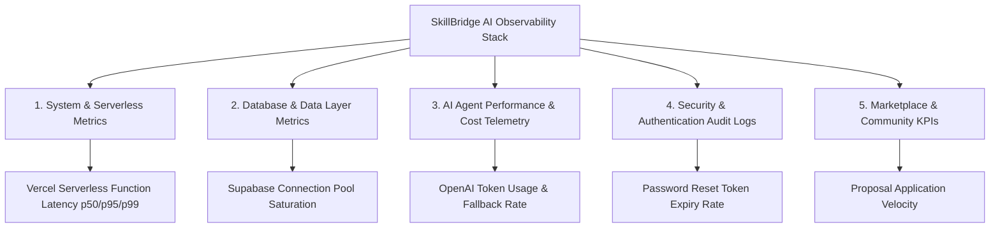

# Deliverable 5: Monitoring Dashboard Design & Operational Telemetry

**Student Name:** Thariq Azees  
**Roll Number:** 2023103576  
**Course:** IoC — Scalable Enterprise Architectural Deployments of Agentic AI Solutions  
**Project Name:** SkillBridge AI — Smart Freelance Marketplace & AI Agent Ecosystem  
**Repository URL:** [https://github.com/ThariqAzees/SkillBridgeAI](https://github.com/ThariqAzees/SkillBridgeAI)  
**Live Application URL:** [https://skill-bridge-ai-blush.vercel.app/it](https://skill-bridge-ai-blush.vercel.app/it)  

---

## 1. Executive Summary & Observability Framework

This specification defines the **Enterprise Telemetry & Monitoring Architecture** for SkillBridge AI. It establishes operational dashboards, alerting thresholds, AI model observability metrics, database health indicators, and security audit logging needed to maintain high availability on serverless infrastructure.

---

## 2. Telemetry & Metric Classification

Operational metrics are categorized into **Currently Logged System Telemetry** and **Proposed Production Metrics**:



---

## 3. Metrics Matrix & Threshold Specifications

### 3.1 Serverless Infrastructure & System Health

| Metric Name | Description | Collection Source | Alert Threshold | Severity Level |
| :--- | :--- | :--- | :--- | :--- |
| `http.request.duration` | API Route Latency (p95) | Vercel Analytics | > 2,500ms over 5m | Warning |
| `http.request.error_rate` | 5xx Server Error Percentage | Next.js API Routes | > 1.5% over 5m | Critical |
| `serverless.cold_start.duration` | Cold Start Execution Latency | Vercel Runtime Logs | > 1,800ms | Info |

### 3.2 Database & Storage Telemetry

| Metric Name | Description | Collection Source | Alert Threshold | Severity Level |
| :--- | :--- | :--- | :--- | :--- |
| `db.pool.active_connections` | Supabase Pooler Saturation | Supabase Metrics | > 80% capacity | Warning |
| `db.query.latency` | Prisma Query Execution Time | Prisma Middleware | > 400ms | Warning |
| `db.connection.errors` | Failed DB Connection Attempts | `src/lib/prisma.ts` | > 3 failures / min | Critical |

### 3.3 AI Agent Telemetry & Cost Management

| Metric Name | Description | Collection Source | Alert Threshold | Severity Level |
| :--- | :--- | :--- | :--- | :--- |
| `ai.openai.request_count` | Total AI Route Calls (`/api/ai/*`) | Route Middleware | > 500 requests / hr | Info |
| `ai.openai.token_consumption` | Total Input + Output Tokens | OpenAI API Response | > 250,000 tokens / day | Warning |
| `ai.openai.fallback_trigger_rate` | Percentage of AI Heuristic Fallbacks | `src/lib/ai/index.ts` | > 5.0% over 15m | Warning |
| `ai.openai.timeout_count` | OpenAI Calls Exceeding 8000ms | Route Handlers | > 5 timeouts / 10m | Critical |

### 3.4 Security & Moderation Incident Telemetry

| Metric Name | Description | Collection Source | Alert Threshold | Severity Level |
| :--- | :--- | :--- | :--- | :--- |
| `auth.password_reset.requests` | Password Reset Initiations | `/api/auth/reset-password` | > 20 requests / hr | Warning |
| `auth.password_reset.invalid_tokens` | Failed Reset Token Attempts | `/api/auth/update-password` | > 5 failures / 10m | Critical |
| `community.moderation.verdict_block` | Auto-Blocked Community Posts | `/api/ai/moderate-post` | > 10 blocks / hr | Warning |

---

## 4. Proposed Grafana / Datadog Dashboard Layout Design

```
+-----------------------------------------------------------------------------------+
|                           SKILLBRIDGE AI OPERATIONAL DASHBOARD                     |
+------------------------------------+----------------------------------------------+
| 1. SYSTEM HEALTH & LATENCY         | 2. AI AGENT PERFORMANCE & COST                |
| [Uptime: 99.95%]  [Error Rate: 0.2%] | [Daily Tokens: 42,500]  [Cost: $0.06/day]    |
| [p95 Latency Chart: ~350ms]        | [Fallback Trigger Rate: 0.4%]                 |
| [Cold Starts: 12/hr]               | [AI Timeout Rate: 0.0%]                      |
+------------------------------------+----------------------------------------------+
| 3. DATABASE & POOLER HEALTH        | 4. SECURITY & AUTHENTICATION AUDIT           |
| [Active DB Poolers: 6 / 20]        | [Active Sessions: 142]                       |
| [Prisma Avg Query: 14ms]           | [Password Resets (24h): 3]                   |
| [DB Connection Errors: 0]          | [Invalid Token Attempts: 0]                  |
+------------------------------------+----------------------------------------------+
| 5. COMMUNITY MODERATION OUTCOMES   | 6. MARKETPLACE BUSINESS METRICS              |
| [Verdict SAFE: 88%]                | [New Projects Posted: 18/day]                |
| [Verdict REVIEW (Admin Queue): 8%] | [Proposal Submissions: 47/day]               |
| [Verdict BLOCK: 4%]                | [Active Freelancer Signups: 24/day]          |
+------------------------------------+----------------------------------------------+
```

---

## 5. Privacy, PII Redaction & Incident Response Protocol

1. **Strict PII Redaction**: Application logs scrub sensitive user parameters (passwords, SMTP credentials, API keys, password reset tokens) prior to log output.
2. **Token Security Logging**: Reset token logs output SHA-256 hashes only. Raw tokens are never written to log sinks.
3. **Incident Response Flow**:
   - **Trigger**: `http.request.error_rate > 1.5%` or `db.connection.errors > 3/min`.
   - **Notification**: Automated PagerDuty / Slack alert dispatched to on-call engineering team.
   - **Remediation**: System inspects Vercel runtime logs, verifies Supabase pooler availability, and toggles API fallback mode if external services degrade.
