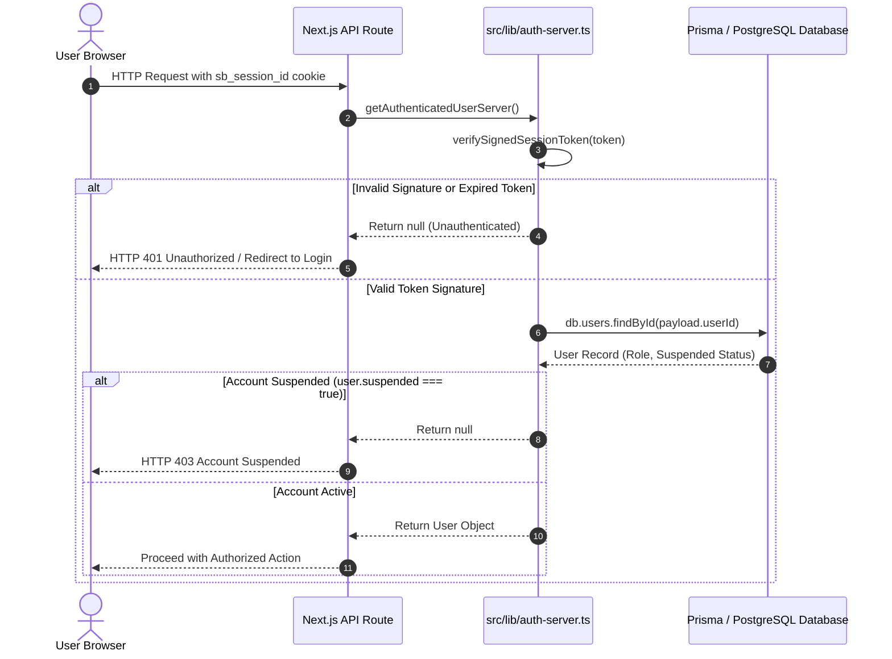
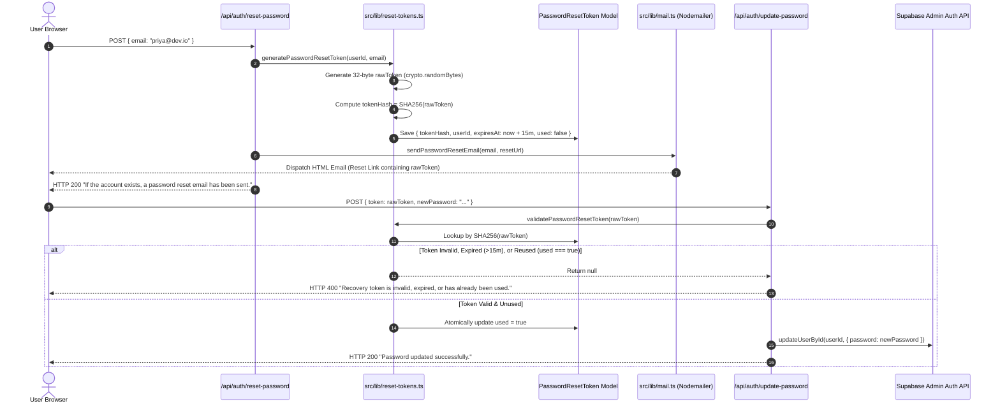

# Deliverable 4: Security Model & Cryptographic Safeguards

**Student Name:** Thariq Azees  
**Roll Number:** 2023103576  
**Course:** IoC — Scalable Enterprise Architectural Deployments of Agentic AI Solutions  
**Project Name:** SkillBridge AI — Smart Freelance Marketplace & AI Agent Ecosystem  
**Repository URL:** [https://github.com/ThariqAzees/SkillBridgeAI](https://github.com/ThariqAzees/SkillBridgeAI)  
**Live Application URL:** [https://skill-bridge-ai-blush.vercel.app/it](https://skill-bridge-ai-blush.vercel.app/it)  

---

## 1. Executive Summary & Security Philosophy

SkillBridge AI implements a **defense-in-depth security model** protecting user identities, administrative portals, cryptographic password resets, and third-party API keys. Security controls operate across browser cookies, API route authorization, data abstraction layers, and server-side secret isolation.

---

## 2. Authentication & Session Architecture

### 2.1 Dual-Engine Session Management
The platform supports dual-engine authentication:
1. **Supabase Auth Engine**: Enabled when valid Supabase credentials (`NEXT_PUBLIC_SUPABASE_URL`, `NEXT_PUBLIC_SUPABASE_PUBLISHABLE_KEY`) are present.
2. **Cryptographic Session Engine (`src/lib/session.ts`)**: Generates and verifies cryptographically signed session tokens stored in the `sb_session_id` HTTP cookie.



### 2.2 Session Cookie Properties
- **Cookie Name**: `sb_session_id`
- **Signature Algorithm**: Universal HMAC-SHA256 cryptographic signature (`computeSignature`).
- **Security Flags**: `HttpOnly` (prevents XSS access), `SameSite=Lax` (prevents CSRF attacks), `Path=/`, `Max-Age=86400` (24-hour expiration).

---

## 3. Server-Side Role-Based Access Control (RBAC)

Authorization is strictly enforced server-side. Role claims in client state are never trusted for sensitive database operations.

```mermaid
graph TD
    Request[Incoming API / Admin Request] --> AuthCheck{getAuthenticatedUserServer()}
    AuthCheck -- Null / Expired --> Reject401[401 Unauthorized Response]
    AuthCheck -- Authenticated User --> RoleCheck{user.role === 'ADMIN'?}
    RoleCheck -- False --> Reject403[403 Forbidden Response]
    RoleCheck -- True --> ExecuteAdmin[Execute Admin Task: Approve / Remove Post / Suspend User]
```

### Role Permissions Matrix

| Functionality / Endpoint | Guest User | Freelancer Role | Client Role | Admin Role |
| :--- | :---: | :---: | :---: | :---: |
| Browse Projects & Community Feed | ✓ | ✓ | ✓ | ✓ |
| Submit Project Proposal (`/applications`) | ✗ | **Authorized** | ✗ | ✗ |
| Create Project Listing (`/projects/new`) | ✗ | ✗ | **Authorized** | ✗ |
| Run AI Profile Enhancer (`/api/ai/enhance-profile`) | ✗ | **Authorized** | ✗ | ✗ |
| Access Admin Panel (`/admin`) | ✗ | ✗ | ✗ | **Authorized** |
| Approve / Remove Posts (`/api/admin/*`) | ✗ | ✗ | ✗ | **Authorized** |
| Suspend Abusive Users (`/api/admin/toggle-suspend`) | ✗ | ✗ | ✗ | **Authorized** |

---

## 4. Cryptographic Password Reset Flow & Safeguards



### Password Security Controls Checklist

1. **High-Entropy Token Generation**: Raw reset tokens are generated using Node's `crypto.randomBytes(32)` (64 hex characters), providing 256 bits of entropy.
2. **SHA-256 Hashing at Rest**: Raw tokens are **never** stored in the database. Only their SHA-256 hash (`crypto.createHash('sha256').update(rawToken).digest('hex')`) is saved in the `PasswordResetToken` table.
3. **15-Minute Expiration**: Reset tokens automatically expire 15 minutes after creation (`expiresAt = Date.now() + 15 * 60 * 1000`).
4. **Atomic Single-Use Consumption**: When a reset token is redeemed, `consumePasswordResetToken` atomically sets `used: true` in the database. Re-submitting the same token yields an immediate `HTTP 400` error.
5. **Non-Enumerating Recovery API**: `/api/auth/reset-password` returns the exact same message regardless of whether the email address exists in the system, preventing account enumeration attacks.
6. **Supabase Auth Synchronization**: Password updates invoke `supabaseAdmin.auth.admin.updateUserById` via `SUPABASE_SERVICE_ROLE_KEY` to keep Supabase Auth credentials in parity with local records.

---

## 5. Secret Protection & Code Audit Findings

- **Environment Isolation**: `SUPABASE_SERVICE_ROLE_KEY`, `OPENAI_API_KEY`, `SMTP_PASSWORD`, and `DATABASE_URL` are strictly server-side variables and are never prefixed with `NEXT_PUBLIC_`.
- **Git Safety**: `.gitignore` explicitly ignores `.env`, `.env.local`, `.env.production`, and build caches. Only `.env.example` (containing sanitized placeholders) is tracked.
- **Audit Finding — Resilient Local Fallback**: When `DATABASE_URL` or `SUPABASE_SERVICE_ROLE_KEY` is omitted, the application seamlessly falls back to local in-memory token hashing and password store (`src/lib/passwords.ts`), ensuring development continuity while maintaining token security.
