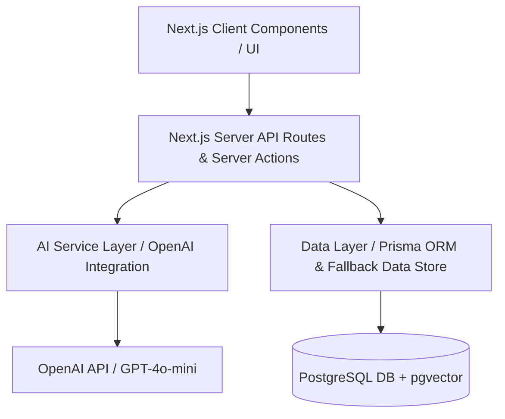

# SkillBridge AI — System Architecture & Design Document

## Architecture Overview

SkillBridge AI is built as a unified Next.js 14 App Router application. It adheres to a clean layered architecture separating representation, business logic, AI intelligence, and data persistence layers.



---

## 1. Directory Structure

```text
src/
├── app/
│   ├── api/
│   │   └── ai/              # AI Service API endpoints (enhance, match, proposal, moderate, assistant)
│   ├── admin/               # Protected Admin Control Panel
│   ├── applications/        # Freelancer application tracking
│   ├── assistant/           # AI Freelancing Assistant chat interface
│   ├── community/           # Developer forum feed with AI moderation
│   ├── dashboard/           # Role-based dashboards (Freelancer, Client, Admin)
│   ├── freelancers/         # Freelancer discovery directory
│   ├── profile/             # Profile details & Edit/Enhance pages
│   ├── projects/            # Marketplace, Create Project, Applications Review
│   ├── globals.css          # Tailwind CSS base styles & glassmorphism
│   ├── layout.tsx           # App Root layout with AuthProvider & Navbar
│   └── page.tsx             # Startup Landing Page
├── components/
│   ├── AIProfileEnhancerModal.tsx
│   ├── AIProposalModal.tsx
│   ├── Footer.tsx
│   └── Navbar.tsx
└── lib/
    ├── ai/                  # AI service helpers with timeout & fallback logic
    ├── auth-context.tsx     # Role-based auth provider & demo account switcher
    ├── db.ts                # Unified database access layer
    ├── seed-data.ts         # Rich mock seed dataset
    └── types.ts             # TypeScript interfaces
```

---

## 2. Server-Side Authorization & Role Rules

- **FREELANCER**: Can edit own profile, run AI profile enhancer, browse marketplace, view AI compatibility match scores, apply to projects via AI proposal generator, create community posts, interact with AI assistant.
- **CLIENT**: Can post projects, edit/delete own projects, view incoming applications for owned projects, shortlist or accept/reject freelancer proposals.
- **ADMIN**: Can inspect all platform entities, access `/admin` route, review flagged posts in the moderation queue, approve or remove content, and suspend/unsuspend user accounts.

---

## 3. Resilience Heuristics

All external AI and database operations feature strict fallback mechanisms:
- If `OPENAI_API_KEY` is missing or times out (>8s), the AI layer returns deterministic, intelligent fallback responses without throwing client-facing runtime errors.
- If Prisma binaries or PostgreSQL connections are unavailable in restricted sandbox environments, the unified data layer gracefully operates over in-memory seed data.
