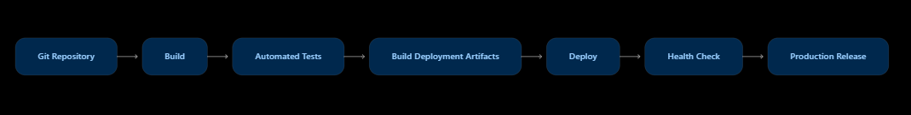

---

## 3. Deployment Strategy

### 3.1 Deployment Overview

CampusFix AI can be deployed as a layered web application consisting of
a frontend application, backend API service, agentic AI workflow, and
persistent data storage.

The deployment separates the user interface from the backend processing
layer so that each component can be maintained and scaled independently.

```mermaid
flowchart TB

    USER[Campus Users]

    subgraph CLIENT["Client Layer"]
        WEB[React Web Application]
    end

    subgraph APP["Application Layer"]
        API[FastAPI Application]
        AUTH[Authentication & RBAC]
        ORCH[Agent Orchestrator]
    end

    subgraph AGENTS["Agent Processing Layer"]
        T[ Triage Agent ]
        P[ Priority Agent ]
        A[ Assignment Agent ]
        R[ Resolution Agent ]
        N[ Notification Agent ]
    end

    subgraph DATA["Data Layer"]
        DB[(SQLite Database)]
        AUDIT[(Ticket / Audit Data)]
    end

    USER --> WEB
    WEB --> API

    API --> AUTH
    API --> ORCH

    ORCH --> T
    T --> P
    P --> A
    A --> R
    R --> N

    API --> DB
    ORCH --> DB
    API --> AUDIT

3.2 Development Deployment
During development, CampusFix AI can be executed locally using separate
frontend and backend processes.
Developer Machine
│
├── React Frontend
│   └── Development Web Server
│
├── FastAPI Backend
│   └── REST API
│
├── Agentic Workflow
│   └── Agent Orchestrator + Agents
│
└── SQLite
    └── campusfix.db

The frontend communicates with the FastAPI backend through REST API
endpoints.
This arrangement makes it possible to independently develop and test the
frontend, backend, and agent workflow.
3.3 Production Deployment
For a production environment, the application can be separated into
deployable services.
#chatgpt-mermaid-_r_6l3_{font-family:-apple-system-body,ui-sans-serif,-apple-system,system-ui,"Segoe UI",Helvetica,"Apple Color Emoji",Arial,sans-serif,"Segoe UI Emoji","Segoe UI Symbol";font-size:16px;fill:rgb(237, 237, 237);}@keyframes edge-animation-frame{from{stroke-dashoffset:0;}}@keyframes dash{to{stroke-dashoffset:0;}}#chatgpt-mermaid-_r_6l3_ .edge-animation-slow{stroke-dasharray:9,5!important;stroke-dashoffset:900;animation:dash 50s linear infinite;stroke-linecap:round;}#chatgpt-mermaid-_r_6l3_ .edge-animation-fast{stroke-dasharray:9,5!important;stroke-dashoffset:900;animation:dash 20s linear infinite;stroke-linecap:round;}#chatgpt-mermaid-_r_6l3_ .error-icon{fill:rgb(27, 27, 27);}#chatgpt-mermaid-_r_6l3_ .error-text{fill:rgb(237, 237, 237);stroke:rgb(237, 237, 237);}#chatgpt-mermaid-_r_6l3_ .edge-thickness-normal{stroke-width:1px;}#chatgpt-mermaid-_r_6l3_ .edge-thickness-thick{stroke-width:3.5px;}#chatgpt-mermaid-_r_6l3_ .edge-pattern-solid{stroke-dasharray:0;}#chatgpt-mermaid-_r_6l3_ .edge-thickness-invisible{stroke-width:0;fill:none;}#chatgpt-mermaid-_r_6l3_ .edge-pattern-dashed{stroke-dasharray:3;}#chatgpt-mermaid-_r_6l3_ .edge-pattern-dotted{stroke-dasharray:2;}#chatgpt-mermaid-_r_6l3_ .marker{fill:rgb(175, 175, 175);stroke:rgb(175, 175, 175);}#chatgpt-mermaid-_r_6l3_ .marker.cross{stroke:rgb(175, 175, 175);}#chatgpt-mermaid-_r_6l3_ svg{font-family:-apple-system-body,ui-sans-serif,-apple-system,system-ui,"Segoe UI",Helvetica,"Apple Color Emoji",Arial,sans-serif,"Segoe UI Emoji","Segoe UI Symbol";font-size:16px;}#chatgpt-mermaid-_r_6l3_ p{margin:0;}#chatgpt-mermaid-_r_6l3_ .label{font-family:-apple-system-body,ui-sans-serif,-apple-system,system-ui,"Segoe UI",Helvetica,"Apple Color Emoji",Arial,sans-serif,"Segoe UI Emoji","Segoe UI Symbol";color:rgb(237, 237, 237);}#chatgpt-mermaid-_r_6l3_ .cluster-label text{fill:rgb(237, 237, 237);}#chatgpt-mermaid-_r_6l3_ .cluster-label span{color:rgb(237, 237, 237);}#chatgpt-mermaid-_r_6l3_ .cluster-label span p{background-color:transparent;}#chatgpt-mermaid-_r_6l3_ .label text,#chatgpt-mermaid-_r_6l3_ span{fill:rgb(237, 237, 237);color:rgb(237, 237, 237);}#chatgpt-mermaid-_r_6l3_ .node rect,#chatgpt-mermaid-_r_6l3_ .node circle,#chatgpt-mermaid-_r_6l3_ .node ellipse,#chatgpt-mermaid-_r_6l3_ .node polygon,#chatgpt-mermaid-_r_6l3_ .node path{fill:rgb(9, 23, 44);stroke:rgb(31, 78, 148);stroke-width:1px;}#chatgpt-mermaid-_r_6l3_ .rough-node .label text,#chatgpt-mermaid-_r_6l3_ .node .label text,#chatgpt-mermaid-_r_6l3_ .image-shape .label,#chatgpt-mermaid-_r_6l3_ .icon-shape .label{text-anchor:middle;}#chatgpt-mermaid-_r_6l3_ .node .katex path{fill:#000;stroke:#000;stroke-width:1px;}#chatgpt-mermaid-_r_6l3_ .rough-node .label,#chatgpt-mermaid-_r_6l3_ .node .label,#chatgpt-mermaid-_r_6l3_ .image-shape .label,#chatgpt-mermaid-_r_6l3_ .icon-shape .label{text-align:center;}#chatgpt-mermaid-_r_6l3_ .node.clickable{cursor:pointer;}#chatgpt-mermaid-_r_6l3_ .root .anchor path{fill:rgb(175, 175, 175)!important;stroke-width:0;stroke:rgb(175, 175, 175);}#chatgpt-mermaid-_r_6l3_ .arrowheadPath{fill:rgb(175, 175, 175);}#chatgpt-mermaid-_r_6l3_ .edgePath .path{stroke:rgb(175, 175, 175);stroke-width:1px;}#chatgpt-mermaid-_r_6l3_ .flowchart-link{stroke:rgb(175, 175, 175);fill:none;}#chatgpt-mermaid-_r_6l3_ .edgeLabel{background-color:rgb(0, 0, 0);text-align:center;}#chatgpt-mermaid-_r_6l3_ .edgeLabel p{background-color:rgb(0, 0, 0);}#chatgpt-mermaid-_r_6l3_ .edgeLabel rect{opacity:0.5;background-color:rgb(0, 0, 0);fill:rgb(0, 0, 0);}#chatgpt-mermaid-_r_6l3_ .labelBkg{background-color:rgba(0, 0, 0, 0.5);}#chatgpt-mermaid-_r_6l3_ .cluster rect{fill:rgb(27, 27, 27);stroke:rgba(255, 255, 255, 0.15);stroke-width:1px;}#chatgpt-mermaid-_r_6l3_ .cluster text{fill:rgb(237, 237, 237);}#chatgpt-mermaid-_r_6l3_ .cluster span{color:rgb(237, 237, 237);}#chatgpt-mermaid-_r_6l3_ div.mermaidTooltip{position:absolute;text-align:center;max-width:200px;padding:2px;font-family:-apple-system-body,ui-sans-serif,-apple-system,system-ui,"Segoe UI",Helvetica,"Apple Color Emoji",Arial,sans-serif,"Segoe UI Emoji","Segoe UI Symbol";font-size:12px;background:rgb(27, 27, 27);border:1px solid rgba(255, 255, 255, 0.15);border-radius:2px;pointer-events:none;z-index:100;}#chatgpt-mermaid-_r_6l3_ .flowchartTitleText{text-anchor:middle;font-size:18px;fill:rgb(237, 237, 237);}#chatgpt-mermaid-_r_6l3_ rect.text{fill:none;stroke-width:0;}#chatgpt-mermaid-_r_6l3_ .icon-shape,#chatgpt-mermaid-_r_6l3_ .image-shape{background-color:rgb(0, 0, 0);text-align:center;}#chatgpt-mermaid-_r_6l3_ .icon-shape p,#chatgpt-mermaid-_r_6l3_ .image-shape p{background-color:rgb(0, 0, 0);padding:2px;}#chatgpt-mermaid-_r_6l3_ .icon-shape .label rect,#chatgpt-mermaid-_r_6l3_ .image-shape .label rect{opacity:0.5;background-color:rgb(0, 0, 0);fill:rgb(0, 0, 0);}#chatgpt-mermaid-_r_6l3_ .label-icon{display:inline-block;height:1em;overflow:visible;vertical-align:-0.125em;}#chatgpt-mermaid-_r_6l3_ .node .label-icon path{fill:currentColor;stroke:revert;stroke-width:revert;}#chatgpt-mermaid-_r_6l3_ .node .neo-node{stroke:rgb(31, 78, 148);}#chatgpt-mermaid-_r_6l3_ [data-look="neo"].node rect,#chatgpt-mermaid-_r_6l3_ [data-look="neo"].cluster rect,#chatgpt-mermaid-_r_6l3_ [data-look="neo"].node polygon{stroke:url(#chatgpt-mermaid-_r_6l3_-gradient);filter:drop-shadow( 1px 2px 2px rgba(185,185,185,1));}#chatgpt-mermaid-_r_6l3_ [data-look="neo"].swimlane.cluster rect{filter:none;}#chatgpt-mermaid-_r_6l3_ [data-look="neo"].node path{stroke:url(#chatgpt-mermaid-_r_6l3_-gradient);stroke-width:1px;}#chatgpt-mermaid-_r_6l3_ [data-look="neo"].node .outer-path{filter:drop-shadow( 1px 2px 2px rgba(185,185,185,1));}#chatgpt-mermaid-_r_6l3_ [data-look="neo"].node .neo-line path{stroke:rgb(31, 78, 148);filter:none;}#chatgpt-mermaid-_r_6l3_ [data-look="neo"].node circle{stroke:url(#chatgpt-mermaid-_r_6l3_-gradient);filter:drop-shadow( 1px 2px 2px rgba(185,185,185,1));}#chatgpt-mermaid-_r_6l3_ [data-look="neo"].node circle .state-start{fill:#000000;}#chatgpt-mermaid-_r_6l3_ [data-look="neo"].icon-shape .icon{fill:url(#chatgpt-mermaid-_r_6l3_-gradient);filter:drop-shadow( 1px 2px 2px rgba(185,185,185,1));}#chatgpt-mermaid-_r_6l3_ [data-look="neo"].icon-shape .icon-neo path{stroke:url(#chatgpt-mermaid-_r_6l3_-gradient);filter:drop-shadow( 1px 2px 2px rgba(185,185,185,1));}#chatgpt-mermaid-_r_6l3_ .node text{font-size:14px;font-weight:600;letter-spacing:normal;fill:rgb(153, 206, 255);}#chatgpt-mermaid-_r_6l3_ .edgeLabels text{font-size:13px;font-weight:600;letter-spacing:-0.08px;fill:rgb(153, 206, 255);}#chatgpt-mermaid-_r_6l3_ .node tspan[font-weight="normal"],#chatgpt-mermaid-_r_6l3_ .edgeLabels tspan[font-weight="normal"]{font-weight:600;}#chatgpt-mermaid-_r_6l3_ .edgeLabel .label rect{opacity:1;rx:13px;ry:13px;fill:rgb(0, 14, 26);stroke:rgb(26, 62, 95);stroke-width:1px;}#chatgpt-mermaid-_r_6l3_ .node rect,#chatgpt-mermaid-_r_6l3_ .node circle,#chatgpt-mermaid-_r_6l3_ .node ellipse,#chatgpt-mermaid-_r_6l3_ .node polygon,#chatgpt-mermaid-_r_6l3_ .node path{fill:rgb(0, 40, 77);stroke:rgba(255, 255, 255, 0.1);stroke-width:1px;}#chatgpt-mermaid-_r_6l3_ .node rect{rx:16px;ry:16px;}#chatgpt-mermaid-_r_6l3_ .node.mermaid-decision .label-container{fill:rgb(0, 14, 26);stroke:rgb(26, 62, 95);stroke-dasharray:2,2;}#chatgpt-mermaid-_r_6l3_ .edgePaths .flowchart-link{stroke:rgb(175, 175, 175);stroke-width:1px;stroke-linecap:round;stroke-linejoin:round;}#chatgpt-mermaid-_r_6l3_ .marker{fill:rgb(175, 175, 175);stroke:rgb(175, 175, 175);}#chatgpt-mermaid-_r_6l3_ :root{--mermaid-font-family:-apple-system-body,ui-sans-serif,-apple-system,system-ui,"Segoe UI",Helvetica,"Apple Color Emoji",Arial,sans-serif,"Segoe UI Emoji","Segoe UI Symbol";}Students / Staff / AdminLoad Balancer / Reverse ProxyFrontend ServiceFastAPI Instance 1FastAPI Instance 2Agent Processing ServiceProduction DatabaseCentralized Logging &Monitoring


3.4 Containerization Strategy
Each major application component can be packaged independently.
CampusFix AI Deployment
│
├── Frontend Container
│   └── React Application
│
├── Backend Container
│   └── FastAPI Application
│
├── Agent Service
│   └── Agent Orchestrator
│       ├── Triage Agent
│       ├── Priority Agent
│       ├── Assignment Agent
│       ├── Resolution Agent
│       └── Notification Agent
│
└── Database
    └── Persistent Database Storage

Containerization provides consistency between development, testing, and
production environments.
It also allows the frontend, backend, and agent processing components to be
scaled independently.
3.5 Scalability Strategy
The architecture can support increasing numbers of campus users by scaling
the stateless application components horizontally.
Horizontal Scaling
Multiple backend instances can run behind a load balancer:
                 Load Balancer
                      |
          +-----------+-----------+
          |           |           |
          v           v           v
       API-1       API-2       API-3
          |           |           |
          +-----------+-----------+
                      |
                Agent Services
                      |
                 Data Storage

Additional FastAPI instances can be introduced when request volume
increases.
Agent processing can also be separated from direct API request handling so
that computationally intensive AI operations do not block normal API
requests.
3.6 Database Strategy
The current application uses SQLite for lightweight development and
demonstration.
For a larger enterprise deployment, the persistence layer can be migrated
to a production database service such as PostgreSQL.
The application should use a database abstraction layer so that the
application logic and agent workflow are not tightly coupled to a specific
database implementation.
A production database should provide:
- Persistent storage
- Backup and recovery
- Concurrent access
- Transaction management
- Access control
- Monitoring
3.7 Reliability and Availability
The production deployment should minimize single points of failure.
Recommended practices include:
- Multiple backend instances
- Health checks for application services
- Persistent database storage
- Automated backups
- Centralized application logging
- Error monitoring
- Controlled deployment and rollback
- Separation of development and production environments
3.8 Deployment Pipeline
A CI/CD pipeline can be used to automate application delivery.




A deployment should proceed only after the application passes the
automated test stage.
3.9 Environment Configuration
Environment-specific configuration should not be hard-coded into the
application.
Sensitive values such as:
- Secret keys
- Authentication configuration
- Database connection information
- AI provider configuration
should be supplied through environment variables or a secure secrets
management mechanism.
The repository can contain a .env.example file containing the required
configuration structure without exposing actual secrets.
3.10 Deployment Evolution
CampusFix AI can evolve through the following deployment stages:
Local Development
       |
       v
Frontend + FastAPI + SQLite
       |
       v
Containerized Deployment
       |
       v
Multiple Backend Instances
       |
       v
Production Database
       |
       v
Cloud / Kubernetes Deployment
       |
       v
Enterprise-Scale Campus Platform

This approach allows the current implementation to remain simple while
providing a clear path toward a scalable enterprise deployment.