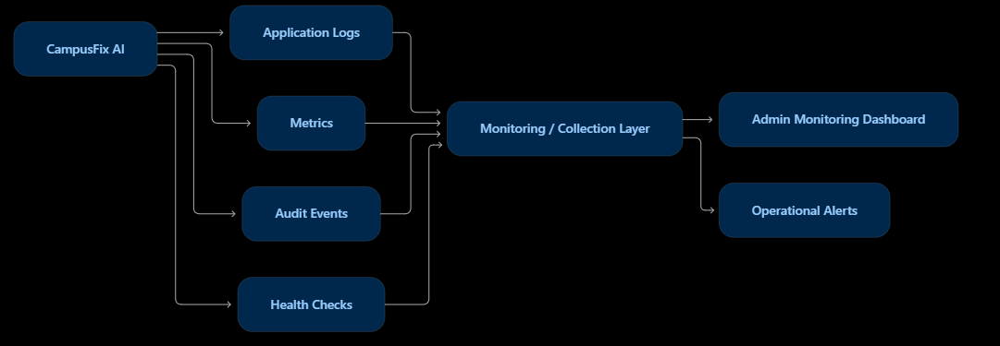

---

## 5. Monitoring Dashboard Design

### 5.1 Monitoring Overview

The CampusFix AI monitoring dashboard provides administrators and system
operators with visibility into maintenance activity, ticket processing,
agent execution, system errors, and overall application health.

The monitoring design focuses on four areas:

1. Business and ticket monitoring
2. Agent workflow monitoring
3. Application health monitoring
4. Security and audit monitoring

### 5.2 Monitoring Architecture

```mermaid
flowchart TB

    USERS[Campus Users]

    subgraph APP["CampusFix AI"]
        FRONTEND[React Frontend]
        API[FastAPI Backend]
        ORCH[Agent Orchestrator]
        AGENTS[AI Agents]
        DB[(Application Database)]
    end

    subgraph OBS["Observability Layer"]
        LOGS[Application Logs]
        METRICS[Application Metrics]
        AUDIT[Audit Events]
        HEALTH[Health Checks]
    end

    subgraph DASH["Monitoring Dashboard"]
        KPIS[System KPI Cards]
        TICKETS[Ticket Analytics]
        AGENTMON[Agent Monitoring]
        ERRORS[Error Monitoring]
        SECURITY[Security & Audit View]
    end

    USERS --> FRONTEND
    FRONTEND --> API
    API --> ORCH
    ORCH --> AGENTS
    API --> DB
    ORCH --> DB

    API --> LOGS
    API --> METRICS
    API --> AUDIT
    API --> HEALTH

    ORCH --> LOGS
    ORCH --> METRICS
    ORCH --> AUDIT

    LOGS --> ERRORS
    METRICS --> KPIS
    METRICS --> TICKETS
    METRICS --> AGENTMON
    AUDIT --> SECURITY
    HEALTH --> KPIS

5.3 Main Dashboard
The administrator monitoring dashboard should provide a high-level view of
the current system state.
Recommended KPI cards include:
KPI	Description
Total Tickets	Total maintenance tickets recorded
Open Tickets	Tickets that still require action
High/Critical Tickets	Tickets requiring urgent attention
Resolved Tickets	Tickets successfully resolved
Average Resolution Time	Average time required to resolve tickets
Agent Success Rate	Percentage of successful agent workflows
Agent Failures	Number of failed agent executions
API Health	Current backend service health


Example layout:
+----------------+----------------+----------------+
| Total Tickets  | Open Tickets   | High Priority  |
|      128       |      34        |       7        |
+----------------+----------------+----------------+

+----------------+----------------+----------------+
| Resolved       | Avg Resolution | Agent Success  |
|      94        |    4.2 hrs     |      96%       |
+----------------+----------------+----------------+

5.4 Ticket Analytics
The dashboard should provide visual analytics for maintenance tickets.
Recommended visualizations include:
Ticket Status Distribution
OPEN          ████████████
ASSIGNED      █████████
IN_PROGRESS   ███████
RESOLVED      █████████████████

Priority Distribution
LOW           ███████████████
MEDIUM        ██████████
HIGH          ████
CRITICAL      ██

Issue Category Distribution
Network       █████████
Electrical    ███████
Plumbing      █████
Equipment     ████████
Cleaning      ████
Other         ███

These visualizations help administrators identify workload patterns and
areas requiring attention.
5.5 Agent Monitoring
The monitoring dashboard should provide visibility into the multi-agent
workflow.
Agent Execution Monitor

Triage Agent
    Executions: 128
    Success:    126
    Failed:       2

Priority Agent
    Executions: 128
    Success:    127
    Failed:       1

Assignment Agent
    Executions: 126
    Success:    124
    Failed:       2

Resolution Agent
    Executions: 124
    Success:    121
    Failed:       3

Notification Agent
    Executions: 121
    Success:    120
    Failed:       1

Useful agent-level metrics include:
- Number of executions
- Successful executions
- Failed executions
- Average execution time
- Retry count
- Current execution status
5.6 Agent Workflow Trace
For each maintenance ticket, administrators should be able to understand
how the agent workflow progressed.
Ticket #CF-1024

✓ Ticket Created
       |
✓ Triage Agent
       |
✓ Priority Agent
       |
✓ Assignment Agent
       |
✓ Resolution Agent
       |
⚠ Human Approval Required
       |
✓ Admin Approved
       |
✓ Notification Sent
       |
✓ Ticket Assigned

This provides transparency into automated decisions and makes debugging
easier when an agent workflow fails.
5.7 System Health Monitoring
The monitoring system should continuously check the health of major
application components.
System Health

Frontend          ● Healthy
FastAPI Backend   ● Healthy
Database          ● Healthy
Agent Orchestrator● Healthy
Agent Services    ● Healthy
Authentication    ● Healthy

Health checks can monitor:
- API availability
- Database connectivity
- Agent service availability
- Authentication availability
- Application response time
A failed health check should generate an operational alert.
5.8 Error Monitoring
The dashboard should provide a centralized view of application and agent
errors.
Example:
Recent Errors

[10:42] Priority Agent - Invalid ticket data
[10:38] API - Request validation failure
[10:31] Resolution Agent - Processing timeout
[10:24] Database - Connection retry

Each error should ideally include:
- Timestamp
- Component
- Error type
- Ticket/request identifier
- Severity
- Error message
- Resolution status
Sensitive information such as passwords, authentication tokens, or secret
keys must not be displayed in monitoring output.
5.9 Security Monitoring
Security-related events should also be visible to administrators.
Examples include:
- Failed login attempts
- Unauthorized API access
- Role violations
- Suspicious ticket modification attempts
- Administrative actions
- Human approval actions
Example:
Security Events

[10:51] Unauthorized API request
[10:45] Failed login attempt
[10:41] Admin approved HIGH priority ticket
[10:35] Ticket assignment modified

This provides an audit trail for important security events.
5.10 Monitoring Data Flow




5.11 Alerting Strategy
Operational alerts should be generated for conditions that require
attention.
Examples:
Condition	Suggested Action
API unavailable	Alert administrator/operator
Database unavailable	Alert and initiate recovery procedure
Repeated agent failures	Investigate agent workflow
Critical ticket created	Notify responsible administrator
Large increase in unresolved tickets	Review maintenance capacity
Repeated unauthorized requests	Investigate security event


Alerts should contain enough information to identify the affected
component without exposing sensitive data.
5.12 Monitoring Dashboard Layout
A complete monitoring dashboard can follow this structure:
+-------------------------------------------------------------+
|                 CAMPUSFIX AI MONITORING                     |
+-------------------------------------------------------------+
| Total Tickets | Open | High/Critical | Resolved | API Health|
+-------------------------------------------------------------+
|                                                             |
| Ticket Status          | Priority Distribution              |
|     Chart              |       Chart                       |
|                                                             |
+-------------------------------------------------------------+
|                                                             |
| Issue Categories        | Agent Execution                   |
|     Chart              | Success / Failure                 |
|                                                             |
+-------------------------------------------------------------+
| Agent Workflow Trace                                       |
| Ticket → Triage → Priority → Assignment → Resolution       |
+-------------------------------------------------------------+
|                                                             |
| Recent Errors            | Security Events                  |
|                                                             |
+-------------------------------------------------------------+

5.13 Operational Benefits
The monitoring architecture provides:
- Faster detection of application failures
- Visibility into maintenance workload
- Transparency of agent decisions
- Detection of repeated agent failures
- Identification of high-priority maintenance issues
- Security event visibility
- Easier troubleshooting
- Better operational decision-making
5.14 Monitoring Summary
CampusFix AI combines application metrics, ticket analytics, agent
workflow monitoring, health checks, logs, and security events into a
centralized monitoring design.
This provides administrators with both a business-level view of campus
maintenance and a technical view of the underlying agentic AI system.