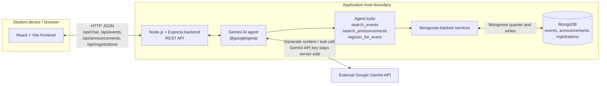
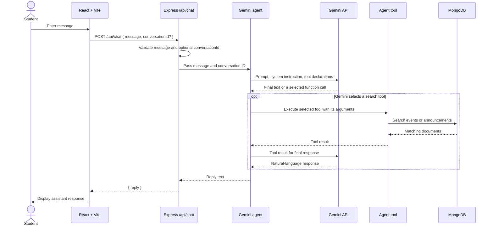

# Student Agentic Assistant

**College Agentic AI Project Submission**

## 1. Architecture Diagram



### Components

| Component | Responsibility |
|---|---|
| React + Vite frontend | Displays the chat interface, sends messages to `/api/chat`, and displays the returned reply. Vite proxies `/api` requests to the backend during development. |
| Node.js + Express backend | Validates chat input, provides REST endpoints for events, announcements, and registrations, and calls the agent. |
| Gemini AI agent | Uses the configured Gemini model to interpret general requests, decide whether to call an available search tool, and produce a response from the tool result. |
| Agent tools | Search MongoDB-backed event and announcement data, or create a registration when the backend has an explicitly confirmed pending action. |
| MongoDB | Stores event, announcement, and registration documents through Mongoose models. |
| External Gemini API | Receives prompts and tool declarations and returns text or function calls. `GEMINI_API_KEY` is used by the backend and is not sent to the browser. |

### Trust boundaries

- The browser is a client boundary: its requests and any supplied values are treated as untrusted input.
- The Express backend is the application boundary. It validates selected fields and enforces explicit confirmation in the agent registration workflow. The direct `POST /api/registrations` route does not enforce the agent's pending confirmation state.
- MongoDB is a separate data boundary accessed by the backend with the configured connection string.
- The Gemini API is an external provider boundary. The backend sends user prompts and receives model responses; the API key remains in the backend environment.

## 2. Agent Workflow Design

### General request workflow



### Registration approval workflow

```mermaid
stateDiagram-v2
    [*] --> Idle
    Idle --> FindingEvent: Registration request
    FindingEvent --> AwaitingDetails: Event found and available
    FindingEvent --> Idle: No matching event / closed / unavailable
    AwaitingDetails --> AwaitingDetails: Ask for or receive name and email
    AwaitingDetails --> AwaitingConfirmation: Name and email collected
    AwaitingConfirmation --> Processing: Explicit "yes"
    AwaitingConfirmation --> Cancelled: "no"
    Processing --> Completed: Registration saved
    Processing --> Failed: Validation, capacity, database or tool error
    Cancelled --> Idle
    Completed --> Idle
    Failed --> Idle
    AwaitingConfirmation --> AwaitingConfirmation: Other reply; ask for yes/no
    Processing --> Processing: Duplicate confirmation while action is processing
```



### Registration sequence

1. A registration request is recognized and the agent searches events.
2. The backend checks that the selected event is open and has remaining capacity.
3. The backend keeps a pending action in memory under the request's `conversationId`.
4. If student details are missing, it asks for the student's name and email. Once both are collected, it asks for confirmation.
5. An explicit confirmation such as `yes` uses the stored event ID, student name, and student email to execute `register_for_event`. The student does not need to repeat those values.
6. The tool calls the registration service, which rechecks the event and capacity and saves a `Registration` document to MongoDB.
7. A `no` response deletes the pending action and does not create a registration.
8. While registration is processing, another confirmation for that conversation is not allowed to execute the same pending action.

Pending approval state is held in an in-memory `Map`. It is not persistent across backend restarts and is not shared between separate backend processes.

### Available tools

| Tool | Current behavior |
|---|---|
| `search_events` | Searches event title, description, and location. With no useful search terms, it lists events. |
| `search_announcements` | Searches announcement title and content. With no useful search terms, it lists announcements. |
| `register_for_event` | Creates a registration through the existing registration service only when the backend supplies a confirmed pending action and matching details. |

The agent uses Gemini function calling for event and announcement searches. The registration confirmation is enforced by backend state; after `yes`, the backend invokes the registration tool with the stored details.

This approval workflow applies only to registration requested through agent chat. The direct `POST /api/registrations` REST endpoint currently performs event/input checks but does not check the agent's pending confirmation state, so it is not independently approval-protected.

## 3. Deployment Strategy

### Current local implementation

- The frontend is a React application served by Vite during development.
- Vite proxies `/api` requests to the Express backend at `http://localhost:5000`.
- The backend runs with `npm run dev` or `npm start`.
- MongoDB is connected using `MONGODB_URI`. In local development this may point to a MongoDB server on the same machine.
- The backend calls the external Gemini API using `GEMINI_API_KEY`.
- Environment values belong in `backend/.env`; example files contain placeholders, not usable secrets.
- The seed script inserts/upserts the sample events and announcements without deleting other database records.
- No production hosting, CI/CD pipeline, container setup, deployment automation, or production database configuration is included in the current project.

### Proposed production deployment (not currently implemented)

| Layer | Proposed approach |
|---|---|
| Frontend | Build the React app with `npm run build` and serve the static output over HTTPS using a static hosting service or a web server. Configure its `/api` path to reach the backend. |
| Backend | Deploy the Express service to a managed Node.js application host. Keep the Gemini and MongoDB credentials in that host's secret/environment configuration. |
| Database | Use a managed MongoDB deployment with network access restricted to the backend and a least-privilege database account. |
| Gemini | Call the Gemini API from the backend only. Configure quotas and billing/provider limits independently of the app deployment. |
| Release | Build and validate changes before deployment; deploy to a test environment first, run health/API checks, then promote the same version to production. Keep a rollback path to the previous known-good release. |

### Scaling considerations

- The pending-registration `Map` is process-local and lost on restart. Multiple backend instances would not share approval state. Production would need a durable, shared state mechanism or a deliberately single-instance design.
- Search queries and database indexes should be reviewed against production data size and traffic.
- Apply request limits and concurrency controls before exposing the service to broad traffic.
- Gemini rate limits, latency, and provider quotas can constrain throughput independently of backend capacity.

### Failure and recovery considerations

- If Gemini is unavailable, the chat endpoint returns an error response; the frontend shows a friendly retry message.
- If MongoDB is unavailable, database-backed operations cannot complete. The current `/api/health` endpoint returns `{ "status": "ok" }` and does not verify MongoDB connectivity.
- A backend restart clears pending registration approvals. A student would need to start the registration flow again.
- Production operation should include database backups, deployment rollback, and alerts for provider, database, and application failures; those mechanisms are not currently configured.

## 4. Security Model

### Measures currently present

- **Backend-held provider key:** The Gemini key is read from `GEMINI_API_KEY` by backend code and is not sent to the React frontend.
- **Environment configuration:** `.env.example` files use placeholder values. The actual `backend/.env` is local configuration and should not be committed or shared.
- **Request validation:** `/api/chat` requires a non-empty string message and validates an optional `conversationId` as a non-empty string of at most 128 characters. The direct registration endpoint validates an ObjectId-shaped event ID and non-empty student name and email strings.
- **Registration checks:** The registration service verifies the event exists, registration is open, and capacity has not been reached. Mongoose schemas also require the registration's event ID, student name, and student email.
- **Approval in the agent workflow:** Registrations initiated through agent chat require a pending action, stored event/student details, and explicit confirmation; cancellation removes pending state. This does not protect the separate direct `POST /api/registrations` route.
- **Basic error handling:** Chat/API and tool failures are logged on the backend and return error responses rather than reporting false registration success.
- **Trust boundaries:** The browser does not hold the Gemini key; database access is performed by the backend; Gemini is an external service.

### Not currently implemented

- Authentication and JWT are **not implemented**. The `conversationId` separates pending actions for ordinary frontend flows but is supplied by the client and is not an authenticated identity.
- The direct `POST /api/registrations` endpoint does not require the agent confirmation state and is not independently approval-protected.
- Authorization, role-based access, CSRF protections, rate limiting, security headers, audit logs, and production secret management are not configured by this project.
- The pending approval store is in-memory and is not designed as a durable or tamper-resistant approval ledger.
- Mongoose validation is present for required schema fields; it does not replace comprehensive application-level validation or database access controls.

### Recommended future security improvements (not implemented)

- Add authentication and authorization, including role-based access where appropriate.
- Authenticate the direct registration endpoint and/or protect it with a server-side authorization/confirmation mechanism that the endpoint enforces.
- Use HTTPS, secure headers, rate limiting, request-size limits, and stricter validation for all public endpoints.
- Use managed secret storage and rotate provider/database credentials; restrict MongoDB network and account permissions.
- Record an audit trail for registration requests, confirmations, cancellations, and outcomes without unnecessarily retaining sensitive data.
- Add stronger validation of model tool arguments and treat all model output as untrusted.
- Consider an authenticated, durable approval workflow before moving beyond the demonstration.

## 5. Monitoring Dashboard

The following is a practical dashboard design. The status column distinguishes existing behavior from instrumentation that would need to be added.

| Dashboard panel | Example metric / display | Current availability |
|---|---|---|
| Backend health | `/api/health` status and uptime | Health route exists, but it only returns `{ "status": "ok" }`; it does not check database or Gemini health. Uptime is not collected. |
| API request count | Requests by route, method, status, and time interval | Not instrumented. |
| Response time | Request latency percentiles (p50/p95/p99) | Not instrumented. |
| Agent/tool usage | Calls by tool name, success/failure, and latency | Tool execution exists; usage metrics are not collected. |
| Registration outcomes | Successful, rejected, cancelled, and failed registration counts | Outcomes are handled in code, but aggregate metrics are not collected. |
| Errors | Backend/API errors by category and route | Basic console error logs exist; there is no centralized dashboard or alerting. |
| Gemini API | Request count, latency, quota/rate-limit failures, and other provider errors | Provider failures are logged to the backend console; metrics and alerts are not implemented. |
| MongoDB | Connection state, query latency, and database failures | Startup logs report connection success/failure; the health route and a monitoring dashboard do not check or track ongoing MongoDB health. |
| Safety / approval | Pending confirmations, approvals, cancellations, duplicate processing blocks | Approval behavior exists in memory; these events are not recorded as metrics or audit logs. |
| Estimated AI/API cost | Request/token estimates and estimated spend by day | Not collected or calculated. |

### Proposed dashboard layout (not implemented)

```text
┌──────────────────────┬─────────────────────┬──────────────────────┐
│ Backend / DB health  │ API requests & rate │ p95 response time    │
├──────────────────────┼─────────────────────┼──────────────────────┤
│ Gemini calls/errors  │ Tool usage          │ Registration outcomes│
├──────────────────────┼─────────────────────┼──────────────────────┤
│ Approval / cancel    │ Error trends         │ Estimated API cost   │
└──────────────────────┴─────────────────────┴──────────────────────┘
```

A production implementation should add structured metrics and logs, define retention limits, and alert on actionable conditions such as database disconnection, elevated error rates, provider quota failures, or unusual registration activity.

## 6. Agentic AI Characteristics

This project is more than a text-only chatbot because it can select and execute application tools using current application data:

1. **Goal interpretation:** Gemini receives the student's request and the system instruction describing the assistant's scope.
2. **Tool selection:** For ordinary requests requiring current data, Gemini can select `search_events` or `search_announcements`. The registration path identifies registration requests and searches for a relevant event.
3. **Tool execution:** Backend code runs the selected tool using Mongoose-backed services; the model does not connect directly to MongoDB.
4. **Observation:** Search results are returned to Gemini so it can formulate a response grounded in those results.
5. **State / pending action:** During registration, the backend keeps the selected event and collected student details in a per-conversation in-memory pending action.
6. **Approval for sensitive action:** Registration is not performed on the initial request. An explicit `yes` is required; `no` cancels.
7. **Action and final response:** After approval, the backend executes the registration tool with the stored details. It reports success only after the tool returns a successful result.
8. **Failure handling:** Tool, database, or Gemini failures are logged and returned as errors or clear failure replies; failure is not presented as successful registration.

The agent has a small fixed set of tools and a limited approval flow. It does not have broad or autonomous access to other systems.

## 7. Limitations and Future Improvements

### Current limitations

- No user authentication or JWT is currently implemented.
- The current setup is intended for local development; MongoDB may be local and there is no production database deployment configuration.
- The agent has only three tools for event search, announcement search, and event registration.
- Pending registration state is stored in memory, is temporary, and is not shared across backend processes.
- There is no persistent general conversation history beyond the registration approval flow.
- There is no production monitoring dashboard or metrics collection.
- Chat depends on availability, limits, and configuration of the external Gemini API.
- The health endpoint does not verify MongoDB or Gemini connectivity.
- The current project does not include deployment automation or an operational recovery process.

### Future improvements

- Add JWT authentication and role-based access.
- Add production monitoring, structured logging, alerting, and audit logging.
- Add rate limiting and stronger validation for requests and model-generated tool arguments.
- Move to a managed cloud MongoDB service with backups and restricted access.
- Store registration approval state durably if the application is deployed with multiple backend instances.
- Add deployment automation, staging checks, and rollback procedures.

These are recommendations only; they are not claimed as implemented features.

## 8. Conclusion

The Student Agentic Assistant demonstrates a simple full-stack agent that connects a React interface, an Express API, MongoDB-backed college data, and Gemini function calling. It can search current events and announcements and supports event registration with explicit confirmation in the agent-chat workflow; the direct registration endpoint does not enforce that confirmation. Its intentionally limited scope makes the tool workflow and approval behavior suitable for a college capstone demonstration while leaving production security, persistence, monitoring, and deployment as future work.
