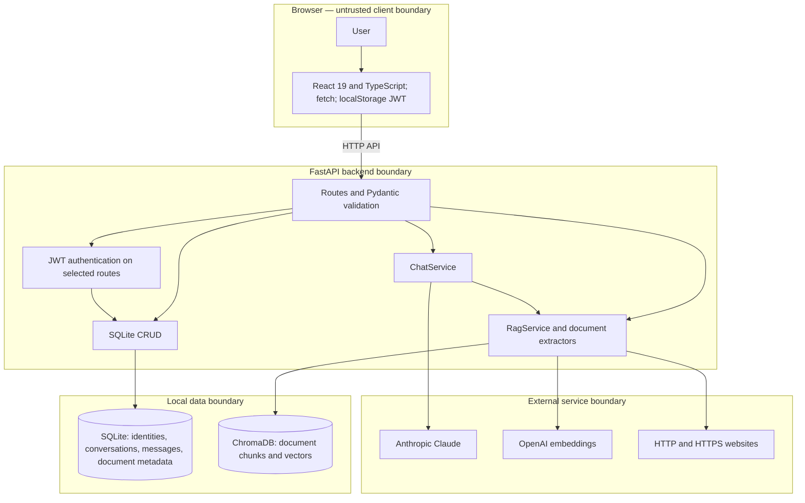
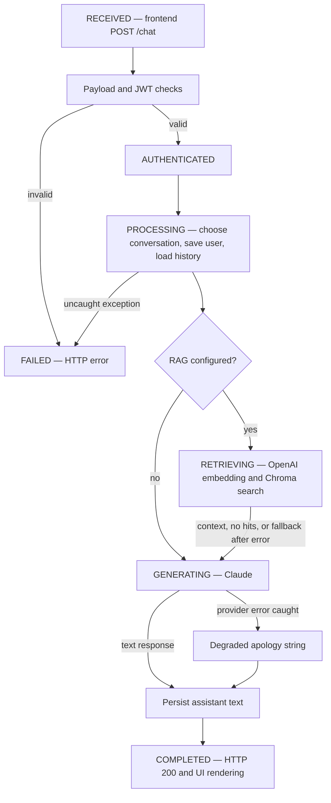
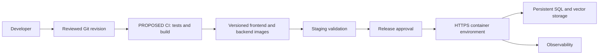
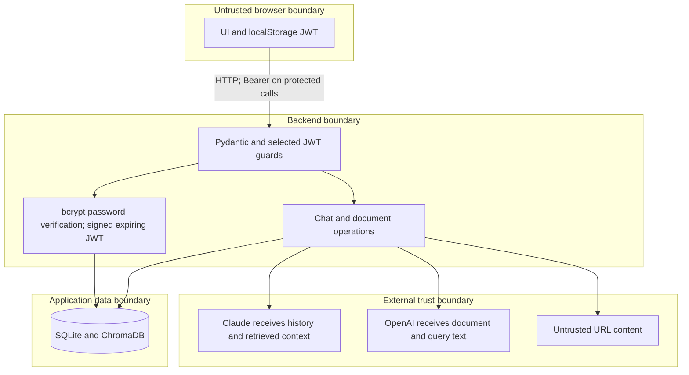
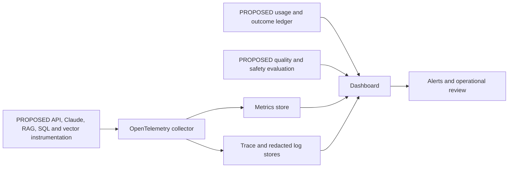

# Agentic AI Assistant

## Capstone Deliverables

This submission documents the existing FastAPI–React TypeScript chatbot, inspected on 2 October 2026. It includes complete application source, an [application-generation prompt](PROMPT.md), and five technical deliverables. **CURRENT IMPLEMENTATION** identifies behavior found in source/configuration; **PROPOSED PRODUCTION DESIGN** identifies future work, not completed features or deployment evidence.

The implemented assistant combines a deterministic chat workflow with optional retrieval. It does not implement autonomous multi-agent execution despite the capstone's “Agentic AI Assistant” title.

## 1. Architecture Diagram

### CURRENT IMPLEMENTATION

The **presentation layer** provides authentication forms, a resizable conversation sidebar, document upload/URL controls, Markdown/code/math rendering, and typing/loading feedback. The **API/application layer** is FastAPI with Uvicorn and Pydantic. The **AI/agent layer** is ChatService calling AsyncAnthropic with stored history. The **RAG/retrieval layer** extracts PDF/TXT/website text, embeds it with OpenAI text-embedding-3-small, and retrieves cosine-similar chunks. The **data layer** uses SQLite and an embedded local Chroma PersistentClient. External integrations are Anthropic, OpenAI, and user-supplied websites.

Documents use 800-character chunks and 100-character overlap. Retrieval requests up to three chunks per personal/global collection, potentially six combined; it does not rerank or return citations. Claude uses the source-configured claude-haiku-4-5 model and a 1024-output-token ceiling. Trust boundaries show where client input, sensitive filesystem data, provider requests, and untrusted website text cross components; they do not imply uniform authorization.

### PROPOSED PRODUCTION DESIGN

Add HTTPS ingress, consistent object authorization, background ingestion, shared SQL/vector services, managed secrets, and telemetry before operating multiple public instances. [Expanded architecture](docs/architecture.md) explains components, data schema, integrations, and source evidence.

## 2. Agent Workflow Design

### CURRENT IMPLEMENTATION

The browser composes the request; the controller validates/authenticates; AuthService resolves identity; DatabaseManager persists history; RagService retrieves optional context; ChatService constructs a Claude request and returns text. These roles are code components. Python functions perform extraction, embedding, search, and storage; Claude does not select or execute them as tools. Named states above describe the flow and are not stored workflow records.

There are no explicit multi-agent handoffs, planner/executor loop, or AI human approval gates. Conversation deletion confirmation is a frontend interaction only. Retrieval failures log warnings and continue without grounding. Claude errors return an apology that can be stored with HTTP 200; message persistence failures may be swallowed. Document metadata can remain after failed vector insertion, and failed vector deletion can leave orphaned text.

### Production Extension — PROPOSED PRODUCTION DESIGN

Introduce coordinator, retriever, responder, and verifier responsibilities with request IDs, typed tool contracts, authorized tenant scope, durable outcomes, bounded retries, and idempotency. Use approval gates for global knowledge publication and future external side effects, recording the exact action and approver. Distinguish degraded, failed, and successful responses. [Expanded workflow](docs/agent-workflow.md) covers roles, tools, handoffs, approvals, persistence, and failure paths.

## 3. Deployment Strategy

### CURRENT IMPLEMENTATION

The backend image uses Python 3.10-slim and Uvicorn on port 8000. The frontend builds with Node 18-alpine and runs as static files in Nginx on port 80. Compose maps browser access to ports 3000/8000, loads backend/.env, sets restart: unless-stopped, polls the backend root, and waits for a healthy backend before starting the frontend. REACT_APP_API_URL is embedded at build time. The launch script is zsh-based; there is no CI/CD pipeline or hosting configuration.

The root health response does not test storage. The Compose volume targets /app/chatbot.db as a directory instead of a SQLite file, and Chroma has no persistent volume. DATABASE_URL is read but unused by DatabaseManager. Root .dockerignore does not apply to the separate backend/frontend contexts, so local secrets can enter backend image builds. These are configuration findings; successful Docker deployment is not asserted.

### PROPOSED PRODUCTION DESIGN

For a container host, configure persistent paths and safe mounts, exact production CORS, browser-reachable HTTPS API URLs, clean build contexts, and coordinated backups. One corrected backend instance is the initial deployment target; horizontal scaling requires shared database/vector services and queued ingestion. Proposed resilience includes readiness checks, provider timeouts/backoff, quotas, and explicit degraded outcomes. Release through isolated development/staging/production environments with immutable images and restore-tested rollback.

Hugging Face Docker Spaces requires a root Dockerfile and sdk: docker/app_port metadata; the current Compose repository needs a hosting-specific adaptation and deliberate persistence. Ordinary Space disk is ephemeral, and platform storage options must be verified for the database workloads. See [official Docker Spaces guidance](https://huggingface.co/docs/hub/main/spaces-sdks-docker) and the [expanded deployment strategy](docs/deployment-strategy.md).

## 4. Security Model

### CURRENT IMPLEMENTATION

Passwords use bcrypt with 12 rounds. JWTs contain subject, user ID, and expiration; default expiry is 30 minutes. Provider keys remain in backend settings. Parameterized SQL, Pydantic field/type validation, selected Bearer dependencies, uploader checks for document deletion, and personal/global retrieval scope exist. CORS permits <http://localhost:3000> with credentials. Logs provide operational events but no immutable audit trail.

Identity/authorization is incomplete: conversation creation, message/full-history reads, and deletion are public; authenticated chat does not verify ownership of an existing conversation ID. Any authenticated user can publish global documents. SECRET_KEY has an unsafe fallback. There are no server-side password-strength or email-format constraints, token revocation/refresh, upload size limits, SSRF protections, moderation, injection detector, retention policy, or encryption controls. Retrieved text enters the system prompt as untrusted context. Browser logout only removes the local token.

### Recommended Production Controls — PROPOSED PRODUCTION DESIGN

Prioritize uniform authentication/object authorization, required strong secrets, context-specific Docker exclusions, tracked-credential review, TLS, rate limits, bounded/sandboxed upload processing, URL destination/redirect controls, and restricted global publication. Add consent/retention/deletion reconciliation, safe context handling, source attribution, adversarial evaluation, and redacted durable audit events. These proposed defenses follow [OWASP SSRF guidance](https://cheatsheetseries.owasp.org/cheatsheets/Server_Side_Request_Forgery_Prevention_Cheat_Sheet.html) and [OWASP prompt-injection guidance](https://cheatsheetseries.owasp.org/cheatsheets/LLM_Prompt_Injection_Prevention_Cheat_Sheet.html). [Expanded security model](docs/security-model.md) includes endpoint-by-endpoint coverage and privacy analysis.

## 5. Monitoring Dashboard Design

### CURRENT IMPLEMENTATION

Only Python logs and the root API status/Compose health poll exist. Web Vitals scaffolding has no reporting callback. There is no telemetry exporter, distributed tracing, quality/safety evaluation, token/cost ledger, business analytics, or monitoring dashboard. No measured values are presented.

### MONITORING DASHBOARD DESIGN — PROPOSED PRODUCTION DESIGN

| Required category | Dashboard design |
| --- | --- |
| HEALTH | Backend availability, SQL readiness, vector readiness, error rate and restart signals |
| TRACE | API, Claude, embedding, and RAG latency percentiles; correlated request waterfall |
| QUALITY | Human response ratings, groundedness, retrieval relevance, no-hit and failed-retrieval rates |
| SAFETY | Authentication failures, invalid/denied requests, rejected ingestion, blocked operations once guards exist, and provider failures |
| COST | Claude attempts, input/output/cache tokens, embedding usage, and estimated cost from verified dated rate cards |
| BUSINESS OUTCOMES | Active users, created conversations, ready documents, AI requests, successful responses, and optional resolution feedback |

Use environment/release/time filters, authorized drill-down, redacted data, and alerts based on agreed SLOs after baseline measurement. Never count HTTP 200 or a persisted apology as true AI success; never count metadata without vectors as a ready document. [Expanded monitoring design](docs/monitoring-dashboard.md) defines instrumentation, outcomes, formulas, and implementation stages.

## Submission Inventory and Verification

Application source remains in backend/ and frontend/, with 49 pytest test functions in test/ (11 authentication, 6 chat, 11 conversation, 21 RAG). Dockerfiles, Compose, npm/Poetry manifests and lockfiles, pytest.ini, and backend/.env.example remain present. No application source, tests, or dependency files were replaced.

Preparation validation and outstanding runtime checks are recorded below. Documentation checks include local links, Markdown formatting, Mermaid parsing, required sections, secret patterns, and source-preservation comparison. A static source review is not evidence of a live Claude/OpenAI request or deployed container.

| Check | Result |
| --- | --- |
| Markdown structure and local links | Checked all 20 repository Markdown files; no unbalanced fences or missing local file targets |
| Submission-guide formatting | Markdown lint passed for 13 new/updated guides with line-length, duplicate-heading, inline-HTML, title-style, legacy code-language and table-style rules excluded |
| Mermaid syntax | All 18 diagrams in new/updated guides parsed successfully using Mermaid; 71 local file links checked |
| Required artifacts and sections | PROMPT.md, DELIVERABLES.md, all five detailed documents, 18 prompt headings, and five deliverable sections verified |
| Credentials in submission prose | No credential/key/private-key/JWT patterns found in new/updated documentation; existing credential-note contents were not copied |
| Source preservation | All 57 tracked application/test/build/dependency files compared against Git HEAD with no content changes; no tracked files missing |
| Ignore rules | Verified dotenv, virtual environments, node_modules, SQLite sidecars, Chroma indexes and Python caches are ignored; backend/.env.example remains included |
| Backend test command | Attempted python -m pytest test/ -v; blocked because pytest is not installed in host Python |
| Frontend dependency installation | npm ci executed successfully; dependency deprecation warnings reported |
| Frontend production build | npm run build succeeded with existing unused-variable/hook warnings and outdated Browserslist data |
| Frontend test suite | Executed npm test -- --watch=false --watchAll=false --runInBand --all with CI=true; one suite failed before assertions because Jest could not parse react-markdown ES modules; zero tests executed |
| Existing frontend assertion | Static review also found the stale Learn React assertion; its assertion failure was not reached |
| Docker/runtime/hosting | Not executed: Docker is unavailable; no real provider calls were made |

The five detailed files under docs/ expand these deliverables. PROMPT.md provides a reproducible generation specification and identifies intentional production corrections separately from the current baseline.
