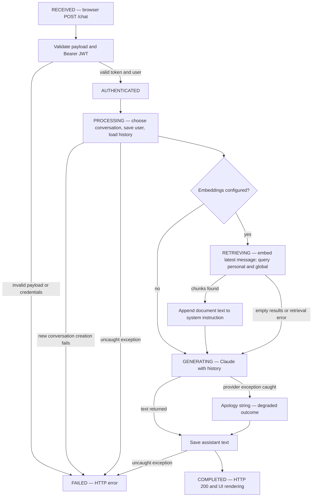

# Agent Workflow Design — Technical Documentation

## CURRENT IMPLEMENTATION

Evidence: [chat route](../backend/main_sqlite.py), [ChatService](../backend/chat_service_sqlite.py), [RagService](../backend/rag_service.py), and [ChatBot](../frontend/src/components/ChatBot.tsx). The following state names explain control flow; the code does not persist or expose these as workflow states.

### Roles, tools, and handoffs

| Role/component | Work performed | Handoff |
| --- | --- | --- |
| User/browser | Compose request, upload documents, select scope | fetch sends JSON or multipart to FastAPI |
| API controller | Validate, authenticate selected operations, persist history | Calls Python services directly |
| AuthService | Verify JWT and resolve user by subject | Returns UserResponse to dependency |
| ChatService | Build system/context/messages, call Claude | Receives text response, returns string |
| RagService | Embed query and search local collections | Returns chunk strings to ChatService |
| DatabaseManager | Store users, messages, documents, conversations | Returns rows, IDs, booleans or fallback values |

These are software responsibilities, not independent AI agents. Claude receives no tools array and cannot invoke functions, delegate work, or approve actions. There is no planner/executor loop or human approval gate. ConfirmDialog confirms conversation deletion in the UI only; callers can invoke the API directly.

### Ordered chat path

1. ChatBot rejects blank UI input, appends the user's message immediately, enables typing/loading feedback, and sends message plus optional conversation_id with the stored Bearer token.
2. Pydantic checks required fields/types. HTTPBearer obtains credentials; AuthService validates signature/expiry and resolves the subject user in SQLite. Missing credentials produce 403 with the pinned FastAPI version; invalid JWT/user produces 401.
3. The API derives user_id from authenticated identity. If no conversation_id exists, it creates a conversation. For a supplied ID, it reuses it without checking existence or ownership.
4. It calls save_message for the user and loads stored history in created_at order. Save return values are not checked. There is no context-window truncation or input-token budget.
5. ChatService starts with the helpful assistant/LaTeX instruction. If OPENAI_API_KEY is present, it embeds the last user message and queries personal and global Chroma collections. Zero chunks means ordinary chat; errors log warnings and allow ordinary chat.
6. Retrieved strings are concatenated into the system instruction. Claude receives formatted history, model claude-haiku-4-5, max_tokens=1024 and an ephemeral cache hint. No citations or relevance scores are exposed.
7. The service returns the first text block. The API attempts to save it and returns response and conversation_id. The browser displays the completed text and clears loading in finally. A new conversation triggers sidebar refresh.

### Ingestion and deletion paths

File upload: authenticate → require configured RAG → check extension → read bytes → PDF extraction/TXT decoding → reject empty text → normalize/chunk → insert SQLite metadata → embed chunks → insert Chroma records → return metadata. URL ingestion follows the same persistence order after an HTTP/HTTPS prefix check and website extraction. No OCR, upload progress queue, approval for global scope, or compensating rollback exists.

Document deletion: authenticate → load metadata → require uploader ownership → request vector deletion → delete SQLite metadata → return success. Chroma deletion catches exceptions, so success can leave orphan vectors. Conversation deletion removes messages and the conversation in SQLite but is currently unauthenticated.

### Failure paths and their limitations

| Failure | Current behavior | Implication |
| --- | --- | --- |
| Invalid JSON/missing fields | Pydantic 422 | String contents and length are not strongly constrained |
| Missing/invalid credentials | 403/401 on protected routes | Public conversation routes bypass this path |
| RAG unconfigured for upload | 503 | Chat can still use Claude without retrieval |
| Unsupported file/empty extracted file | 400 | Extension check does not establish safe content |
| URL prefix invalid/empty extraction | 400/422 | URL fetch errors collapse into empty text |
| Retrieval failure | Warning and ungrounded generation | No UI flag indicates grounding was skipped |
| Claude provider exception | Apology string returned, usually saved and HTTP 200 | HTTP success and assistant rows cannot measure AI success |
| SQLite operation failure | Many methods log and return None/empty/False | Message save failures may not stop response |
| Vector insert failure | API 500 after metadata insertion | SQL/vector inconsistency remains |
| Vector deletion failure | Warning; SQL metadata deletion continues | Retrieval may retain text after apparent deletion |
| Uncaught chat route error | Generic HTTP 500 | No durable retry state or correlation ID |

There is no application-level retry orchestration, cancellation, idempotency key, dead-letter queue, or circuit breaker. Provider SDK defaults may apply but are not configured as an explicit resilience policy in this repository.

## Production Extension — PROPOSED PRODUCTION DESIGN

Add a coordinator that holds a durable request ID and moves through VALIDATING, AUTHORIZED, RETRIEVING, GENERATING, VERIFYING, COMPLETED, DEGRADED, FAILED, or AWAITING_APPROVAL. A retriever role should receive only authorized tenant/scope/query inputs and return chunk IDs, source attribution, and relevance data. A responder role should consume untrusted context as data; a verifier should check grounding and safety before publication. These can begin as bounded services; multiple model agents are optional.

Define allowlisted tools for retrieve_documents and ingest_document with schema validation, caller identity, timeout, output-size limits, and structured error contracts. Handoffs carry request ID, tenant ID, permissions, approved scope, evidence IDs, and explicit outcome; model output must never grant authorization.

Require human approval before publishing shared/global knowledge or any future external side effect. Record approver, exact proposed operation, scope, timestamp, expiration, and decision. Revalidate identity and permission at execution, bind approval to the exact action, and do not retry a side effect without idempotency. Read-only authorized retrieval need not request repeated approval.

Distinguish provider failure from successful response in API status/telemetry. Permit a bounded retrieval fallback only with a visible degraded flag; fail closed for identity or scope failures. Use ingestion states pending/ready/failed, transactional metadata changes plus reconciliation, bounded retries, and a review queue. Add ownership and negative-path tests before exposing these capabilities publicly.
