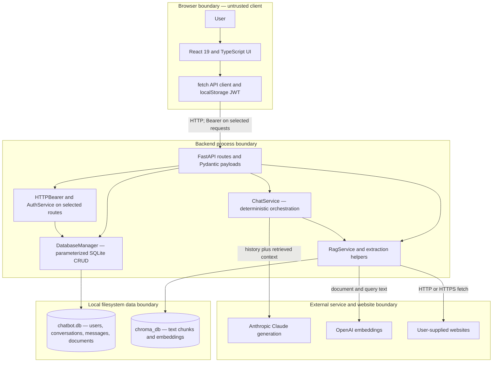

# Architecture Diagram — Technical Documentation

## Scope and evidence

This document describes the source inspected on 2 October 2026. **CURRENT IMPLEMENTATION** means code or configuration exists; it does not imply a live integration has been demonstrated. **PROPOSED PRODUCTION DESIGN** means a future change. The capstone title “Agentic AI Assistant” describes the submission theme; the implemented assistant uses deterministic orchestration, not autonomous multi-agent execution.

Primary evidence: [API](../backend/main_sqlite.py), [chat service](../backend/chat_service_sqlite.py), [retrieval](../backend/rag_service.py), [database](../backend/database_sqlite.py), [authentication](../backend/auth_service.py), [browser API client](../frontend/src/api.ts), and [Compose](../docker-compose.yml). Some original comments mention GPT/OpenAI chat; executable code uses Anthropic for generation and OpenAI only for embeddings.

## CURRENT IMPLEMENTATION

### Layers and components

| Layer | Actual components | Responsibility |
| --- | --- | --- |
| Presentation | React 19, TypeScript 4.9, react-scripts 5, custom CSS | Login, chat, history sidebar, document panel, loading/error states |
| API/application | FastAPI 0.104.1, Uvicorn 0.24.0, Pydantic 2.9.2 | JSON/multipart routing, dependency-based authentication, orchestration |
| AI/agent | AsyncAnthropic, ChatService | Full-history request, optional context injection, single text response |
| RAG/retrieval | OpenAI SDK, ChromaDB, pypdf, BeautifulSoup, requests | Extract, chunk, embed, store, retrieve, delete |
| Data | sqlite3 and local Chroma PersistentClient | User identities, messages, document metadata, chunk text/vectors |
| External integrations | Anthropic, OpenAI, arbitrary HTTP/HTTPS sites | Generation, embeddings, URL ingestion |

App validates any stored token on initial load. Login handles client-side validation and authentication. ChatBot manages active messages and conversation state; AllConversations refreshes every 30 seconds and confirms conversation deletion. DocumentPanel supports personal/global file and URL ingestion. MessageBubble uses React Markdown, GFM, syntax highlighting, and KaTeX. MessageInput prevents empty UI sends and disables while waiting. There is no router library, state store, streaming transport, or client-side provider SDK.

FastAPI directly calls service objects in one backend process. SQLite starts at the application startup hook; Chroma initializes when rag_service is imported, even when embeddings are not configured. Blocking SQLite, Chroma, OpenAI embedding, PDF parsing, and requests calls occur inside async request processing. Claude generation is asynchronous. There is no task queue or document worker.

### Data layout and ownership

| SQLite table | Stored fields and constraints |
| --- | --- |
| users | id, unique username, unique email, password_hash, created_at |
| conversations | id, user_id, created_at |
| messages | id, conversation_id, role constrained to user/assistant, content, created_at |
| documents | id, user_id, filename, file_type, chunk_count, is_global, created_at |

Foreign keys are declared but foreign-key enforcement is not explicitly enabled. DatabaseManager uses one connection with check_same_thread=False, sqlite3.Row, parameterized statements, and explicit commits. There are no migrations or cross-store transactions. The default path is chatbot.db relative to the launch directory; DATABASE_URL in Settings does not configure the global manager.

Chroma persists at ./chroma_db, with telemetry disabled. Personal collections are user_{id}; global_docs is shared. Each chunk carries doc_id, user_id, filename and an ID based on document/chunk index. Original uploaded files are read in memory; no original-binary archive is implemented. SQLite records metadata before embeddings/vector insertion, allowing partial ingestion failures.

### Retrieval and provider data flow

Text is whitespace-normalized into 800-character chunks with 100-character overlap. OpenAI text-embedding-3-small embeds documents and the latest user message. Cosine search returns up to three results from each personal/global collection, potentially six total, without a shared rank or minimum relevance threshold. ChatService joins chunks into the system prompt, then sends conversation history to claude-haiku-4-5, max_tokens=1024, with an ephemeral system cache hint. Response usage, retrieved metadata, and distances are not returned or persisted.

Trust boundaries are descriptive, not proof of enforcement. Browser payloads cannot establish identity; selected API routes verify JWTs, while several conversation routes are public. Local SQL and vector storage contain sensitive text. Document/query text leaves the backend for OpenAI, and history plus retrieved context leaves it for Anthropic. URL ingestion introduces untrusted remote content and an outbound network boundary. See [security model](security-model.md) for authorization gaps and injection/SSRF risks.

## PROPOSED PRODUCTION DESIGN

Keep the browser/API/provider separation, but add TLS ingress, consistent identity and object authorization, validated tool contracts, a background ingestion queue, and explicit document processing states. Use shared relational and vector services before horizontal API scaling; preserve tenant isolation in every query. Add managed secrets, retention/deletion workflows, telemetry, and consistent backup/restore procedures. These components are absent from the existing repository.
