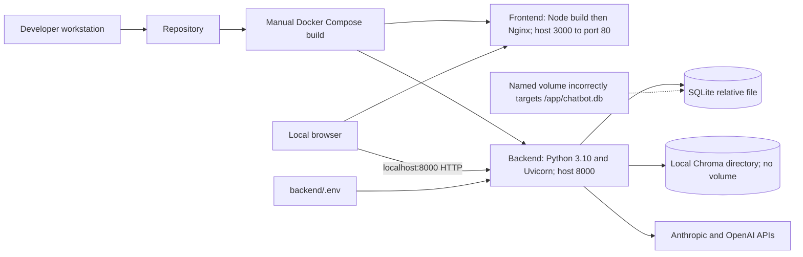
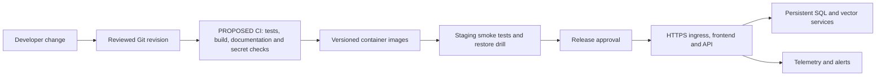

# Deployment Strategy — Technical Documentation

## CURRENT IMPLEMENTATION

Evidence: [backend Dockerfile](../backend/Dockerfile), [frontend Dockerfile](../frontend/Dockerfile), [Compose](../docker-compose.yml), [Nginx](../frontend/nginx.conf), [settings](../backend/config_sqlite.py), and [startup script](../start.sh).

### Runtime and container architecture

The backend image installs requirements_sqlite.txt on python:3.10-slim, copies its build context into /app, and runs uvicorn main_sqlite:app --host 0.0.0.0 --port 8000. No reload flag, worker count, non-root USER, resource limit, or application readiness probe is defined in that Dockerfile. It includes no frontend or proxy.

The frontend image uses node:18-alpine to run npm ci and npm run build. Its Nginx runtime serves the resulting static files on port 80 and falls back to index.html for SPA requests. Nginx has no /api proxy. React's REACT_APP_API_URL is embedded at build time; changing runtime environment variables in Nginx does not change it. Never put provider keys in REACT_APP variables.

Compose builds using separate ./backend and ./frontend contexts. It exposes 8000:8000 and 3000:80, injects backend/.env, uses restart: unless-stopped, and starts the frontend after backend health. The backend check requests / every 30 seconds, with 10-second timeout, three retries, and 10-second start period. An unhealthy status does not itself make Docker restart a running process; the restart policy responds to container exits. The root endpoint always returns an API status payload without probing SQLite, Chroma, or provider access.

### Existing configuration limitations

- chatbot_db:/app/chatbot.db mounts a named-volume directory where sqlite3 expects a file. Based on Docker volume semantics, this is a likely startup persistence defect, not a tested successful deployment. Use a persistent data directory and put the database file within it after making its path configurable. [Docker volume documentation](https://docs.docker.com/engine/storage/volumes/) supports directory-based volume usage.
- Chroma writes to /app/chroma_db and has no Compose volume. Recreating the backend can lose vectors independently of SQL metadata.
- DATABASE_URL is read by Settings but the global DatabaseManager ignores it. Changing that environment variable alone does not fix the path.
- REACT_APP_API_URL is hard-coded to <http://localhost:8000> in Compose. That works only when the browser can reach a backend on its own localhost; remote hosting needs a browser-reachable HTTPS API or a configured same-origin proxy.
- Root .dockerignore is outside both actual build contexts. It does not protect the backend COPY . . from copying backend/.env, nor exclude frontend node_modules once installed. Add context-specific ignore files before building distributable images.
- requests is imported by URL extraction but omitted as a direct dependency. Some dependency resolutions may install it transitively; release manifests should declare it.
- The Poetry lockfile has no entries for OpenAI, ChromaDB, pypdf, or BeautifulSoup despite those dependencies appearing in pyproject.toml. Regenerate and validate that lockfile separately; the documentation uses pip requirements plus explicit requests installation.
- There is no CI/CD pipeline or hosting manifest. Existing Docker files are a local packaging starting point, not production deployment evidence.

### Environment variables

| Variable | Consumer and current behavior |
| --- | --- |
| ANTHROPIC_API_KEY | Required backend Claude SDK credential |
| OPENAI_API_KEY | Optional for ordinary chat; required for RAG ingestion and query embeddings |
| SECRET_KEY | Backend JWT signing; current code has an unsafe known fallback |
| ALGORITHM | JWT algorithm, default HS256 |
| ACCESS_TOKEN_EXPIRE_MINUTES | JWT expiry interval, default 30 |
| DATABASE_URL | Read by config_sqlite.py; not connected to global database manager |
| REACT_APP_API_URL | Frontend start/build configuration; default <http://localhost:8000> |

Run backend commands from backend/ so local dotenv and relative storage resolve consistently. See [root README](../readme.md) for PowerShell and POSIX setup. start.sh is a zsh script using POSIX virtual-environment paths, background processes, and npm install; it is not a native PowerShell launcher.

## PROPOSED PRODUCTION DESIGN

### Environments and release

Use separate development, staging, and production keys/data. Development uses reload and synthetic documents. Staging uses production-style images and disposable test users. Production serves HTTPS and approved uploads; never share a global collection across these environments.

Pin compatible dependency versions and base-image digests, validate lockfile resolution, build with clean contexts, scan artifacts for credentials, and tag images with the revision. Release gates should include object-authorization tests, document isolation/deletion checks, database readiness, and synthetic provider requests without sensitive data. Keep an earlier image and coordinated SQL/vector backup for rollback; restoring an image alone does not restore schema or vector contents. No pipeline in the current repository performs these steps.

### Scaling and resilience

Begin with one backend instance and one persistent local data store after fixing mounts/paths. Static frontend assets can be served independently or through a CDN. Merely increasing Uvicorn workers or replicating the current container does not establish safe scale: the code has a single SQLite connection per process, local Chroma, blocking ingestion/retrieval operations, and no shared workflow state.

For multiple instances, introduce a shared relational database with migrations/pooling, a shared vector service with tenant filters, queue-based ingestion workers, controlled provider concurrency, and rate/usage quotas. Apply provider timeouts, bounded backoff, circuit breakers, and explicit degraded/failed outcomes. Add readiness checks, storage health checks, resource limits, and coordinated backups tested with restoration. Do not mount one local embedded Chroma directory into many unrelated instances as a substitute for a supported shared service.

### Container hosting plan

A general container host can run the static frontend and API separately behind TLS ingress. Build the frontend with the actual API URL, configure backend CORS for that frontend origin, and mount persistent data at configured paths. These require future configuration/code corrections; this documentation does not claim they were applied.

For Hugging Face Docker Spaces, the platform expects a Docker Space with a root Dockerfile and Space README metadata specifying sdk: docker and app_port (default 7860). The current two-context Compose layout is not a ready Space deployment. A future hosting branch can build the frontend, serve it through a reverse proxy on the Space port, proxy API requests to internal Uvicorn, and rebuild with a same-origin API base. Store credentials as Space secrets and verify persistence for both stores. Current Hugging Face documentation says ordinary container disk is lost on restart and describes attached Storage Buckets for persistence; do not assume a pre-existing /data volume or safe live SQLite behavior on a bucket. Prefer external persistent SQL/vector services, or test a supported storage/backup arrangement before storing student data. See [Docker Spaces](https://huggingface.co/docs/hub/main/spaces-sdks-docker).

### Acceptance and validation status

Local Python/npm commands and Docker entry points have been checked against filenames and package scripts. Runtime results are recorded in [DELIVERABLES.md](../DELIVERABLES.md). Docker is unavailable in the preparation environment, so images, healthchecks, persistence, and hosting were not executed. Real Claude/OpenAI access, data restoration, and multi-instance performance remain deployment acceptance checks.
