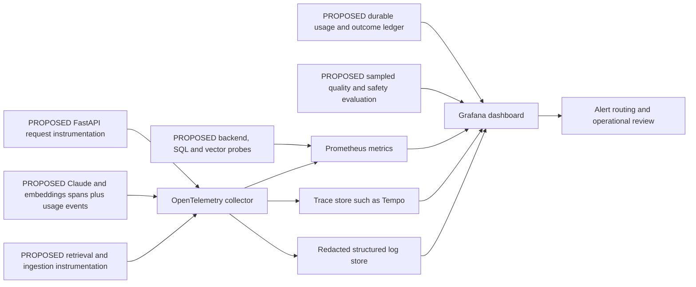

# Monitoring Dashboard Design — Technical Documentation

## CURRENT IMPLEMENTATION

[main_sqlite.py](../backend/main_sqlite.py), [chat service](../backend/chat_service_sqlite.py), [RagService](../backend/rag_service.py), and [DatabaseManager](../backend/database_sqlite.py) use standard Python logging. GET / returns a static healthy status and API metadata. Compose polls that endpoint; it does not verify database or vector availability. There is no /metrics endpoint, trace propagation, structured provider outcome, token/cost persistence, analytics pipeline, safety evaluation, or operational dashboard.

[reportWebVitals.ts](../frontend/src/reportWebVitals.ts) contains a callback-based utility, but [index.tsx](../frontend/src/index.tsx) calls it without a callback, so it does not export metrics. The design below is **PROPOSED PRODUCTION DESIGN**, not existing monitoring or measured results.

## Proposed monitoring architecture

OpenTelemetry, Prometheus, Grafana, Tempo, a structured log store, evaluation jobs, and usage tables are proposed integrations and are not present in dependency manifests or Compose.

## Dashboard layout and metric definitions

Use filters for environment, release, route, provider, model, and time window. Restrict tenant/user drill-down to authorized operators. Start with health tiles, then trace waterfall and latency graphs, quality/safety trends, cost breakdown, and outcome funnels. Show “not instrumented” or “no samples” until data exists; do not display fabricated zeros or example measurements as evidence.

| Required category | Proposed panels and definitions | Instrumentation and limitation |
| --- | --- | --- |
| HEALTH | Backend availability: successful probes / attempts; SQL readiness: connection plus safe SELECT; vector readiness: client query/check success; error rate and restart count | Add separate liveness/readiness and storage probes; current / proves only HTTP response |
| TRACE | API duration p50/p95/p99 by route; Claude request latency; query embedding latency; Chroma search latency; ingestion duration; time spent persisting | Request root span with child SQL/embedding/retrieval/Claude spans; use monotonic duration; no current spans |
| QUALITY | Human-rated helpfulness/correctness, groundedness, retrieval relevance, no-hit rate, retrieval error rate, citation coverage | Record retrieval candidates and authorized source IDs; distinguish empty collections/no hits/errors; current chunks have no exposed scores or citations |
| SAFETY | Auth failures by reason, schema-invalid requests, denied object access, rejected uploads/URLs, flagged injection, blocked AI operations, provider failures | Add bounded event codes and policy counters; current logs contain some failures but there is no blocking AI policy |
| COST | Claude attempts/successes, input/output/cache tokens, OpenAI embedding tokens, estimated cost by model/release/time | Capture provider usage before returning text, maintain dated price configuration and reconcile billing; no current usage ledger |
| BUSINESS OUTCOMES | Active users, conversations created, documents attempted/ready, AI requests, successful responses, repeated usage and resolution feedback | Emit authenticated activity and explicit outcomes; current SQL rows alone cannot identify true generation success or ready ingestion |

### Health and tracing

Measure API availability independently of storage readiness. A safe SQL probe should verify the expected schema and readable storage; vector checks should verify the supported client/collection operation without exposing user content. Provider synthetic checks should be infrequent, use nonsensitive inputs, and record dependency status separately from API availability.

Propagate a request ID from API to services and logs. A chat trace should contain auth validation, conversation/history SQL operations, query embedding, personal/global vector searches, Claude generation, and final persistence. An upload trace should include fetch/parse, chunking, metadata insertion, embedding, and vector insertion. Capture timeout/error/degraded outcomes even when HTTP 200 is returned. Avoid high-cardinality user IDs in metric labels; use restricted trace/log fields where necessary.

### Quality and safety

Groundedness requires identifying which chunks were used; current query returns strings only. Add source IDs, collection scope, distances, and model outcome to a restricted evaluation record. Use a consented evaluation dataset and blind human review against a rubric for relevance, correctness, completeness, and harmful output. Track hallucination/unsupported-claim rate and retrieval Recall@k against labeled queries. These are planned evaluation methods, not measured quality scores.

Define retrieval_no_hit separately from retrieval_error and retrieval_skipped_unconfigured. Count an authentication failure when a protected request lacks valid identity; count an authorization denial only after object-policy checks exist. “Blocked AI operations” remains unavailable until an actual guardrail/policy gate is implemented. Provider refusal, provider failure, and application policy block must have distinct outcome codes.

### Cost

Record logical AI requests separately from provider attempts/retries. Capture actual usage from Anthropic responses, including cache usage when supplied, and OpenAI embedding usage. Cost estimates use a dated, verified provider rate card, not hard-coded assumptions: sum token counts by billable category divided by one million and multiplied by the category rate. Include embeddings and cache-related categories; do not infer tokens from character count as if measured. Track latency/token budget and cost per successful response; reconcile estimates with provider billing. No prices or estimated monetary values are asserted in this submission.

### Business outcomes

Define active users as distinct authenticated users with at least one qualifying chat/ingestion activity during the selected day/week. Conversations created counts actual creation events, not sidebar polling. Document success requires both metadata and vectors to reach ready state; current metadata rows may survive failed vector insertion. AI request success requires valid provider text and completed persistence, excluding apology fallback, refusal, degraded result, and failure as separately labeled outcomes. Display successful responses / AI requests and uploaded-ready / upload attempts; evaluate usefulness with explicit optional feedback. Current assistant message counts are insufficient for these measures.

## Proposed alerts, audit, and implementation stages

| Signal | Proposed trigger policy | Response |
| --- | --- | --- |
| Readiness unavailable | Repeated failed storage probes across a configured window | Inspect filesystem/database state; stop routing writes if unsafe |
| Latency or provider errors | Sustained deviation from an approved SLO/baseline | Inspect provider child spans, concurrency and retries |
| Ingestion inconsistency | Metadata ready without vectors, or orphan vectors | Run authorized reconciliation and deletion repair |
| Authentication/denial surge | Abnormal rate against a learned baseline | Review restricted security events and rate controls |
| Cost budget | Configured daily/monthly forecast limit exceeded | Review traffic and enforce quota policy |
| Quality/safety regression | Evaluation thresholds approved after baseline collection | Review affected release, data and prompts |

No alert thresholds are measured or currently enforced. Choose SLOs after load tests and stakeholder agreement. Redact secrets, raw passwords, bearer tokens, query-string credentials, and sensitive content before export; use bounded retention, access control, and pseudonymous actor identifiers. Audit writes, deletions, global publication, approvals, and policy decisions in a separate durable log.

Implementation stages: (1) structured outcomes and request IDs, (2) probes and latency/error metrics, (3) provider usage/cost ledger, (4) quality/safety evaluation, (5) business outcomes and approved alert policies. Validate counters with synthetic traffic, forced provider/storage failures, and controlled document deletion. This sequence avoids treating a 200 response or stored assistant apology as proof of success.
