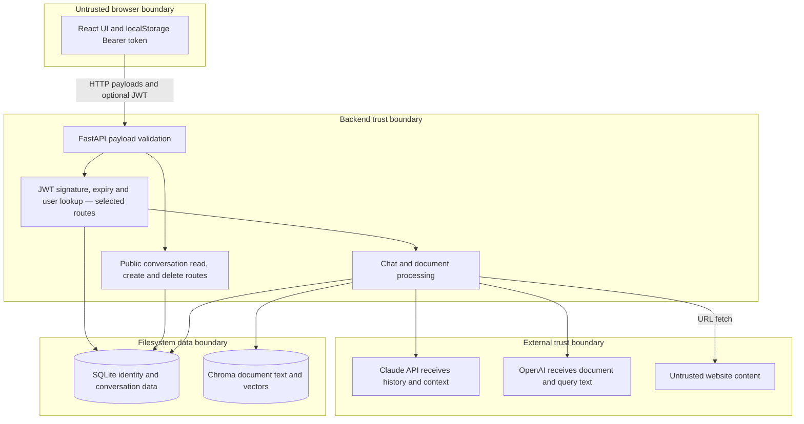

# Security Model — Technical Documentation

## CURRENT IMPLEMENTATION

Evidence: [authentication](../backend/auth_service.py), [routes](../backend/main_sqlite.py), [models](../backend/models.py), [database](../backend/database_sqlite.py), [retrieval](../backend/rag_service.py), and [browser authentication](../frontend/src/App.tsx).

### Identity, authentication, and session handling

Registration checks username/email uniqueness and hashes passwords with salted bcrypt through passlib, 12 rounds, identifier 2b. Login verifies the hash and issues a JWT with sub (username), user_id, and exp. python-jose signs/verifies using SECRET_KEY and ALGORITHM, with HS256 and 30 minutes as default algorithm/expiry. Current-user lookup uses sub and requires that user still exist. Responses do not return password hashes.

The browser stores authToken in localStorage, checks /auth/me on initial load, and removes the token on logout or failed initial validation. Logout does not revoke already issued tokens. No refresh token, revocation list, session store, password reset, MFA, or account-verification flow exists. localStorage is readable by JavaScript and is not an HttpOnly cookie.

### Authorization coverage

| Operation | Actual server enforcement |
| --- | --- |
| GET /auth/me and POST /chat | Valid token/current user required |
| GET /conversations | Valid token; query filters current user's ID |
| POST /conversations | No authentication; accepts caller-provided user_id |
| GET /conversations/{id}/messages and /full | No authentication or ownership check |
| DELETE /conversations/{id} | No authentication or ownership check |
| Existing conversation_id in POST /chat | Authentication present; no conversation ownership/existence check |
| Document upload, URL upload and list | Valid token; list includes own and global documents |
| DELETE /documents/{id} | Valid token and uploader ownership check |
| Publishing global documents | Any authenticated uploader can set is_global; no privileged role or approval |

These gaps permit cross-user conversation access/modification and cannot be solved by hiding UI controls, attaching unused headers, or CORS. Existing tests intentionally call some public conversation routes without authentication, so passing those tests would not establish secure authorization.

### Secrets and API key protection

Provider credentials are loaded server-side using dotenv/environment settings; the browser makes backend requests, not credentialed provider calls. No real credentials belong in PROMPT.md, deliverables, templates, screenshots, or logs. SECRET_KEY currently has a known fallback rather than startup enforcement. The example template uses empty credential fields to require local configuration.

.gitignore excludes dotenv files, key/certificate containers, secrets directories, virtual environments, node_modules, databases, caches, and generated Chroma directories. Ignore rules do not remove files already tracked or detect arbitrary secrets embedded in text. The existing demo-acc.md is already tracked despite an ignore rule; its contents are excluded from capstone documentation and need a separate credential review before sharing the repository.

Docker's root ignore file does not apply to the backend/frontend contexts. backend COPY . . can bake a locally created .env into an image unless context-specific exclusions are added. No secret manager, rotation automation, image credential scan, or deployment secret policy is implemented.

### Privacy and validation

SQLite holds email, identity, conversation text, and document metadata. Chroma stores extracted text and vectors. Provider processing sends document/query text to OpenAI and conversation history plus retrieved context to Anthropic. Personal collections separate retrieval scope, but global uploads deliberately share knowledge. There is no implemented consent screen, retention limit, account/data export, user deletion workflow, at-rest encryption, or guaranteed erasure across SQL/vector stores.

SQL values are parameterized. Pydantic enforces field presence and basic types but uses plain strings for username/email/password/message/url. Server-side email-format, password-strength, nonempty-message, maximum-length, and URL-host constraints are absent. Login implements client-side username, email, password, and confirmation checks, which direct API callers can bypass.

File upload checks only filename extension and nonempty extracted text, reads the entire upload into memory, and uses pypdf or UTF-8 decoding with ignored errors. No file-size ceiling, MIME/signature validation, malware scan, parser sandbox, OCR, or per-user quota exists. Original file names are metadata, not saved filesystem paths. URL ingestion restricts scheme prefix and applies a 15-second timeout, but does not block private/loopback/metadata hosts, inspect resolved addresses, constrain redirects, or bound downloaded content. This creates an SSRF exposure.

CORS allows <http://localhost:3000>, credentials, all methods, and all headers. It limits permitted browser cross-origin access but is not authorization and does not constrain direct HTTP clients. TLS is not configured in the supplied local Docker setup.

### AI guardrails and auditability

The system prompt asks for helpful answers and LaTeX formatting. There is no application moderation policy, safety classifier, tool permission system, injection detector, grounding verifier, or structured citation requirement. Retrieved text is placed directly into the system prompt; malicious uploaded/website content can influence responses. Claude is not given executable tools, which limits direct model-driven side effects but does not protect answer integrity or data disclosure.

Python INFO/WARNING/ERROR logs cover startup, authentication attempts, chat steps, ingestion, and failures. Logs include usernames, user/conversation IDs, filenames, URLs, and exception strings. They are not an immutable audit trail; no trace IDs, redaction pipeline, retention policy, access-controlled log store, or approval ledger exists. Provider failures and storage failures can be masked by fallback outputs.

## Recommended Production Controls — PROPOSED PRODUCTION DESIGN

| Priority | Control | Reason and validation |
| --- | --- | --- |
| Before public exposure | Authenticate and authorize every conversation operation | Add cross-user read/write/delete and supplied-ID negative tests |
| Before public exposure | Reject missing/weak signing secrets; protect build contexts; review tracked credentials | Test startup validation and scan source/history/images without printing secrets |
| Before public exposure | HTTPS, exact production CORS origins, rate limits and quotas | Check browser integration and direct API abuse limits |
| Before public exposure | SSRF destination/DNS/redirect controls and bounded fetches | Test loopback, private ranges, cloud metadata, redirect bypass and large responses |
| Before public exposure | Upload byte limits, signature/type checks and isolated PDF processing | Test malformed/oversized payloads and resource exhaustion |
| Before shared ingestion | Privileged global publication and approval records | Test that ordinary users cannot publish globally |
| Before sensitive use | Consent, minimized provider data, retention and coordinated deletion | Test SQL/vector reconciliation and backup erasure policy |
| Before sensitive use | Untrusted-context separation, source attribution and injection evaluation | Use adversarial documents and evaluate grounded/safe responses |
| Production operations | Redacted structured audit events, trace IDs, secrets rotation and recovery drills | Verify access control, incident investigation and restores |

Prefer a server-managed session or carefully designed short-lived token scheme; if using cookies, add appropriate HttpOnly/Secure/SameSite and CSRF defenses. Review rendered Markdown links/images and apply browser security headers; skipHtml=false without a raw-HTML plugin is not evidence that arbitrary HTML is executed.

SSRF and injection controls above are recommendations informed by [OWASP SSRF prevention](https://cheatsheetseries.owasp.org/cheatsheets/Server_Side_Request_Forgery_Prevention_Cheat_Sheet.html) and [OWASP LLM prompt-injection prevention](https://cheatsheetseries.owasp.org/cheatsheets/LLM_Prompt_Injection_Prevention_Cheat_Sheet.html). The recommended controls have not been added to application source during documentation preparation.
