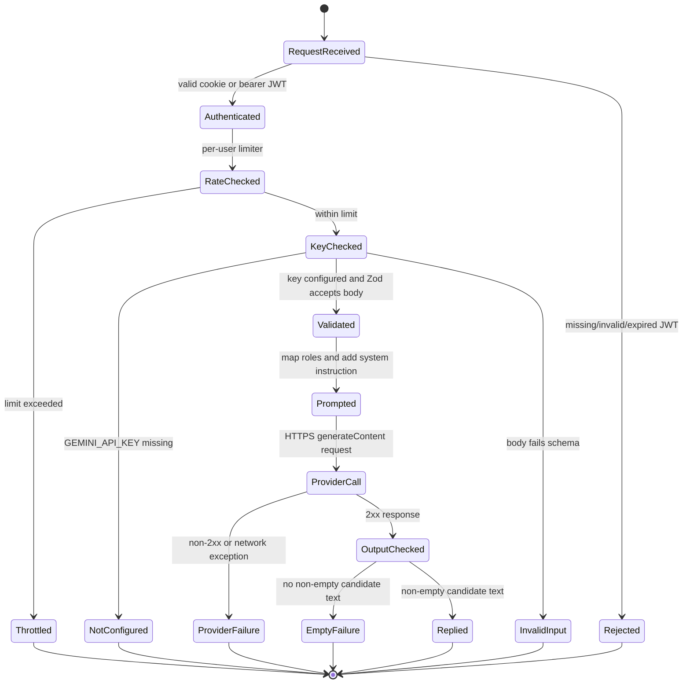

# Workout Coach Agent Workflow

## Scope

The current Workout Coach is one server-side LLM request/response flow. It is not a multi-agent architecture. There are no model-callable tools, workout-write actions, human-coach queue, approval interface, or conversation database in the checked-in implementation.

This document marks controls as **Implemented** or **Recommended** so a demo reviewer can distinguish behavior from future design.

## Actors and Roles

| Actor | Role | Status |
|---|---|---|
| Signed-in user | Supplies a text question and the current conversation turns | Implemented |
| Browser chat UI | Collects a message, appends it to local component state, sends it, and displays reply/error/loading state | Implemented |
| Express API | Authenticates, rate-limits, validates input, constructs the provider request, parses output, and sanitizes errors | Implemented |
| Gemini model | Generates a text response under a server-provided system instruction | Implemented |
| Healthcare professional | Possible referral when the user reports pain or medical concerns | Advice only; no actual handoff integration |
| Future tools/agents | Workout-history lookup, exercise catalog retrieval, or scheduling | Not implemented; do not claim availability |

## Request Contract

`POST /coach/chat` accepts JSON shaped like:

```json
{
  "messages": [
    { "role": "user", "content": "How many sets should I start with?" }
  ]
}
```

The API requires authentication, then applies a per-user limit of 12 requests per minute. The schema allows 1-16 messages; each content string is trimmed, non-empty, and at most 2,000 characters. Assistant messages are translated to Gemini's `model` role. The configured model defaults to `gemini-3.5-flash-lite`; output is limited to 500 tokens with temperature 0.6.

The server currently checks for `GEMINI_API_KEY` before validating the body. The browser sends the conversation held in the current chat UI; no chat is persisted server-side. The backend does not retrieve workout history or user profile information for the prompt.

## State Machine



The `Validated` state does not run a separate safety classifier. Safety handling is instruction-following by the model. It is not a deterministic policy engine and cannot guarantee that generated advice is safe.

## Failure and Recovery Paths

| Condition | API behavior | UI/recovery |
|---|---|---|
| No token | `401` | Sign in again |
| Invalid/expired token | `403` | Sign in again |
| Per-user limit exceeded | `429` from rate limiter | Wait and retry |
| Missing `GEMINI_API_KEY` | `503` with configuration guidance | Configure the API service and restart it |
| Invalid request shape/length | `400` | Correct the request |
| Gemini non-2xx response | `502`, provider status logged without request key | Retry; repeated errors require operator investigation |
| Network exception | `502`, exception logged | Check connectivity and retry |
| Missing/empty candidate text | `502` | Retry |
| Successful candidate text | `200 { reply }` | Render assistant reply |

The browser keeps the submitted user message visible after a failed request and displays an alert. It does not automatically replay a message. Retrying is user initiated.

## Safety, Handoffs, and Approvals

**Implemented:** The system instruction says the coach is not a doctor or certified trainer, asks it not to diagnose injuries or prescribe treatment, directs users with pain/injury/medical concerns to a qualified healthcare professional, and asks for general evidence-informed guidance.

**Not implemented:** There is no separate classifier, response moderation service, professional referral directory, live trainer handoff, approval queue, structured clinical escalation, or audit workflow. The coach cannot execute writes or call tools. Its only output is text.

**Recommended before tool use:** Give each tool a narrow schema and permission check; provide only the minimum authorized data; require explicit confirmation for any write; make all tool calls auditable; test prompt injection and authorization bypass; keep a human approval gate for high-impact actions. Do not add workout mutation tools to a demo without server-side ownership checks.

## Failure Testing Plan

No dedicated test runner or coach test suite is currently configured. Add tests for:

- Missing, invalid, and expired session credentials.
- Rate-limit behavior and exact input boundaries (0/1/16/17 messages; 0/1/2,000/2,001 characters).
- Missing API key, Gemini `429`/`5xx`, network failure, invalid JSON, blocked output, and empty candidates.
- Beginner programming, insufficient context, pain/injury, medical treatment, extreme dieting, off-topic questions, and attempts to extract secrets/system instructions.
- Ensuring a reply never claims to have viewed workout data or changed a workout when no such context/tool was supplied.
