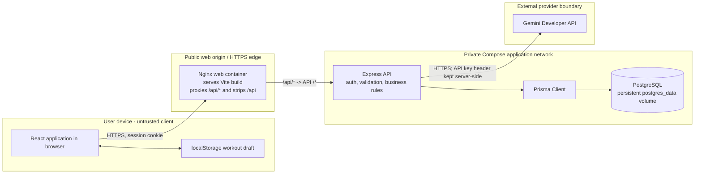
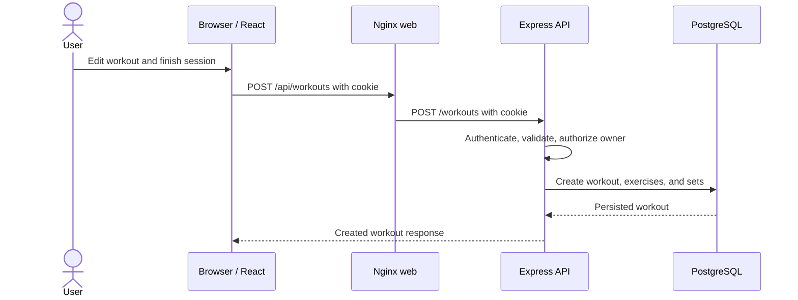
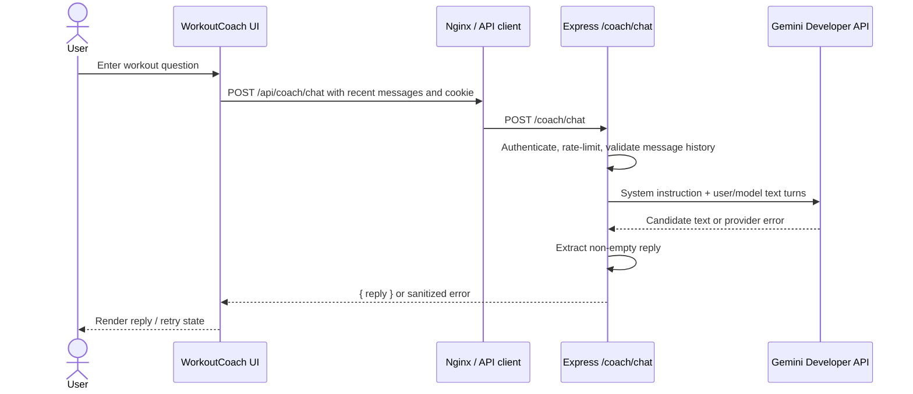

# PULSE System Architecture

## Status and Scope

This document describes the checked-in MVP architecture. It is a three-tier web application with a single Express API and a server-side Gemini integration. It is not a multi-agent system.

Status labels:

- **Implemented** means the behavior is present in the repository.
- **Configured** means deployment configuration exists but has not necessarily been run on a public host.
- **Recommended** means a proposed improvement.
- **Unverified** means it cannot be proven from the repository alone.

## Container and Trust-Boundary View

The Compose topology keeps the API and database ports internal; only the web container publishes a host port. The Nginx proxy gives the browser a same-origin `/api` endpoint. A separately hosted frontend can instead set `VITE_API_BASE_URL` to the API origin and must use matching CORS and cookie settings.

## Request Flows

### Workout Write

An unfinished workout draft is stored in browser `localStorage`. It is not a server backup and is not encrypted. Completed workout records are stored in PostgreSQL.

### Workout Coach

**Implemented:** The API sends only the conversation messages supplied by the browser, bounded by the route schema. It does not query or include the user's workout records, profile, or exercise history in the Gemini request. The Gemini key is read by the API from `GEMINI_API_KEY`.

## Components and Responsibilities

| Component | Responsibility | Status |
|---|---|---|
| React/Vite browser app | Authentication UI, workout logging, social pages, chat UI, and API client | Implemented |
| Browser local storage | Draft for an in-progress workout | Implemented; device-local only |
| Nginx web container | Serves static Vite build and proxies `/api/` to the API | Configured in Compose |
| Express API | Authentication, authorization, input validation, domain routes, and Gemini calls | Implemented |
| Prisma Client | Maps API queries to PostgreSQL | Implemented |
| PostgreSQL | Users, exercises, workouts, sets, follows, and likes | Configured in Compose |
| Gemini Developer API | Generates coach text replies | Implemented; availability and quotas are external |
| Metrics/tracing backend | Aggregated observability | Not implemented |

## Data and External Boundaries

- PostgreSQL stores account/profile data, exercise catalog data, workout records and sets, follows, and likes.
- The browser receives workout/profile data allowed by the API privacy rules. The API is responsible for enforcing ownership and visibility.
- The browser sends coach conversation turns to the API. Those turns are forwarded to Google Gemini; users should not include secrets or unnecessary health details.
- Avatar and seeded profile image URLs may point to external image providers. These are browser-side image requests, not part of the workout API path.
- No message queue, Redis service, vector database, background worker, or AI tool server is present in the checked-in deployment.

## Known Gaps

- Compose runs `prisma db push` at API startup. This is an MVP schema-sync strategy, not a versioned production migration workflow.
- The repository configures health checks but has no distributed tracing, application metrics, centralized log store, or alert definitions.
- Compose and container configuration are checked in, but a live public deployment is not verified by this document.
- `docs/agent-workflow.md`, `docs/security-model.md`, `docs/deployment-strategy.md`, and `docs/monitoring-dashboard.md` describe the corresponding boundaries and gaps in more detail.
